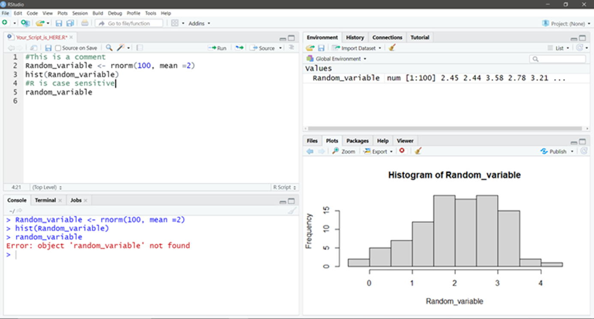
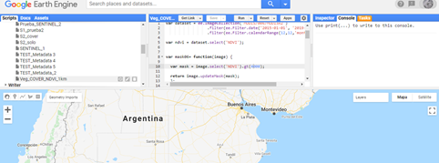
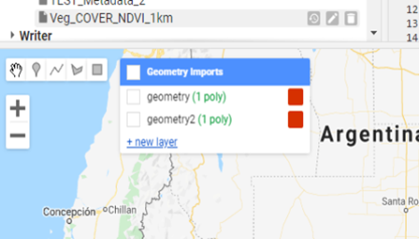
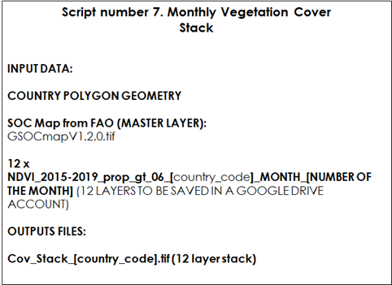
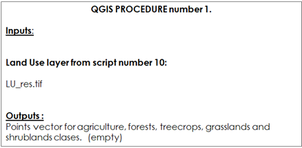

--- 
title: "Technical Manual Global Soil Organic Carbon Sequestration Potential Map GSOCseq"

author: "Food and Agriculture Organization of the United Nations, Rome, 2020"
date: '25/11/2020'
output:
  pdf_document: default
  html_document:
    df_print: paged
site: bookdown::bookdown_site
css: "justify.css"
#cover-image: images/cover.png
documentclass: book
papersize: b5
fontsize: 10pt
bibliography: "GSOCseq_references_FAO.bib"
csl: "food-and-agriculture-organization-of-the-united-nations.csl"
nocite: '@*'
link-citations: yes
description: The GSOCseq Technical Manual
always_allow_html: true
---
\mainmatter
\pagestyle{fancy}


```{r set-options, echo=FALSE, cache=FALSE}
options(width = 65)
library(kableExtra)
## redefine str for the width option
str <- function(...){
  utils::str(..., strict.width = "cut")}
# reproducible results
set.seed(123)
## Boolean object for running all the code #####
# if FALSE will use precalculated RK prediction and svm tuning
#RUN.ALL <- TRUE
# Cache results
knitr::opts_chunk$set(cache=T)
```

\frontmatter
\addtocontents{toc}{\protect\hypersetup{hidelinks}}   
\addtocontents{lot}{\protect\hypersetup{hidelinks}}
\addtocontents{lof}{\protect\hypersetup{hidelinks}}
\tableofcontents
\listoffigures
\listoftables
\printnomenclature

# List of contributors{-}

## Authors{-}


Guillermo Peralta (GSP Secretariat)  
Luciano Di Paolo (GSP Secretariat)  
Christian Omuto (GSP Secretariat)  
Kostiantyn Viatkin (GSP Secretariat)  
Isabel Luotto (GSP Secretariat)  
Yusuf Yigini (GSP Secretariat)  


*Cover design:* Matteo Sala


## Contributers and Reviewers{-}

|               |                                      |
|-----|--------------------------------------|
| P4WG | (Pillar 4 Working Group Agency) |
| INSII | (International Network of Soil Information Institutions) |
| ITPS | (Intergovernmental Technical Panel on Soils) |
| 4per1000 SCT| (4 per 1000 Scientific and Technical Committee) |
| CIRCASA | (Coordination of International Research Cooperation on Soil Carbon Sequestration in Agriculture) |
| UNCCD-SPI | (The UNCCD Science-Policy Interface) |  
  
  
## Special Advisor {-}
Pete Smith (University of Aberdeen)
  
  
\vfill


 


**Recommended citation:**

> FAO. 2020. GSOCseq Global Soil Organic Carbon Sequestration Potential Map
Technical Manual. G. Peralta,L. Di Paolo, C. Omuto, K. Viatkin, I. Luotto, Y. Yigini, 1st Edition, Rome. 

<!--chapter:end:index.rmd-->


# | Presentation
Soils have become one of the world's most vulnerable resources in the face of climate change, land degradation, biodiversity loss and increased demand for food production. The role of soils and soil organic carbon (SOC) in the climate system and climate change adaptation and mitigation has been recognized widely and validated in various studies, both experimentally and through modelling. Maintaining and increasing SOC stocks is not only crucial for reducing greenhouse gas (GHG) emissions and removing CO~2~  from the atmosphere but also for harnessing the benefits of increased SOC (and soil organic matter - SOM) for soil health and fertility by improving water storage and thereby increasing the access of plants to water, food production potential and resilience to drought (FAO, 2017). It may lead to changes in health threat to human beings, and poses a significant challenge to rural communities and to our ability to thrive on our planet. The widespread adoption of site-specific sustainable soil management (SSM) practices in agricultural lands can harness a large C sink capacity at the global scale and its role as an effective strategy to mitigate GHG has been widely documented.
The magnitude and rate of carbon sequestration in soils can vary greatly, depending on the different land uses and practices, soil characteristics, vegetation, topography and climate, among other soil forming factors and processes. It is thus relevant to identify which regions, environments and production systems have a greater potential to increase SOC stocks as well as establishing priorities for research and the implementation of public policies. 
Responding to a request for support in addressing the Sustainable Development Goal Indicators, especially indicator 15.3 which includes the restoration of degraded soils, the Global Soil Partnership (GSP) Plenary Assembly in 2020 instructed the Intergovernmental Technical Panel on Soils (ITPS) and the GSP Secretariat to develop the Global Soil Organic Carbon Sequestration Potential map (GSOCseq map), following the same country-driven approach developed for the Global Soil Organic Carbon map (GSOCmap). This 'bottom-up' approach is expected to generate a GSOCseq map from national SOCseq maps, developed and validated by local experts, based on the implementation of SOC models using standardized procedures and by leveraging the best available local data.

To this end, members under the International Network of Soil Information Institutions (INSII) umbrella developed general guidelines and technical specifications for the preparation of the GSOCseq map and countries were invited to prepare their national soil organic carbon sequestration potential maps according to these specifications. Given the scientific advances in the tools for modeling and mapping SOC, many countries requested the GSP Secretariat to support them in the process of preparing national SOCseq maps. Hence, an intensive capacity development program on SOC sequestration potential through the use of modelling and mapping techniques is being implemented. Regional and national training sessions are being organized using an on-the-job-training modality to ensure that national experts are trained on the state of the art modeling and mapping techniques using their own data sets to produce reliable SOCseq maps.
This Technical Manual was prepared as a comprehensible reference knowledge base to support the capacity development process. It provides the necessary background knowledge, methodologies and technical steps to produce national SOCseq maps. It includes step-by-step guidance for developing 1 km grids of SOC sequestration potential,  as well as for the preparation of local data and the compilation and preprocessing of spatial data sets, using open source software environments and tools. 
This Technical Manual supplements the Technical Specifications and Country Guidelines for Global Soil Organic Carbon Sequestration Potential Map (GSOCseq), (FAO and GSP, 2020), and part of its contents is included in the current Manual. 
It is our hope that this Technical Manual will fulfill its mandate of easily enabling any user to produce digital SOC sequestration  maps using soil legacy data, process oriented SOC models and modern techniques of digital soil mapping and realize the overall aim of improving decision making on soil management.

## How to use this book

This Manual is organized in 13 Chapters, including this one. Chapter 2 provides scientific background on the importance of SOC sequestration as a GHG mitigation strategy, factors that regulate SOC sequestration and finally how it can be estimated. Chapter 3 provides scientific background on the use of different SOC models to estimate SOC changes and SOC sequestration potential. Chapter 4 describes one of the most used process-oriented SOC models, to be used as a standard to allow comparisons between countries: the RothC model. Chapter 5 describes the general modeling procedures to generate national SOCseq maps using this SOC model.  Chapter 6 describes the required data sets, potential data sources and methodologies to estimate modeling inputs for the modeling approach described in Chapter 5.  Chapter 7 gives an overview of the steps and software requirements to generate national SOCseq maps using a spatially explicit R-version of the RothC model. Chapters 8 to 11 constitute the core of this document, providing a step by step guide on how to run the R-scripts and generate the final product:  

*   Chapter 8 summarizes the different steps and scripts to be used during the complete process;    
*   Chapter 9 summarizes the procedures and scripts harmonization and preparation of input data;     
*   Chapter 10 summarizes the procedures for running the model from the prepared data;    
*   Chapter 11 summarizes the procedures for the generation of the final maps from the modeling runs.   

Chapter 12 provides an overview for the estimation of uncertainties. Lastly, Chapter 13 summarizes the procedure for the sharing of the national SOCseq maps. 

## The sample data set  
The sample data set provided with this Technical Manual was compiled to model and map the potential soil organic carbon sequestration for the district of Pergamino, Buenos Aires. It covers an area of 2,950 km^2^ that is mainly dedicated to agriculture. Pergamino is located in the Corn Belt of Argentina and with its subtropical climate it is favorable for double cropping systems, allowing for two harvests a year. The lowlands of this district are used mainly as pastures for the production of calves.  

This Technical Manual used in combination with the provided sample data set and scripts can be used as a step-by-step guide, which covers data preparation and harmonization, modeling potential soil organic carbon sequestration, rasterizing the results, estimating the uncertainty and finally data sharing.  

The sample data set and scripts can be found in the following repository: https://github.com/FAO-GSP/GSOCseq  

The contents of this repository and especially the Training Material folder, which contains the scripts and input data folder, can be downloaded as a .zip file through the the *Code* button on the GitHub page. Figure 1.0 illustrates how the material can be downloaded. 

  

More information on the necessary data and the provided data set can be found in Chapter 6, while an overview of the different steps and scripts needed is presented in Chapter 8.  

<!--chapter:end:01.Presentation.rmd-->

# | Soil Organic Carbon (SOC) sequestration

## Soil carbon  
Soils constitute the largest terrestrial carbon (C) pool. Total soil carbon (C) stock comprises soil organic C (SOC) and soil inorganic C (SIC) components. SOC is the carbon component of soil organic matter (SOM), a heterogeneous pool of C comprised of diverse materials including fine fragments of litter, roots and soil fauna, microbial biomass C, products of microbial decay and other biotic processes (i.e. such as particulate organic matter), and simple compounds such as sugar and polysaccharides (Jansson et al., 2010). The global SOC stock of ice-free land contains about 1500-2400 Pg C (1 Pg = 1 Gt) in the top 1 m, 2300 Pg C in the top 3 m, and 3000 Pg C in the soil profiles (Batjes et al., 1996; Scharlemann et al., 2014; Tifafi et al., 2018; Lorenz and Lal, 2018). This represents more than the sum of carbon contained in the atmosphere and vegetation (Smith et al., 2019). Soil inorganic C comprises pedogenic carbonates and bicarbonates, which are particularly abundant in arid regions and in alkaline soils. The SIC stock is estimated at 700-1700 Pg C in the top 1-m soil layer (Lorenz and Lal, 2018) and is believed to occur predominantly in the deeper layers of temperate soils
Although soils contribute to a major share of agricultural greenhouse gas emissions (GHGs), due to the size of the soil carbon pool, even small increments in the net soil C storage represent a substantial C sink potential (Paustian et al., 2016). Carbon sequestration implies transferring atmospheric CO~2~  into long-lived pools and storing it securely so it is not immediately reemitted (Lal et al., 2018). Thus, soil C sequestration means increasing SOC and SIC stocks through judicious land use and sustainable soil management (SSM) practices. Due to the current knowledge on SOC dynamics, the global distribution, and the current knowledge on size of the SOC pool compared to the SIC pool, this technical manual will focus on SOC sequestration.  


## SOC sequestration
The basic process of SOC sequestration in the terrestrial biosphere involves transfer of atmospheric CO~2~  into plant biomass and conversion of biomass into stable SOC through formation of organo-mineral complexes (Lal et al., 2018). Thus, soil carbon sequestration relies on plant photosynthesis to carry out the initial step of carbon "removal" from the atmosphere. However, rather than increasing the storage of carbon contained in plant biomass, SOC sequestration relies on management practices that increase the amount of carbon stored as soil organic matter, primarily in cropland and grazing lands. The main advantage of scaling up soil C sequestration as a biological negative emission strategy is that carbon stocks are most depleted on lands currently under agricultural management and thus this approach does not require land use conversions (e.g., to forests) nor it increases the competition for land resources.  In addition, increases in SOC stocks are highly beneficial in maintaining and increasing soil health and soil fertility, which provides additional incentives for adopting SOC sequestering practices (Paustian et al., 2019).

## Factors affecting SOC sequestration
SOC sequestration is governed by the balance between the rate of C added to the soil from plant residues (including roots) and organic amendments (e.g., manure, compost), and the rate of C lost from the soils, which is mainly as CO~2~  from decomposition processes (i.e., heterotrophic soil respiration). Other forms of organic C can be lost as CH4 from anaerobic (e.g. flooded) reactions  and to a lesser extent through leaching of dissolved organic C. Soil erosion can greatly affect C stocks at a particular location, but at larger scales erosion may not represent a loss process per se but rather a redistribution of soil C (Paustian et al., 2019). 
Decomposition rates are controlled by a variety of factors including soil temperature and moisture, drainage (impacting soil O2 status) and pH (Paustian et al., 2019). Soil physical characteristics such as texture and clay mineralogy also impact the longevity and persistence (i.e., mean residence time) of soil C, by affecting organic matter stabilization processes, through mineral-organic matter associations (Schmidt et al., 2011; Paustian et al., 2019). In native ecosystems the rate of C inputs is a function of the type (e.g., annual vs. perennial, woody vs. herbaceous) and productivity of the vegetation, largely governed by climate (mainly temperature and precipitation) but also nutrient availability and other growth determining factors. In managed ecosystems such as cropland and grazing land both the rate of C input as well as the rate of soil C loss via decomposition are impacted by the soil and crop management practices applied. There is no one universal management practice to increase SOC sequestration (Lal et al., 2018), but in general, soil C stocks can be increased by: (a) increasing the rate of C addition to the soil, which removes CO~2~  from the atmosphere, and/or (b) reducing the relative rate of loss (as CO~2~ ) via decomposition, which reduces emissions to the atmosphere that would otherwise occur (Paustian et al., 2019).
Three key aspects need to be considered regarding the pattern of gains or losses of soil C and hence SOC sequestration (Paustian et al., 2019). The first is that with increased C inputs and/or decreased decomposition rates, soil C stocks tend toward a new equilibrium state and thus after a few decades C gains attenuate, becoming increasingly small over time. Secondly, although sequestered SOC can be highly stable, changes in management that lead to C gains are potentially reversible, i.e., if management reverts back to its previous condition, much or all of the gained C can be lost. Thus, practices that led to increased soil C need to be maintained long term. Third, mineral soils (i.e., non-peat soils) have an upper limit or "saturation level" of soil C (Six et al., 2002). While this maximum soil C concentration is well above the observed C concentration of most managed soils, carbon rich mineral soils that already have very high SOC levels (e.g., >5% C by mass) may have a propensity for further C gains.

## Estimating SOC sequestration potential

Taking into account the above mentioned factors, SOC sequestration potential after the adoption of SSM practices under specific conditions can be expressed in different ways depending on the definition of SOC baseline stocks and time towards a new equilibrium state. This Technical Manual will refer to two types of SOC sequestration: an 'absolute SOC sequestration' (SOCseq abs), expressed as the change in SOC stocks over time relative to a base period (or reference period, t0); and a 'relative SOC sequestration' (SOCseq rel), expressed as the  change in SOC stocks over time relative to business as usual practices (Fig. 2.1). Thus, the 'absolute' attainable SOC sequestration can be determined for business as usual (BAU) and SSM practices (See Chapter 5), and can be either positive, neutral or negative:  
\begin{equation}
\tag{2.1}
\Delta SOC_{ABS} t C ha^{-1} = SOC_{SSM/BAU \ t}  -  SOC_{t0}
\end{equation}

where SOC $SSM/BAU\ t$ refers to the final SOC stocks once a new equilibrium is reached or after a defined period of time (e.g. 20 years), and $SOC\  t0$ refers to the initial or base period SOC stocks ($t$=0). The 'relative' attainable SOC sequestration is either neutral or positive, can be determined as:  
\begin{equation}
\tag{2.2}
\Delta SOC t C ha^{-1} = SOC_{SSM \ t} -  SOC_{BAU \ t }
\end{equation}
where $SOC_{SSM \ t}$ refers to the final SOC stocks once a new equilibrium is reached or after a defined period of time (e.g. 20 years) after SSM practices are implemented, and  $SOC_{BAU \ t}$ refers to the final SOC stocks under business as usual (BAU) practices at the end of the same considered period. Mean annual SOC sequestration rates (t C ha^-1^ yr^-1^; absolute or relative) can be determined by dividing SOC changes by the duration of the defined period. For more specifications on the approaches proposed in this manual, see Chapter 5.    

    
  
Thus, agricultural lands may show potential for improvement in their SOC stock after the adoption of SSM practices (compared to business as usual practices), by either gaining or maintaining SOC levels. Four situations are possible: a) lands where SOC levels have reached equilibrium and it is possible to increase levels through SSM; b) lands where the SOC is increasing but can be further increased through SSM; c) lands where SOC is declining and it is possible to stop or mitigate losses in SOC levels through SSM; and d) lands where SOC is declining and it is possible to reverse this fall through SSM. These situations are depicted in Fig. 2.1.
It has been estimated that the widespread adoption of site/biome-specific SSM practices can harness a large C sink capacity in agricultural systems at a global scale: 0.4-1.2 Pg C yr^-1^ (Lal, 2004); 1.0-1.32 Pg C yr^-1^ (Smith et al., 2008); 0.4-1.1Pg C yr^-1^ (De Vries, 2017); 0.32-1.01 Pg C yr^-1^ (Batjes et al., 2019). However, the extent and rates of SOC sequestration in agricultural lands may vary greatly depending on the different land uses and practices, soil characteristics, vegetation, topography and climate, among other soil forming factors and processes (Smith et al., 2008; Minasny et al., 2017; Lal et al., 2018; Batjes et al., 2019). Sequestration rates due to management practices in croplands and grasslands are usually in the range of 0.2 - 0.8 t C ha-1 year -1 (Poepleau and Don, 2015; Kampf et al., 2016; Minasny et al., 2017; Conant et al., 2017; Paustian et al., 2016; Paustian et al., 2019).
It is therefore relevant to identify which regions, environments and systems have a greater potential to increase SOC stocks and establish priorities for research and implementation of private and public policies. In this sense,  coupling SOC models to GIS (Geographic Information Systems) platforms enables the transition t from site-specific SOC stocks estimations to spatial simulations and projections (e.g. Smith et al. 2005; Milne et al., 2007; Kamoni et al., 2007; Falloon et al., 2007; Gottschalk et al., 2012; Lugato et al., 2014), allowing for the identification of conditions that  increase the SOC sequestration potential.


 

<!--chapter:end:02.Soil_Organic_Carbon_sequestration.rmd-->

# | SOC Modelling 
Modelling is an approach used to infer SOC stocks and distributions in conditions where they have not been measured, such as: under future climatic conditions, at locations or regions where no measurement exists, for management scenarios that have not yet been implemented (FAO, 2019). In the last decades, a number of numerical models have been developed, including mathematical representations that quantitatively describe soil characteristics and processes. The breadth of these approaches can be illustrated by the recent compilation of 90 mathematical models describing SOC changes and biogeochemical related soil processes developed in the last 80 years (Falloon and Smith, 2009; Manzoni and Porporato, 2009; Campbell and Paustian, 2015). However, according to their structure, number of input variables required and temporal and spatial resolution, not all available C models are suitable for all studies (Manzoni and Porporato, 2009). 

## Process-oriented models
Among the different types of SOC models, process-oriented multicompartment models have been dominant in efforts to simulate changes in SOC in agricultural lands, grasslands and other production systems (Stockmann et al., 2013).
Process-oriented models are built considering the processes involved in the transfer of SOC across the soil profile and its transformations (Smith et al., 1998). They are generally used to predict SOC dynamics based on different conceptual C pools or compartments that alter in size via decomposition rates and stabilization mechanisms (each compartment or pool being a fraction of SOC with similar chemical and physical characteristics; Stockmann et al., 2013). Models belonging to this class can potentially have a variable degree of complexity, from one compartment to multiple compartments (Jenkinson et al., 1990). Early models simulated SOC as one homogeneous compartment (Jenny, 1949). Beek and Frisel (1973) and Jenkinson and Rayner (1977) proposed two-compartment models, and as computational tools became more accessible, multi-compartment models were developed (McGill, 1996). 

According to Falloon and Smith (2009), decay rates $k$ are usually expressed in this type of models by first-order kinetics with respect to the concentration $C$ of the pool:  
\begin{equation}
\tag{3.1}
\frac{dC}{dt} =- kC 	
\end{equation}

The flows of carbon within most models represent a sequence of carbon going from plant and animal debris to the microbial biomass and then, to soil organic pools of increasing stability. The output flow from an organic pool is usually split. It is directed to a microbial biomass pool, another organic pool and, under aerobic conditions, to CO~2~ . This split simulates the simultaneous anabolic and catabolic activities and growth of a microbial population feeding on one substrate. Two parameters are generally required to quantify the split flow, often defined as a microbial (utilization) efficiency and a stabilization (humification) factor, which control the flow of decayed carbon to the biomass and humus pools, respectively.

## Examples of process-oriented models
CENTURY ( Parton, 1996), RothC (Jenkinson et al 1990; Coleman and Jenkinson, 1996), SOCRATES (Grace et al., 2006), DNDC (Li, 1996), CANDY (Franko et al., 1997), DAISY (Hansen et al., 1991), NCSOIL (Hadas et al., 1998) and EPIC (Williams et al., 1983; 1984) are known examples of this kind of process-oriented multicompartment models. They have been developed and tested using long-run data sets, and in general they show a good ability to predict SOC dynamics over decades across a range of land uses, soil types and climatic regions (Smith et al., 1997). As mentioned before, process-oriented models can be combined with GIS software, giving a modelling platform well suited for global, national, and regional scale studies  (e.g. Smith et al. 2005; Milne et al., 2007; Kamoni et al., 2007; Falloon et al., 2007; Gottschalk et al., 2013; Lugato et al., 2014).
The review by Campbell and Paustian (2015) emphasizes the fact that among these known process-oriented models, no one clearly outperforms the others. The increase in multi-model comparison publications in the last decades shows the lack of consensus in SOC modelling approaches. It is also noteworthy that among these multi-model comparisons, there was no single model identified with conclusively higher performance capacity. For a detailed comparison between some of the most used SOC models refer to Campbell and Paustian (2015).

However, in order to obtain consistent results in SOC sequestration estimates at a global scale, and to allow comparisons between countries and regions, the use of a standard 'process-oriented' SOC model, following standardized procedures is required in this first step.
The Rothamsted soil organic carbon model (RothC; Coleman and Jenkinson, 1996, Chapter 4) is proposed as the standard comparison model in this Technical Manual, for the following reasons:

*   It requires less and more easily obtainable data inputs when compared to other process-oriented models 
*   It has been applied using data from long-term experiments across several ecosystems, climate conditions, soils and land use classes;
*   It has been successfully applied at national, regional and global scales; e.g. Smith et al. (2005), Smith et al. (2007), Gottschalk et al. (2012), Wiesmeier et al. (2014),  Farina et al. (2017),  Mondini et al. (2018), Morais et al.(2019);
*   It (or its modified/derived version) has been used to estimate carbon dioxide emissions and removals in different national GHG inventories as a Tier 3 approach; according to the latest review by Smith et al. (2020): Australia (as part of the FullCam model, Japan (modified RothC), Switzerland, and UK (CARBINE, RothC).  

The following Chapter describes the RothC model and its general requirements. Users are nevertheless encouraged to use modified versions of the RothC model (e.g. Farina et al., 2013) if it has been demonstrated that these versions improve estimations under local conditions. Users are also encouraged to provide supplementary SOC sequestration maps developed using alternative preferred SOC models and procedures. The use of a multi-model ensemble approach (e.g. Riggers et al, 2019; Lehtonen et al., 2020) with selected models is intended for future versions of the GSOCseq map. 


<!--chapter:end:03.SOC_Modelling.rmd-->

# | The RothC model  

## Model description
RothC is a model for the turnover of organic carbon in non-waterlogged topsoil that allows for the inclusion of the effects of soil type, temperature, moisture content and plant cover on the turnover process, with a monthly time step (Coleman and Jenkinson, 1996). C sequestration in RothC is quantified solely based on soil processes, and as such it is not linked to a plant production model. The user defines carbon inputs to the soil. SOC is split into four active compartments and one inactive compartment which comprises the inert organic matter (IOM). The four active compartments differ in the mean residence time of organic carbon in the soil and are defined as:

*   Decomposable Plant Material (DPM); 
*   Resistant Plant Material (RPM); 
*   Microbial Biomass (BIO);
*   Humified Organic Matter (HUM).  

The structure of the model is shown in Figure 4.1.
The IOM compartment is resistant to decomposition and is calculated using the following equation (Falloon et al., 1998):

\begin{equation}
\tag{4.1}
IOM = 0.049 \times SOC^{1.139} 
\end{equation}

Where $SOC$ is soil organic carbon, t C ha^-1^, and $IOM$ is Inert organic matter, t C ha^-1^.
Incoming carbon inputs are split between DPM and RPM, depending on the DPM/RPM ratio of the particular incoming material. For most agricultural crops and improved grassland, the default DPM/RPM ratio is 1.44, i.e. 59% of the plant material is DPM and 41% is RPM. For unimproved grassland and scrub (including Savanna) a default ratio of 0.67 is used. For a deciduous or tropical woodland a default  DPM/RPM ratio of 0.25 is used, i.e. 20% of the plant material is DPM and 80% is RPM.
Both DPM and RPM decompose to form CO2, BIO and HUM. The proportion that goes to CO2 and to BIO + HUM is determined by the clay content of the soil. The BIO + HUM is then split into 46% BIO and 54% HUM. BIO and HUM both decompose to form more CO2, BIO and HUM. Each compartment decomposes by a first-order process with its own characteristic rate. If an active compartment contains Y t C/ha, this declines at the end of the month to:

\begin{equation}
\tag{4.2}
Y e^{-abckt} t C ha^-1 
\end{equation}

where $a$ is the rate-modifying factor for temperature; $b$ is the rate-modifying factor for moisture; $c$ is the soil cover rate-modifying factor; $k$ is the decomposition rate constant for that compartment; and $t$ is 1/12, since $k$ is based on an annual decomposition rate. $Y (1 - e^{-abckt})$ is the amount of the material in a compartment that decomposes in a particular month.
RothC has also been adapted to simulate N and S dynamics (Falloon and Smith, 2009), but nutrient and C dynamics are not interconnected in RothC. It was originally developed and parameterized to model the turnover of organic C in arable topsoil, and it was later extended to model turnover in grasslands, savannas and woodlands, and to operate in different soils and under different climates (Coleman and Jenkinson, 1996).    

    
  
 
## RothC general data requirements
The model requires climatic, soil and management data that are relatively easy to obtain or estimate.  Each modeling unit (e.g. cell of a grid) requires the following minimum data (Table 4.1):


**Table 4.1** *Roth-C model minimum data requirements*

```{r, echo = FALSE}
dt <- read.csv("tables/Table_4.1.csv", sep = ";")
kable(dt, col.names = gsub("[.]", " ", names(dt))) %>%
kable_styling("striped", full_width = F)
```


Careful harmonization of modeling procedures, datasets and input estimation methodologies is essential to obtain consistent SOC sequestration results across regions and countries. The general approach and modeling procedures to generate national SOCseq maps using the RothC model are described in Chapter 5. The land use datasets required for the proposed procedures are described in Chapter 6.


<!--chapter:end:04.The_RothC_model.rmd-->

# | Modelling approach for the GSOCseq  

## General framework 
SOC sequestration estimates will focus on croplands and grazing lands for the current GSOCseq map version. As defined by IPCC (2006, 2019), croplands include: all annual and perennial crops  (cereals, oils seeds, vegetables, root crops and forages);  perennial crops (including trees and shrubs, orchards, vineyards and plantations such as cocoa, coffee, tea, oil palm, coconut, rubber trees, bananas, and others), and their combination with herbaceous crops (e.g., agroforestry); arable land which is normally used for cultivation of annual crops, but which is temporarily used for forage crops or grazing as part of an annual crop-pasture rotation (mixed system), is to be included under croplands. Grazing lands include different land uses permanently dedicated to livestock production with a predominant herbaceous cover, including intensively managed permanent pastures and hay land, extensively managed grasslands and rangelands, savannahs, and shrublands.
Since the proposed standardized methodology and the defined model are neither parameterized nor recommended for use on organic, sandy, saline, and waterlogged soils, soils with SOC stocks higher than 200 t C ha^-1^, sand contents higher than 90% and/or electrical conductivity higher than 4 dS m-1 at 0-30 cm depth, paddy rice lands, peatlands and wetlands will be masked out from the global results in this first version.
Excluded conditions and land uses can be included in future versions of the GSOCseq map, as harmonized procedures for specific conditions are developed. Countries are nevertheless encouraged to provide supplementary maps developed using preferred alternative SOC models and methodologies, especially for excluded conditions.

## Potential SOC sequestration estimates after the implementation of SSM practices

In order to assess the SOC sequestration potential, SOC stocks in 0-30 cm of mineral soils shall be projected using the RothC model over a 20-year period, under business as usual (BAU) land use and management, and after adoption of SSM practices in croplands and grazing lands (See Chapter 2). A 20-year period is assumed to be the default period during which SOC stocks are approaching a new steady state, to be able to compare results among regions and countries, and with other estimation methods (e.g. IPCC, 2006 Tier 1-2; IPCC, 2019). For some systems, it is acknowledged that the new steady state may take much longer, even more than 100 years, depending on soil and climate characteristics (e.g. Poulton et al, 2018). Together with the 20-years projection, countries can project SOC stocks over 50 or 100 years or more, and determine the stocks and the period at which a new steady state is attained according to local conditions, and produce additional sequestration maps (See mandatory and optional products, Technical Specifications, sections 4.1 and 4.2).
As stated in Chapter 2, SOC sequestration potential after the adoption of SSM practices in current agricultural lands shall be estimated by: an 'absolute SOC sequestration' (SOCseq abs), expressed as the change in SOC stocks over time relative to a base period (or reference period, t0); and a 'relative SOC sequestration' (SOCseq rel), expressed as the change in SOC stocks over time relative to the business as usual scenario. Absolute and relative sequestration and sequestration rates for a 20-year period shall be estimated following the equations described in Chapter 2 (eq. 2.1 and 2.2)

## Business as usual and sustainable soil management scenarios
SOC stocks in 0-30 cm of mineral soils in current agricultural lands shall be projected over a 20-year period, under a business as usual scenario (BAU) and under sustainable soil management (SSM) scenarios. The BAU scenario refers to the land use, land management, production practices or technologies that are currently being implemented (as in time = 0, or 2020) in croplands and grazing lands. BAU practices represent typical, prevailing practices in a specific agro-ecological zone and productive system. SSM practices refer to management practices that are expected to remove CO2 from the atmosphere and retain it as SOC, to enhance SOC accumulation, or to mitigate or reverse SOC losses compared to the BAU (See Fig. 2.1). Although there is no universal soil management practice, basic principles are widely applicable, such as those identified in the Voluntary Guidelines for Sustainable Soil Management (VGSSM; FAO, 2017) for increasing soil carbon inputs to soil and enhancing soil organic matter content:

*   increasing biomass production and residue returns to the soil;
*   using cover crops and/or vegetated fallows;
*   implementing a balanced and integrated soil fertility management scheme; 
*   implementing crop rotations, combining legumes and pulses with high residue crops, or improving the crop-mix;
*   effectively using organic amendments, manure, or other carbon-rich wastes (which are not currently applied to soils);
*   promoting agro-forestry and alley cropping; 
*   managing crop residues and grazing to ensure optimum soil cover; among others.

A very wide range of management practices are currently being implemented and can potentially be introduced into the world's agricultural systems, depending on climatic, soil, socio-cultural and economic conditions. In turn, different SSM C-oriented practices are often combined, making it difficult to dissociate their effects on SOC dynamics. Thus, as a first step, and to harmonize the results on a global map, and because soil carbon turnover models are the most sensitive to carbon inputs (FAO, 2019),  these guidelines propose to group SSM practices into three scenarios as a standard method, based on their expected relative effects on C inputs compared to BAU: Low, Medium and High increase in C inputs (referred as SSM1, SSM2, and SSM3 scenarios; for technical procedures, refer to section 5.4). National experts' opinion and local data are essential to accurately estimate or validate the target areas and carbon input levels for the different SSM scenarios in forthcoming versions.
 
## General modeling procedures
The modeling approach proposed in the current Technical Manual is based on the studies by Smith et al. (2005; 2006; 2007) and Gottschalk et al. (2012). The following sections describe the different modeling phases of the approach. 

### Initialization: Long spin-up
Prior to the simulation of SOC stocks and sequestration under the different scenarios, model initialization is required to set the initial SOC condition (total SOC and partition of the different pools) at the start of the simulation period, and to adjust the C inputs estimates. 
In a first initialization step, RothC shall be run iteratively to equilibrium to calculate the size of the SOC pools and the annual plant carbon inputs using constant environmental conditions (Phase 1, Figure 5.1), for each grid cell on the map. A first equilibrium run for a standard 10,000-year period should be performed, considering constant climatic conditions as the average of historic climate data from 1980 to 2000 (see Chapter 6,  Climate datasets), clay contents (see Chapter 6, soil datasets), and land use as in year 2000 (see Chapter 6, land use datasets). The duration of the equilibrium run can be reduced if the data suggests that the equilibrium is reached with fewer iterations. The total annual plant C input can be initially assumed to be 1 t C ha^-1^ yr^-1^and the proportions of plant material added to the soil for each month are set to describe the typical input pattern for each land use class (Smith et al., 2007; Mondini et al., 2017).
After the first equilibrium run, the annual C input from plant residues needs to be optimized so that the results of the 'long spin-up' fit the estimates of total SOC stocks of 0-30 cm provided in the FAO-ITPS GSOCmap.  C equilibrium inputs can be adjusted using the following equation (Smith et al., 2005):


\begin{equation}
\tag{5.1}
C_{eq}=C_i \times[\frac{SOC_{GSOCmap}-IOM}{(SOC_{sim}-IOM}]                                              
\end{equation}

                                                      
where $C_{eq}$ is the estimated annual C input at equilibrium, $C_i$ is the initial annual  C addition (the sum of the proportions of the C input in the first equilibrium is 1), $SOC_{GSOCmap}$ is the estimated soil C given in FAO-ITPS GSOC map, $SOC_{sim}$ is the simulated soil C after the first equilibrium run, and $IOM$ is the C content of the inert organic matter fraction in the soil (all in t C ha^-1^). The size of the IOM fraction (t C ha^-1^) can be set according to the equation given by Falloon et al. (1998):

\begin{equation}
\tag{5.2}
IOM=0.049 \times SOC_{GSOCmap}^{1.139} 
\end{equation}

A second long term (minimum 1,000 years) equilibrium run shall be performed using the estimated $C_{eq}$, (under the same conditions as the first run), in order to obtain the size of the different SOC pools (t C ha^-1^) at year 2000.

### Short spin-up
Since FAO-ITPS GSOC map SOC was generated from individual SOC measurements taken over different decades (i.e. 1960s to 2000s), a temporal harmonization of SOC stocks can be performed as a second initialization step to minimize differences in current SOC stocks at year 0 (i.e. initial SOC stocks at year 2020), and account for climatic variations in the 2000-2020 period:

*   SOC stocks from the GSOC map shall be considered to be the stocks twenty years prior to the simulation (t = -20 yr; i.e. year 2000).
*   A 20-year 'short spin-up' run can be performed to adjust for major deviations among different measurement periods on the GSOC map (figure 5, Phase 2), using year-to-year climatic conditions for the period 2001-2020 (See Chapter 6, Climate datasets),     clay contents (See Chapter 6, soil datasets), the stocks in the different SOC pools from the results of the 'long spin-up'        run, and land use as in year 2020 (land use representative of the period 2001-2020; or yearly land use data shall be used when    available).
*   Year-to-year C inputs over the period 2001-2020 should be adjusted considering year-to-year changes in estimated Net Primary  Production (NPP), (details in Chapter 6, monthly carbon inputs). SOC stocks can either increase or decrease during this 'short    spin-up' stage. 

This 'short spin-up' period is intended to: reduce the effects of different time measurements in the GSOC map (over- or underestimation of current initial SOC stocks); minimize initialization effects (e.g. deviations in the estimation of initial pool sizes); and account for the effects of sub-regional, regional and global climatic and land use changes over the period 2001-2020 and their effects on NPP. If recent (2015-2020) national SOC monitoring campaigns have been undertaken to generate the latest version of the FAO-IPS GSOC map, the SOC stocks from the GSOCmap can be considered as the current stocks (t = 0 y; i.e. year 2020), and the 'short spin-up' phase is not required.

### Forward runs
After the equilibrium and 'short spin-up' runs, SOC sequestration due to SSM practices can be estimated in a forward run (Figure 5.1, phase 3). SOC stocks can be simulated from 2020 (t=0)  to 2040  (t = +20) for the BAU and the three SSM scenarios, using average mean monthly climate variables (2001-2020), C inputs adjusted as described in Chapter 6 and land use maps from 2020. 
It should be noted that global climatic changes are to be expected over the next 20 years. However, climate change projections diverge significantly in the second half of the century, after the year 2050 (IPCC, 2014; 2018). As there is a lack of consensus over which climate projections to use for future scenarios as well as a significant divergence  in terms of climatic trends after 2050, the use of monthly average climatic variables from 2001-2020 for the period 2020-2040 is set as the standard for the forward run. However, the proposed methodology allows for the integration of climate change scenarios, especially for longer-term projections (i.e. + 2050) in future versions.  
The absolute SOC sequestration is estimated as the difference between the corresponding SOC stocks from the forward modeling at year +20 (2040) for the different scenarios and the estimated baseline SOC stocks for year 0 (year 2020; refer to equation 2.1). The relative SOC sequestration is to be determined as the difference between the corresponding SOC stocks from the forward at year +20 (2040) for the SSM scenarios and the simulated SOC stocks at year +20 (2020) for the BAU scenario (refer to equation 2.2).  


## Summary
The different modeling phases and their data requirements are summarized in in Figure 5.1 and Table 5.1.


**Table 5.1** *Summary of the different modeling phases and data requirements.*

```{r, echo = FALSE}
dt <- read.csv("tables/Table_5.1.csv", sep = ";")
kable(dt, col.names = gsub("[.]", " ", names(dt))) %>%
kable_styling("striped", full_width = F)
```

The different datasets required to run the RothC model for the different modeling phases are described in Chapter 6. 


<!--chapter:end:05.Modelling_approach_for_the_GSOCseq.rmd-->

# | Datasets and inputs   
A careful harmonization of datasets and input estimation procedures is essential to obtain consistent results across regions and countries. This Chapter describes the required datasets, the potential data sources and the methodologies to estimate required  inputs for the modeling approach described in Chapter 5. Procedures for the preparation and harmonization of input data are explained in Chapter 9.

## Climate datasets
Gridded climate data shall be obtained from:

a.)    National Sources or a preferred regional data source;  
b.)    Global datasets, when national or regional gridded historical climate datasets are not available. 

The dataset provided by the Climate Research Unit (CRU), developed by the University of East Anglia, United Kingdom (Harris et al., 2014) at a resolution of 0.5$^\circ$ (~50x50 km) shall be used as the standard global dataset if national or regional gridded data is not available, or if the available national data is at a coarser resolution. The CRU 2019 dataset (CRU TS v. 4.03) covers the period 1901-2018, including precipitation (pre), average/minimum and maximum air temperatures (tmp, tmn, tmx), cloud cover percentage  (cld), diurnal temperature range (dtr), vapor pressure (vap), number of rainy days (wet), frost days (frs), and potential evapotranspiration (pet); (See Table 6.2, Datasets and download sources).  

The following variables and datasets are required to run the model (See Chapter 5, General modeling procedures):

*   Monthly average air temperature ($^\circ$C),
*   Monthly precipitation (mm), 
*   Monthly potential evapotranspiration (Penman-Monteith; mm)
*   Datasets: 1981-1990  (series average); 1991-2000 (series average); 2011-2010 (year to year); 2011-2018 (year to year).

The same data sources must be used in all modeling phases.

## Soil datasets

### Initial total SOC stocks
Initial total SOC stocks to 30cm depth (in t C ha^-1^) are to be derived from the GSOCmap (30 arc seconds; ~ 1km x 1km resolution grid), latest revised version (FAO-ITPS, 2019). Countries wishing to include an updated or improved estimate of current SOC stocks, compared to the latest version of the GSOCmap, are encouraged to submit their updated national SOCmap to the GSP Secretariat and use it for modeling. 
Since the GSOCmap was generated from national measurements taken between the 1960s and the 2000s, and no temporal corrections have been developed in many countries, GSOCmap values will represent SOC stocks for the year 2000. A 'short spin-up' model run (20 years) with climate variables and management forcing for the period 2000-2020 shall be performed to reduce the effect of temporal deviations. Thus, the simulated SOC content at 2020 after the 'short spin-up' run will represent the initial SOC stocks prior to implementation of SSM practices (See Chapter 6, General modeling procedures). If recent national SOC monitoring campaigns (2015-2020) have been undertaken to generate the latest version of the FAO-IPS GSOC map, the SOC stocks from the GSOCmap can be considered as the current stocks (t = 0 y; i.e. year 2020), and the 'short spin-up' phase is not required.
 
### Initial C pools
The initial C stocks in the different pools (in t C ha^-1^) considered in the RothC model  (DPM, RPM, BIO, HUM and IOM, Fig. 4.1) shall be estimated following the 'long spin-up' and 'short spin-up' procedure described in Chapter 6. 

### Soil texture: clay content
The average clay contents over 0-30 cm depth is to be obtained from gridded data (raster format) from:

*   national Sources (1 km x 1 km resolution);
*   global datasets, where national or regional datasets are not available.  

The topsoil clay content (0-30 cm, % mass fraction; 1 x 1 km resolution) from the Harmonized World Soil Database (HWSD) or SoilGrids developed by the- International Soil Reference and Information Centre (ISRIC) (see Table 6.2) shall be used as the standard global database if national or regional data is not available in the required format or resolution. Clay content can be averaged at finer resolutions to obtain 1 x 1 km grids. However, countries are encouraged to produce their own texture and clay content maps to be used as inputs for the SOCseq map, following the digital soil mapping approaches described in the GSOCmap Cookbook (FAO, 2018).
Average clay contents over a 0-30 cm depth interval can be derived by taking a weighted average of the predictions over the depth interval using numerical integration (Hengl et al., 2017). 

\begin{equation}
\tag{6.1}
\frac{1}{b-a} \int_{a}^{b} f(x) dx \approx \frac{1}{(b-a)} \frac{1}{2} \sum_{k=1}^{N-1}(x_{k+1} - x_{k})(f(x_{k}) + f(x_{k +1})) 
\end{equation}
                       
where N is the number of depths; b is 30 cm, a is 0 cm, xk is the k-th depth and f(xk) is the value of the target variable (i.e., clay content) at depth xk. For example, for the 0-30 cm depth interval, with soil clay values at the first four standard depths (0, 5, 15 and 30 cm) equal to 14.5, 25.0, 25.3 and 25.0, clay content 0-30 cm equals:

\begin{equation}
\tag{6.2}
	\frac{(5-0) \times(14.5+25.0)+(15-5) \times(25.0 + 25.3) + (30 - 15) \times (25.3 + 25.0)} {30\times 0.5} = 24.25
\end{equation}

## Land cover datasets

The gridded land cover data layers shall be obtained from:

*   national or regional sources;
*   global datasets, where national or regional land use or land cover datasets are not available.

Since land cover may vary substantially between data sources and estimates of past and current land cover may have important deviations from real land cover and land use, users should estimate land use from the source that best reflects national and subnational conditions. Land cover datasets should cover the 2000-2020 (or approximate) period.
The ESA (European Space Agency) land cover Global dataset (See Table 6.2), and its reclassification into FAO Global Land Cover - SHARE (GLC-SHARE; See Table 6.2) classes will be provided by the GSP Secretariat, if no national land use dataset is available. However, users should estimate land use from the source that best reflects national and subnational conditions. Other global and regional datasets are provided in Table 6.2 at the end of this Chapter.
The land cover classes will affect the decomposability of the incoming plant material (DPM/RPM ratio; See Section 6.6). A spatialized R-version of RothC is provided by the GSP Secretariat (See Chapter 7, software environment) and runs considering the 11 classes defined in the FAO Global Land Cover - SHARE (GLC-SHARE). A default DPM/RPM value is assigned to each class (Table 6.1). Thus, when using this spatialized R-version of RothC without modifying its scripts, the land use classes from the possible different datasets need to be re-classified into FAO Global Land Cover - SHARE (GLC-SHARE) land use classes. However, users can model alternative land use classes, and modify these default  DPM/RPM values. If so,  modifications in the R-version must be then introduced (See Chapter 7). Examples of land cover reclassification from the ESA land cover database into the RothC land use categories are presented (Table 6.4) at the end of this Chapter.

**Table 6.1** *FAO Land cover classes, land cover number and default DPM/RPM ratios. An extra land use class (&#42;Tree-crops) is shown as an example of the disaggregation of a land use class.*

```{r, echo = FALSE}
dt <- read.csv("tables/Table_6.1.csv", sep = ";")
kable(dt, col.names = gsub("[.]", " ", names(dt))) %>%
kable_styling("striped", full_width = F)
```

As a minimum, land use for the year 2000 and land use for the year 2020 (or last available year) at 1x1 km resolution shall be defined. The predominant land use category in each cell of the 1x1 km grid shall be selected if finer resolutions are available.

## Monthly vegetation cover
It is required to indicate the approximate annual distribution of monthly vegetation cover for the simulations in order to:

*   adjust the topsoil moisture deficit estimations (See Chapter 4, Fig. 4.1); 
*   consider the effects of soil cover on SOC decomposition rates (See Chapter 4, Fig.4.1).

The annual distribution of vegetation cover can be derived from:

*   public statistics of national and/or administrative units considering the predominant agricultural systems in a temporal series (2000-2020); 
*   derived from NDVI (normalized difference in vegetation index) values from historic satellite images (See datasets, Table 6.2).

The occurrence of plant cover can be assumed to be constant in grasslands, shrublands and savannas and during specific months (e.g. 1-6 months for croplands) (e.g. Smith et al., 2005; Smith et al., 2007). The following coefficients can be set for based on the specific land cover and/or land use:

*   Perennial tree-crops, forests and grasslands (c=0.6);
*   Months with predominantly bare soil and unvegetated fallows (c=1);
*   Annual crops (c=0.6).

Considering a temporal series (2000-2020), the proportion of images with NDVI values greater than a specified threshold, indicating active vegetation growth, can be estimated (e.g. NDVI >  0.6). The monthly probability of being vegetated (P veg) can be estimated for each cell grid and each month of the year (1-12), as:

\begin{equation}
\tag{6.3}
P_{veg} = \frac{Number\ of \ images \ NDVI > 0.6}{Total \ images}  
\end{equation}

NDVI is proposed as an alternative for estimating vegetation cover when no vegetation cover data or local knowledge is available. The proposed threshold may vary according to local conditions. Global monthly vegetation cover datasets estimated by NDVI (2000-2020) will be provided by the GSP Secretariat. However, NDVI may be a biased indicator in areas with low vegetation cover (e.g. drylands, shrublands), or high nubosity. In these cases, countries are encouraged to use other locally validated spectral indices to accurately estimate monthly vegetation cover (e.g. Multi Sensor Vegetation Index; Moradizadeh and Saradjian, 2016). 


## Monthly carbon inputs: 

### C inputs under BAU practices: 
Carbon inputs for the BAU scenarios shall be estimated using the approach proposed by Smith et al. (2005; 2006; 2007) and Gottschalk et al. (2012). Total plant C inputs to the soil, which include plant litter, root exudates and fine root turnover, are rarely known. To overcome this problem, RothC shall be run in 'equilibrium mode' to calculate the initial plant carbon inputs to the soil (or 'equilibrium Carbon inputs', Ceq), which led to the initial SOC stocks (GSOCmap), under historic forcing conditions. The Ceq thus represents the historical average of annual carbon input of the BAU scenario up to the year 2000. For further details on the equilibrium run and initialization to estimate Ceq, refer to section 3.2 (General modeling procedures). 
Once these initial carbon inputs have been established (from the year 2000 onwards), year-to-year changes can be adjusted in accordance with changes in Net Primary Production (NPP), as changes in C inputs to the soil are assumed to be associated with changes in NPP (Smith et al., 2005). Thus, annual C inputs for the BAU scenario can be adjusted as:

\begin{equation}
\tag{6.4}
BAU_{Ct} = C_{t-1} \times (NPP_{t-1})-1 \times NPP_t
\end{equation}


where $BAU_{Ct}$ is the annual carbon input of a specific year $t$; $C_{t-1}$ is the annual carbon input of the previous year; $NPP_t$ is the net primary production of year $t$, and $NPP-t$ is the NPP of the previous year (in tC ha^-1^). Thus, the average NPP over the initialization period shall be associated with Ceq and the annual C inputs for the BAU scenario can be adjusted as:
\begin{equation}
\tag{6.5}
BAU_{Ct \ 2001} = C_{eq} \times NPP_{1980-2000}^{-1} \times NPP_{2001}                                                 
\end{equation}

where $BAU_{Ct \ 2001}$ is the annual carbon input for the first year of the 'short spin-up' phase; $C_{eq}$ is the estimated annual C input at equilibrium derived through the 'long spin-up' process; $NPP_{1980-2000}$ is the estimated average net primary production over the initialization period (1980-2000); and $NPP_{2001}$  is the estimated annual net primary production for the first year of the 'short spin-up' phase. The annual C inputs for the BAU scenario can be then adjusted following equation 7, according to changes in the NPP.
The estimation of NPP using the MIAMI model (Lieth, 1975) is defined as the standard method in this document. It requires little input and is easily applicable worldwide, can be used to estimate NPP under future climatic conditions, and can act as a baseline for different NPP datasets or projections (e.g. Gottschalk et al., 2012). NPP estimated with the MIAMI model is computed with the following equations:

\begin{equation}
\tag{6.6}
NPP_{MIAMI}= min(NPP_T , NPP_P)                                                                       
\end{equation}

\begin{equation}
\tag{6.7}
NPPT_{MIAMI}= \frac{3000}{1 + e^{1.315-0.119} \times T}  
\end{equation}

                                                            

\begin{equation}
\tag{6.8}
NPPP_{MIAMI} = 3000 \times 1^{-0.000664P} 
\end{equation}

where $NPP$ is the climatic net primary production in dry matter (DM; g m^-2^ yr^-1^), $NPP_T$ is the temperature dependency term of NPP, where $T$ is the annual mean temperature ($^\circ$C) and $NPP_P$ is the moisture dependency term of NPP, where P is the mean annual sum of precipitation (mm). NPP is limited by either temperature or precipitation. MIAMI model NPP can be expressed in t C ha^-1^ yr^-1^ as:

\begin{equation}
\tag{6.9}
NPP_{MIAMI} \ tC ha^1 yr^{-1} = NPP_{MIAMI} (DM; g m^{-2} yr^{-1}) \times 0.01 \times 0.48                  
\end{equation}


The annual NPPMIAMI shall be estimated for each grid cell from the climatic datasets described in section 6.1 for the different simulation periods (1981-1990; 1991-2000; 2001-2010; 2011-2020; 2021-2040). The NPPMIAMI is used to estimate BAU carbon inputs under current and projected climatic conditions.
The change in NPP is used as a surrogate for estimating the change in C input and assumes that a similar proportion remains in the field (e.g. Smith et al., 2005; Gottschalk et al., 2012). In a first instance, countries should focus on C inputs in agricultural lands in 2020, the use of which has not changed since the year 2000. Changes in land use and management over the period 2000-2020 and associated changes in C inputs can nevertheless be taken into account, if trends in biomass removal are known, in order to adjust C inputs (e.g. Schulze et al., 2010; Plutzar et al., 2016; Neumann and Smith, 2018). Thus, the annual changes in C inputs by equations 7 and 8 can be adjusted using annual land cover data. For example, by assuming and approving an NPP of 12, 28 and 47% for forests, grasslands and croplands (Schulze et al., 2010), the annual NPP of a specific year (NPPt) can be adjusted using these coefficients (equations 6.9 to 6.11), and the annual C inputs can then be estimated by equations 6.3 and 6.4:

\begin{equation}
\tag{6.10}
NPPt_{forests} = NPP_{MIAMI} \times 0.88				 
\end{equation}

\begin{equation}
\tag{6.11}
NPPt_{grasslands} = NPP_{MIAMI} \times 0.72	
\end{equation}

\begin{equation}
\tag{6.12}
NPPt_{croplands} = NPP_{MIAMI} \times 0.53
\end{equation}


### C inputs under SSM practices: 

SSM practices shall be grouped into three scenarios as a standard method, based on their expected relative effects on C inputs compared to BAU: Low, Medium and High C inputs. The SSM practices considered in this approach are practices that affect C inputs to the soil, as changes in C inputs have been identified as one of the factors to which models are most sensitive when projecting changes in SOC stocks (FAO, 2019).
As with estimates of BAU C inputs, total plant C inputs to the soil, including plant litter, root exudates and fine root turnover, are rarely known. Thus, C inputs of SSM scenarios will represent a % increase from BAU C inputs:

\begin{equation}
\tag{6.13}
	\Delta \% CSSM-BAU = (Cinputs_{SSM} - Cinputs_{BAU}) \times Cinputs_{BAU}
\end{equation}
	
As a standard, the expected effects (% increase in C inputs) of 3 scenarios have been conservatively set at:

*   Low: 5 % increase in C inputs
*   Medium: 10% increase C inputs
*   High: 20 % increase in C inputs

These percentages (based on Smith, 2004; Wiesmeier et al., 2016) shall be used to produce the mandatory maps for the global product. An additional 'High increase' scenario, considering a 30% increase in C inputs, can be modeled, to compare results with recent 'top-down' modeling approaches (e.g. CIRCASA).
The use of default percentages in C input increase can be applied globally without complex configuration. However, countries should carefully check whether these scenarios are reasonable and under what type of management practices they are achievable. Countries are encouraged to produce and provide additional maps, taking into account their own estimates of the effects of different selected practices or land use changes, based on expert knowledge and local capacities. These effects can be determined on the basis of expert opinion and available information at the country level. A meta-analysis should be conducted based on the latest available local and regional studies to estimate how agricultural practices affect average annual C inputs (and the % increase in C input compared to BAU practices). These practices may include, for example, the use of cover crops, rotation with high residue yielding crops or perennials, residue retention, grazing management, plant nutrition, species introduction, manure or organic amendment application, among others. If no data is directly provided in the compiled studies, carbon inputs and % increase in C inputs relative to BAU practices shall be estimated considering the framework proposed by Bolinder et al. (2007). 
The annual C inputs required to model the effects of SSM practices under 3 scenarios (Low, Medium, High) for each modeling unit (i.e. grid cells) shall be estimated from the annual BAU C inputs:

\begin{equation}
\tag{6.14}
SSM_{Ct} t C ha^-1 yr^-1 = BAU_{Ct} + \% \Delta CSSM_i - BAU \times  BAU_{Ct}
\end{equation}

where $SSM_{Ct}$ represents the estimated annual C inputs for a specific scenario ($i$ =Low, Medium, High) for year $t$; $BAU_{Ct}$ represents the estimated annual C inputs for the BAU scenario for year t (determined from C inputs at equilibrium, as explained at the beginning of this section and in Chapter 5), and 
$\% \Delta CSSM_i - BAU$ is the representative % increase in C inputs for a specific scenario ($i$=Low, Medium, High). 

## Residue decomposability: decomposable to resistant plant material ratio (DPM/RPM)
Default values for the DPM/RPM ratio (decomposability of incoming plant material) can be used (e.g. 1.44 for crops and improved grasslands; 0.67 for unimproved grasslands and shrublands, and 0.25 for forests, woodlands and tree crops; Falloon and Smith, 2009). Table 6.1 (Land cover datasets) show default DPM/RPM for FAO land use classes.  These default values can be modified according to region-specific data and local knowledge. 

## Required datasets and global data sources. Summary
The required datasets described in this chapter are summarized in Table 6.2. The proposed regional and global data sources to obtain the required input data when no quality national or regional data is available are described in Table 6.3. 

**Table 6.2** *Summary of the input data requirements for the proposed modeling approach to generate national SOCseq maps*
```{r, echo = FALSE}
dt <- read.csv("tables/Table_6.2.csv", sep = ";")
kable(dt, col.names = gsub("[.]", " ", names(dt))) %>%
kable_styling("striped", full_width = F)
```

**Table 6.3** *Global and regional data sources to generate national SOCseq maps*

```{r, echo = FALSE}
dt <- read.csv("tables/Table_6.3.csv", sep = ";", fileEncoding = 'UTF-8-BOM')
kable(dt, col.names = gsub("[.]", " ", names(dt)))  %>%
kable_styling("striped", full_width = F)
```

**Table 6.4** *Land cover aggregation schemes into RothC land use classes. Example from ESA*
```{r, echo = FALSE}
dt <- read.csv("tables/Table_6.4.csv", sep = ";")
kable(dt, col.names = gsub("[.]", " ", names(dt)))  %>%
kable_styling("striped", full_width = F)
```
*cover classes= "-9999" denotes areas to be excluded without local adaptations in the RothC model.*


<!--chapter:end:06.Datasets_and_inputs.rmd-->

# | Software environment 

A spatially explicit version of the RothC model (e.g. Gottschalk et al., 2012; Mondini et al. 2017; Morais et al.; 2019) is required to generate national SOC sequestration maps. A spatialized version of the model was developed by the GSP Secretariat using an open source R-environment, based on the SoilR package developed by Sierra et al. (2012; downloadable from the Max Planck Institute of Biogeochemistry (https://www.bgc-jena.mpg.de/TEE/software/soilr/). 
Other spatialized versions have been developed in Fortran (e.g. Gottschalk et al., 2012) and MATLAB (e.g. Morais et al., 2019) environments. Users can use these and other alternative local adaptations of a spatialized RothC model by following the general procedures and input data described in Chapter 5 and 6 to obtain consistent results. Users are asked to provide evidence, i.e. .peer-reviewed scientific journal papers university theses etc.,, demonstrating that the use of the modified version and changes in model parameters are appropriate for the selected agro-ecological conditions. 
This Chapter summarizes the steps required to set-up the software environment (R, RStudio) to prepare the input data and run the spatialized R-version of the RothC model through scripts provided by the GSP. Additional supplementary scripts for QGIS and Google Earth Engine (GEE) are also provided.
Users are required to download the following open source software:

*   RStudio (latest stable version, https://rstudio.com/products/rstudio/download/)
*   QGIS (latest stable version, https://qgis.org/en/site/forusers/download.html)

In order to use Google Earth Engine users must register an account. The  instructions in this  Chapter will guide users through installing  and  manually configuring  the  software  to  be used  for Microsoft  Windows desktop  platform.  Instructions for the  other  platforms  (e.g. Linux  Flavours, Mac OS) can be found through free online resources.

## Setting up the software environment: R, RStudio and R Packages
R is a language and environment for statistical computing. It provides a wide variety of statistical (e.g. linear modeling, statistical tests, time-series,  classification, clustering,  etc.)  and graphical methods.  It is highly extensible through packages, which are collections of R functions,  data and  documentation. 

### Obtaining and installing R

In order to run RStudio, R base needs to be installed according to the user's environment. Installation files and instructions can be downloaded  from the  Comprehensive R Archive Network  (CRAN) following these steps:

1.    Go to the following link https://cloud.r-project.org/index.html to download and install  R.
2.    Pick an installation file for your platform.

### Obtaining and installing RStudio
Since R base does not have a Graphical User Interface (GUI), first time users may encounter some difficulties in running the provided scripts.  There are some GUIs  which offer some of the  functionality of R.  RStudio makes R easier to use. It includes a code editor, debugging and visualization tools.  Similar steps need to be followed to install RStudio:

1.   Go to  https://www.rstudio.com/products/rstudio/download/ to  download and install  RStudio's open source edition.
2.   On the download page, RStudio Desktop, Open Source License option should be selected.
3.   Pick an installation file for your platform.

### Getting started with R
One of the main benefits of using R is that this programming language relies on a wide and active community of developers and end-users. Several manuals, including the one found on CRAN below, guiding material, tutorials and web pages dedicated to debugging errors, such as stackoverflow (listed below) can be found online: 

*   R manuals:  http://cran.r-project.org/manuals.html
*   Contributed documentation: http://cran.r-project.org/other-docs.html
*   Quick-R:  http://www.statmethods.net/index.html
*   Stackoverflow R community: https://stackoverflow.com/questions/tagged/r

## R packages
As mentioned previously, the main advantage of R is its extensibility. The scope of the possible implementations of R can be greatly increased with the vast collection of packages that extend its basic functionalities. Packages are the equivalent of add-ons that developers can freely write and make available through the open-source platform that constitutes R.

### Finding R packages
The  primary  source  for R  packages  is CRAN's official website,  where  currently about  12,000 available  packages  are listed.  For spatial applications, various packages are available.  You can obtain information about the available packages directly on CRAN with the available.packages() function.  The function returns a matrix of details corresponding to the packages currently available at one or more repositories.  An easier way to browse the list of packages is using the Task Views link, which groups together packages related  to a given topic. The following Subsections present some of the most used packages related to digital soil mapping.

### Some useful R-packages for the SOCseq maps
R has a large and growing number of spatial data packages.  We recommend taking a quick browse on R's official website to see the spatial packages available: http://cran.r-project.org/web/views/Spatial.html. Some of these packages that will be useful to generate the national SOCseq maps include:

*   *raster*: Reading, writing, manipulating, analyzing and modeling of gridded spatial data.  The package implements basic and high-level functions, processing of very large files is supported.
*   *rgdal*: Provides bindings to the 'Geospatial' Data Abstraction Library ('GDAL') (>= 1.11.4) and access to projection/transformation operations from the 'PROJ' library. Use is made of classes defined in the 'sp' package. Raster and vector map data can be imported into R, and raster and vector 'sp' objects exported. 
*   *ncdf4*: Provides a high-level R interface to data files written using unidata's netCDF library (version 4 or earlier), which are binary data files that are portable across platforms and include metadata information in addition to the data sets. Using this package, netCDF files (either version 4 or ``classic'' version 3) can be opened and datasets read in easily.
*   *SoilR*: This package contains functions for modeling Soil Organic Matter decomposition in terrestrial ecosystems. See https://cran.r-project.org/web/packages/SoilR/SoilR.pdf.
*   *abind*: Combine multidimensional arrays into a single array. This is a generalization of 'cbind' and 'rbind'. Works with vectors, matrices, and higher-dimensional arrays. Also provides functions 'adrop', 'asub', and 'afill' for manipulating, extracting and replacing data in arrays.
*   *soilassessment*: Soil assessment builds information for improved decision in soil management. It analyzes soil conditions with regard to agriculture crop suitability requirements (such as those given by FAO http://www.fao.org/land-water/databases-and-software/crop-information/en/ soil fertility classes, soil erosion models and soil salinity classification. Suitability requirements are for crops grouped into cereal crops, nuts, legumes, fruits, vegetables, industrial crops, and root crops.

### Installation of R-Packages used in this technical manual
The authors of this Technical Manual used a number of different R packages (summarized in Table 7.1). All required packages can be installed using the following code and the install.packages() function when starting a new SOC sequestration mapping project:

```{r,eval=FALSE}
Install.packages("name_of_the_package")

```

Alternatively, the code for the installation of the needed packages is included at the beginning of each Chapter.

**Table 7.1** *Required R-packages for the national SOC sequestration potential maps using an R-environment*

```{r,echo=FALSE}
dt <- read.csv("tables/Table_7.1.csv", sep = ";",fileEncoding = 'UTF-8-BOM')
kable(dt, col.names = gsub("[.]", " ", names(dt))) %>%
kable_styling("striped", full_width = F)
```

## Considerations when using R
It is important to note the following points when using R:

*   As shown in Figure x, R is a case-sensitive scripting software. More than 90% of its commands are scripted in a text-editor and executed by running the line/script.
*   Hash (#) denotes the beginning of a comment and is not executed by the software. Consequently, it can be used to insert comments in a line. All comments after hash (#) are colored green (like green traffic light) implying "pass" without execution.
*   With the default editor theme errors and warnings are given in red, while functions and numbers are given in blue and commands and variables are given in black.
*   When using RStudio text-editor, four panes are available in which the top left pane is the text editing window, top right pane is for the data environment, bottom right pane is for display and help, and the bottom left is the console for executing the scripts.
*   Implemented scripts and reports (warning or errors) are shown in the console panel.
*   Some commands may run for some time and patience is recommended to enable the software to progress to completion. During such time, a red icon will be shown at the top left corner of the console panel.
*   The execution of a line or script can be stopped if necessary by clicking on the "STOP" button from the tools bar. 

  

<!--chapter:end:07.Software_environment.rmd-->

# | Running the scripts: overview  

## Summary of steps and scripts
The generation of national SOC sequestration potential maps using the spatially explicit R-version of the RothC model shall be divided in three stages (Figure 8.1.): 

1.    Preparation and Harmonization of data (consists of eleven R scripts, one QGIS model script, and one Google Earth Engine script)
2.    Running the model in three phases (three R scripts), 
3.    Transformation of vector data to raster data (map generation, one R script).


 

## Stage 1: Preparation of data
Running the model over an area will require several spatial layers of information (climate, clay content, land use, vegetation cover, NPP layers) and defining target points where the model will be run. So before running the model, we will "harmonize" the different spatial layers, in order to have the same extent, same pixel size and same Coordinate Reference System (CRS). On the other hand, each modeling phase (spin up, short spin-up/warm up, forward runs) will require a different selection of layers for the different time series. So we will create 'stacks' of the different layers for the single modeling phases.
Land cover classes need to be re-classified into land use types that the model will recognize. We will reclassify land cover classes (like the ones provided by ESA; European Space Agency) to match the FAO land cover classes. 
At this stage, we will also create other input layers (like NPP and vegetation cover layers) which are necessary to run the model. 
Finally, we will create target points over the land use classes of interest (agricultural lands). These target points will become the modeling units (where the model is to be run). So, the first step (Fig. 8.1; see Chapter 9) is aimed at:

*   preparing, organizing and harmonizing all the required input data layers to run the model in the different phases
*   creating supplementary input data layers
*   creating target points for land use classes of interests

Eleven R scripts, one QGIS script and one Google earth engine script are provided to complete these tasks (Table 8.1.).


## Stage 2: Running the model
Once the input data layers are prepared and stacked, we will run the spatialized RothC model at each target point using three specific scripts (Table 8.1. in the following three phases (Chapter 10):

1.  Long spin up phase: he equilibrium carbon inputs (carbon inputs in tha^-1^ y^-1^ required to reach SOC stocks in year 2000) and the initial stocks of the different SOC pools are calculated; 
2.  Short spin up or Warm Up phase: SOC stocks are adjusted for the 2000-2020 period; 
3.  Forward" phase: SOC stocks are projected (2020 to 2040) under a "business as usual" scenario (no changes in carbon inputs), "low" scenario (5 $\%$ increase in carbon inputs), "medium" scenario (10$\%$ increase in carbon inputs), and "high" scenario (20 $\%$ increase in carbon inputs). 

## Stage 3: generation of the map
After the "forward" modeling phase, in the final step we will calculate the average absolute and relative SOC sequestration rates over a 20-years period for each scenario and for each target point. The vector target points will be then rasterized and saved to geotiff format to obtain the final product, using a specific R script. All the provided scripts are summarized in Table 8.1.

**Table 8.1** *Summary of the scripts for the complete modelling process*

```{r,echo=FALSE}
dt <- read.csv("tables/Table_8.1.csv", sep = ";")
kable(dt, col.names = gsub("[.]", " ", names(dt))) %>%
kable_styling("striped", full_width = F)
```


<!--chapter:end:08.Running_the_scripts_overview.rmd-->

# | Stage 1: preparation of input data  

This stage is aimed at:

*   preparing, organizing and harmonizing all the required input data layers to run the model in the different phases; 
*   creating supplementary input data layers;
*   creating target points for land use classes of interests.

During this stage we will need to arrange and prepare climate datasets for the different modelling phases, generate NPP estimates for each phase, generate vegetation cover data, prepare clay content data layers, and harmonize and stack all layers for each modelling phase. Finally, we will have to create target points to run the model. This stage requires the most effort and is the most time consuming of the entire process.  Eleven R scripts, one QGIS script and one Google earth engine script are provided to complete these tasks. 

## Preparation of SOC layer
As a default option, users are invited to use the GSOCmap to retrieve their SOC data for their area of interest (AOI). This can be achieved easily, by clipping the GSOCmap to the extent of a shapefile making up the borders of the chosen study area or country. All data sources can be found in Table 6.3 of Chapter 6.   

### Script Number 0."SOC_MAP_AOI.R"

**Table 9.1** *Script Number 0. Preparation of the Soil Organic Carbon SOC layer. Inputs and Outputs*


 
First, open the scrip SOC_MAP_AOI.R in RStudio. If you haven't done so previously install the necessary packages. Then create two user-defined variables containing the paths to the two working directories:
*   "WD_AOI" which contains the vector polygon of the AOI;
*   "WD_GSOC", which contains the GSOCmap raster layer

```{r,eval=FALSE}
#Install all necessary packages
install.packages(c("raster","rgdal","SoilR","Formula","soilassessment","abind","ncdf4"))

#Load the packages into R
library(raster)
library(rgdal)

# Set the path to GSOCmap and Area of interest (AOI) vector.
WD_AOI<-("C:/Training_Material/INPUTS/AOI_POLYGON")
WD_GSOC<-("C:/Training_Material/INPUTS/SOC_MAP")

# Open the shapefile of the AOI (region/country)
setwd(WD_AOI)
AOI<-readOGR("Departamento_Pergamino.shp")

#Open FAO GSOC MAP 
setwd(WD_GSOC)
SOC_MAP<-raster("GSOCmap_1.6.1.tif")
```
Finally, we clip the SOC layer with the vector polygon of the AOI and save the result to the WD_SOC folder. This layer will become the master layer of the process. 
```{r,eval=FALSE}
SOC_MAP_AOI<-crop(SOC_MAP,AOI)
SOC_MAP_AOI<-mask(SOC_MAP_AOI,AOI)
writeRaster(SOC_MAP_AOI,filename="SOC_MAP_AOI.tif",format="GTiff")
```
## Preparation of climate Layers

The climate variables needed for the three modeling phases are:
1.    Monthly rainfall (mm/month);  
2.    Monthly Evapotranspiration (mm/month); 
3.    Average monthly mean air temperature (average $^\circ$C/month). 

We will need to arrange these climatic variables into three datasets:

*   1980-2000 (monthly average values for the complete series)
*   2001-2020 (year to year monthly values)
*   2001-2020 (monthly average values for the complete series)

Gridded climate data shall be obtained from either National Sources or regional or global datasets when national gridded historical climate datasets are not available. The recommended global data source of these layers is the one provided by the Climate Research Unit (http://www.cru.uea.ac.uk/). 
We will present two scripts to obtain the reformatted climate spatial layers to run the three modelling phases, using the CRU datasets. Users can prepare the necessary input climate datasets using other data sources. However, this script may still be helpful to guide the preparation process of other datasets, and as a guide of the required outputs that will be needed as inputs for the different modeling phases.  


### Script Number 1."CRU_variables_SPIN_UP.R"
For each modelling phase we will need a different selection of climate layers. For phase 1 ("Long Spin up"), we will need to stack 12 spatial layers (the output file will be a multiband raster layer) for each climate variable mentioned above (temperature, precipitation and evapotranspiration). The time series for this initial phase goes from 1981 to 2000. The script number 1 will transform the downloaded CRU files to geotiff raster files  and obtain monthly averages (temperature, precipitation, evapotranspiration) for the 1981-2000 series, ready to be used in the spin up modelling phase. 

**Table 9.2** *Script Number 1. Preparation of CRU datasets for the "Long Spin Up phase". Inputs and Outputs*


Open the script CRU_variables_SPIN_UP.R in RStudio.  
The first lines begin with "#", which indicates that these lines are commented. From line 7 to line 10, the script loads the required packages into R.
```{r,eval=FALSE}
library(raster)
library(rgdal)
library(ncdf4)
library(abind)
```
From line 15 to line 48 the script opens two nc files (1981-1990 and 1991-2000 periods),  from a local directory to be defined with the setwd function and converts them into an internal variable called "tmp".  Here we will have to set the path to the local directory of the two temperature files downloaded from the CRU site. Remember to unzip the CRU files. 
```{r,eval=FALSE}
#Set working directory
#Set working directory
WD<-("C:/Training_Material/INPUTS/CRU_LAYERS")
setwd(WD)

# TEMPERATURE
# Open nc temperature file 1981-1990 unzip the cru files
nc_temp_81_90<-nc_open("cru_ts4.03.1981.1990.tmp.dat.nc")
lon <- ncvar_get(nc_temp_81_90, "lon")
lat <- ncvar_get(nc_temp_81_90, "lat", verbose = F)
t_81_90 <- ncvar_get(nc_temp_81_90, "time")
tmp_81_90<-ncvar_get(nc_temp_81_90, "tmp")
#close de nc temperature file
nc_close(nc_temp_81_90) 
# Open nc temperature file 1991-2000
nc_temp_91_00<-nc_open("cru_ts4.03.1991.2000.tmp.dat.nc")
lon <- ncvar_get(nc_temp_91_00, "lon")
lat <- ncvar_get(nc_temp_91_00, "lat", verbose = F)
t_91_00 <- ncvar_get(nc_temp_91_00, "time")
tmp_91_00<-ncvar_get(nc_temp_91_00, "tmp")
#close de nc temperature file
nc_close(nc_temp_91_00) 
# Merge 1981-1990 and 1991-2000 data 
tmp<-abind(tmp_81_90,tmp_91_00)
```

Then the script generates a variable to be used later on called "tmp_Jan_1":
```{r,eval=FALSE}
# Get one month temperature ( January)
 tmp_Jan_1<-tmp[,,1]
 dim(tmp_Jan_1)
```
Now, all the settings for this part of the script are done. The user just has to go on running the rest of the script until the "Precipitation" code begins where "Precipitation" files will be needed.
The code below will generate one temperature file, consisting of a stack of 12 raster files with an average of 20 years for each month. Each raster corresponds to a month. 
```{r,eval=FALSE}
# Create empty list
r<-raster(ncol=3,nrow=3)
Rlist<-list(r,r,r,r,r,r,r,r,r,r,r,r)
 # Average of 20 years (j)  and 12 months (i) 
######for loop starts#######
 for (i in 1:12) { 
var_sum<-tmp_Jan_1*0
k<-i
 for (j in 1:20) {
print(k)
var_sum<-(var_sum + tmp[,,k])
 k<-k+12
 }
#Save each month average. 
 var_avg<-var_sum/20
name<-paste0('Temp_1981_2000_years_avg_',i,'.tif')
 # Make a raster r from each average
ra<- raster(t(var_avg), xmn=min(lon), xmx=max(lon), ymn=min(lat), ymx=max(lat), crs=CRS("+proj=longlat +ellps=WGS84 +datum=WGS84 +no_defs+ towgs84=0,0,0"))
ra<-flip(ra, direction='y')
writeRaster(ra,filename=name, format="GTiff")
Rlist[[i]]<-ra
}
######for loop ends#######
 #save a stack of months averages
 Temp_Stack<-stack(Rlist)
writeRaster(Temp_Stack,filename='Temp_Stack_81-00_CRU.tif',"GTiff")
```

The first line of the "Precipitation" code block will delete all the variables that have been created until that moment. This will free up memory and increase the execution speed of the rest of the script running.
```{r,eval=FALSE}
 #######################################################################################
#PRECIPITATION
 rm(list = ls())
WD<-("C:/Training_Material/INPUTS/CRU_LAYERS")
setwd(WD)
```
From line 106 to line 144, the script operates in the same way as for the initial "Temperature" code block. We must define the path to the CRU precipitation files and run the rest of the code:

```{r,eval=FALSE}
 # Open nc precipitation file 1981-1990
nc_pre_81_90<-nc_open("cru_ts4.03.1981.1990.pre.dat.nc")
 lon <- ncvar_get(nc_pre_81_90, "lon")
lat <- ncvar_get(nc_pre_81_90, "lat", verbose = F)
t <- ncvar_get(nc_pre_81_90, "time")
 pre_81_90<-ncvar_get(nc_pre_81_90, "pre")
 #close de nc temperature file
 nc_close(nc_pre_81_90) 
# Open nc precipitation file 1991-2000
nc_pre_91_00<-nc_open("cru_ts4.03.1991.2000.pre.dat.nc")
 lon <- ncvar_get(nc_pre_91_00, "lon")
lat <- ncvar_get(nc_pre_91_00, "lat", verbose = F)
t <- ncvar_get(nc_pre_91_00, "time")
 pre_91_00<-ncvar_get(nc_pre_91_00, "pre")
 #close de nc temperature file
 nc_close(nc_pre_91_00) 
 # Merge 1981-1990 and 1991-2000 data 
 pre_81_00<-abind(pre_81_90,pre_91_00)
# Have one month Precipitation ( January)
 pre_Jan_1<-pre_81_00[,,1]
 dim(pre_Jan_1)
```
The following code block is very similar to the one used to create the temperature files, but instead of creating an annual average, the script saves the average of the monthly sum.
```{r,eval=FALSE}
 # Create empty list
r<-raster(ncol=3,nrow=3)
Rlist<-list(r,r,r,r,r,r,r,r,r,r,r,r)
 # Average of 20 years (j)  and 12 months (i) 
######for loop starts#######
 for (i in 1:12) { 
var_sum<-pre_Jan_1*0
k<-i
 for (j in 1:20) {
print(k)
var_sum<-(var_sum + pre_81_00[,,k])
 k<-k+12
 }
#Save each month average. 
 var_avg<-var_sum/20
name<-paste0('Prec_1981_2000_years_avg_',i,'.tif')
 # Make a raster r from the each average
ra<- raster(t(var_avg), xmn=min(lon), xmx=max(lon), ymn=min(lat), ymx=max(lat), crs=CRS("+proj=longlat +ellps=WGS84 +datum=WGS84 +no_defs+ towgs84=0,0,0"))
ra<-flip(ra, direction='y')
writeRaster(ra,filename=name, format="GTiff")
Rlist[[i]]<-ra
}
######for loop ends#######
 #save a stack of months averages
Prec_Stack<-stack(Rlist)
writeRaster(Prec_Stack,filename='Prec_Stack_81-00_CRU.tif',"GTiff")
```
Finally, we must run the "Potential Evapotranspiration" block of the script. First, as we did before, we should delete the variables created in the "Precipitation" code block.

```{r,eval=FALSE}
########################################################################
# POTENTIAL EVAPOTRANSPIRATION 
 rm(list = ls())
WD<-("C:/Training_Material/INPUTS/CRU_LAYERS")
setwd(WD)
The same commands are repeated as the ones executed for the previous code blocks: "Temperature" and "Precipitation". 
# Open nc temperature file 81 - 90
nc_pet_81_90<-nc_open("cru_ts4.03.1981.1990.pet.dat.nc")
 lon <- ncvar_get(nc_pet_81_90, "lon")
lat <- ncvar_get(nc_pet_81_90, "lat", verbose = F)
t <- ncvar_get(nc_pet_81_90, "time")
 pet_81_90<-ncvar_get(nc_pet_81_90, "pet")
 #close de nc temperature file
 nc_close(nc_pet_81_90) 
 # Open nc temperature file 91 - 00
 nc_pet_91_00<-nc_open("cru_ts4.03.1991.2000.pet.dat.nc")
 lon <- ncvar_get(nc_pet_91_00, "lon")
lat <- ncvar_get(nc_pet_91_00, "lat", verbose = F)
t <- ncvar_get(nc_pet_91_00, "time")
 pet_91_00<-ncvar_get(nc_pet_91_00, "pet")
 #close de nc temperature file
 nc_close(nc_pet_91_00) 
 # Merge 1981-1990 and 1991-2000 data 
 pet_81_00<-abind(pet_81_90,pet_91_00)
# Have one month ETP ( January)
 pet_Jan_1<-pet_81_90[,,1]
 dim(pet_Jan_1) 
 # Create empty list
r<-raster(ncol=3,nrow=3)
Rlist<-list(r,r,r,r,r,r,r,r,r,r,r,r)
 # Average of 8 years (j)  and 12 months (i) 
######for loop starts#######
 for (i in 1:12) { 
var_sum<-pet_Jan_1*0
k<-i
 
for (j in 1:20) {
print(k)
var_sum<-(var_sum + pet_81_00[,,k])
 k<-k+12
 }
#Save each month average. 
 var_avg<-var_sum*30/20
name<-paste0('PET_1981_2000_years_avg_',i,'.tif')
 # Make a raster r from the each average
ra<- raster(t(var_avg), xmn=min(lon), xmx=max(lon), ymn=min(lat), ymx=max(lat), crs=CRS("+proj=longlat +ellps=WGS84 +datum=WGS84 +no_defs+ towgs84=0,0,0"))
ra<-flip(ra, direction='y')
writeRaster(ra,filename=name, format="GTiff")
Rlist[[i]]<-ra
}
######for loop ends#######
 #save a stack of months averages
 PET_Stack<-stack(Rlist)
writeRaster(PET_Stack,filename='PET_Stack_81-00_CRU.tif',"GTiff") 
```
Script number 1 is completed. The user should have created two files for the Temperature variable, two for the Precipitation variable and one for ETP variable. All these files will be used to create a raster stack of all layers needed to run the "long spin up" phase.


### Script Number 2.  "CRU_variables_WARM_UP.R"
The purpose of the "Warm up" phase is to adjust the initial SOC stock and initial pools for the "forward" phase.  Once the input climate layers have been harmonized, the model will run for each year from 2001 to 2018/20,  using the monthly climate  data of each year of the series (for 216/240 values for each month of the time series). The script number 2 is prepared to arrange the necessary CRU climate files for this phase. We will need to generate one raster stack of 216/240 spatial layers for each climate variable mentioned above (216 spatial layers if we use just 18 years period instead of a 20 year period; from 2001 to 2018, depending on the available climate data). Each stack will have one layer for each month from 2001 to 2018/2020.
For phase number 3, the "Forward" phase, we will need monthly averages of the time series 2001-2018/20. We will use the same arrangement as used in phase number one (one stack of 12 bands for each variable) but instead of using the averages of the 1981-2000 period we will use the climatic data of the 2001-2018/20 period. We will assume that there is no climate change in the next 20 years.  Thus, script number 2 will also prepare the climate files for the "forward phase".
 

**Table 9.3**  *Overview of the input and output files in script number 2 used for the files for Warm Up and Forward Phases.*


First, we must  load the required R packages.

```{r, eval = FALSE}

library(raster)
library(rgdal)
library(ncdf4)
library(abind)
```
Then we will have to define the path directory to the CRU files.

```{r, eval = FALSE}
# TEMPERATURE
WD<-("C:/Training_Material/INPUTS/CRU_LAYERS")
setwd(WD)
 # Open nc temperature file 2001-2010
nc_temp_01_10<-nc_open("cru_ts4.03.2001.2010.tmp.dat.nc")
 lon <- ncvar_get(nc_temp_01_10, "lon")
lat <- ncvar_get(nc_temp_01_10, "lat", verbose = F)
t_01_10 <- ncvar_get(nc_temp_01_10, "time")
 tmp_01_10<-ncvar_get(nc_temp_01_10, "tmp")
 #close de nc temperature file
 nc_close(nc_temp_01_10) 
 # Open nc temperature file 2010-2018
nc_temp_11_18<-nc_open("cru_ts4.03.2011.2018.tmp.dat.nc")
 lon <- ncvar_get(nc_temp_11_18, "lon")
lat <- ncvar_get(nc_temp_11_18, "lat", verbose = F)
t_11_18 <- ncvar_get(nc_temp_11_18, "time")
 tmp_11_18<-ncvar_get(nc_temp_11_18, "tmp")
 #close de nc temperature file
 nc_close(nc_temp_11_18) 
 # Merge 2001-2010 and 2011-2018 data 
 tmp<-abind(tmp_01_10,tmp_11_18)
 # Have one month temperature ( January)
 tmp_Jan_1<-tmp[,,1]
 dim(tmp_Jan_1)
 
```
The next code block will create two raster stacks: a temperature monthly average for the 18/20 year period, and a file with one layer per month per year, summarizing 216 layers in the stack.
```{r, eval = FALSE}
# Create empty list
r<-raster(ncol=3,nrow=3)
Rlist<-list(r,r,r,r,r,r,r,r,r,r,r,r)
 # Average of 20 years (j)  and 12 months (i) 
##########for loop starts###############
 for (i in 1:12) { 
var_sum<-tmp_Jan_1*0
k<-i
for (j in 1:(dim(tmp)[3]/12)) {
print(k)
var_sum<-(var_sum + tmp[,,k])
 k<-k+12
 }
#Save each month average. 
 var_avg<-var_sum/(dim(tmp)[3]/12)
name<-paste0('Temp_2001_2018_years_avg_',i,'.tif')
 # Make a raster r from each average
ra<- raster(t(var_avg), xmn=min(lon), xmx=max(lon), ymn=min(lat), ymx=max(lat), crs=CRS("+proj=longlat +ellps=WGS84 +datum=WGS84 +no_defs+ towgs84=0,0,0"))
ra<-flip(ra, direction='y')
#writeRaster(ra,filename=name, format="GTiff")
Rlist[[i]]<-ra
}
##########for loop ends###############
 #save a stack of months averages
 Temp_Stack<-stack(Rlist)
writeRaster(Temp_Stack,filename='Temp_Stack_01-18_CRU.tif',"GTiff")
 # SAVE 1 layer per month per year
 Rlist2-Rlist
##########for loop starts###############
 for (q in 1:(dim(tmp)[3])) {
print(q)
var<-(tmp[,,q])
 #Save each month average. 
 name<-paste0('Temp_2001-2018',q,'.tif')
 # Make a raster r from each average
ra<- raster(t(var), xmn=min(lon), xmx=max(lon), ymn=min(lat), ymx=max(lat), crs=CRS("+proj=longlat +ellps=WGS84 +datum=WGS84 +no_defs+ towgs84=0,0,0"))
ra<-flip(ra, direction='y')
#writeRaster(ra,filename=name, format="GTiff")
Rlist2[[q]]<-ra
}
##########for loop ends###############

Temp_Stack_2<-stack(Rlist2)
writeRaster(Temp_Stack_2,filename='Temp_Stack_216_01-18_CRU.tif',"GTiff") 
 #PRECIPITATION
 rm(list = ls())
WD<-("C:/Training_Material/INPUTS/CRU_LAYERS")
setwd(WD)
 # Open nc precipitation file 2001-2010
nc_pre_01_10<-nc_open("cru_ts4.03.2001.2010.pre.dat.nc")
 lon <- ncvar_get(nc_pre_01_10, "lon")
lat <- ncvar_get(nc_pre_01_10, "lat", verbose = F)
t <- ncvar_get(nc_pre_01_10, "time")
 pre_01_10<-ncvar_get(nc_pre_01_10, "pre")
 #close de nc temperature file
 nc_close(nc_pre_01_10) 
 # Open nc precipitation file 2011-2018
nc_pre_11_18<-nc_open("cru_ts4.03.2011.2018.pre.dat.nc")
 lon <- ncvar_get(nc_pre_11_18, "lon")
lat <- ncvar_get(nc_pre_11_18, "lat", verbose = F)
t <- ncvar_get(nc_pre_11_18, "time")
 pre_11_18<-ncvar_get(nc_pre_11_18, "pre")
 #close de nc temperature file
 nc_close(nc_pre_11_18) 
 # Merge 2001-2010 and 2011-2018 data 
 pre_01_18<-abind(pre_01_10,pre_11_18)
# Have one month Precipitation ( January)
 pre_Jan_1<-pre_01_18[,,1]
 dim(pre_Jan_1)  
 Continue running until the end of the block:
 # Create empty list
r<-raster(ncol=3,nrow=3)
Rlist<-list(r,r,r,r,r,r,r,r,r,r,r,r)
Rlist2<-Rlist
 # Average of 20 years (j)  and 12 months (i) 
#########for loop starts############
 for (i in 1:12) { 
var_sum<-pre_Jan_1*0
k<-i
 for (j in 1:(dim(pre_01_18)[3]/12)) {
print(k)
var_sum<-(var_sum + pre_01_18[,,k])
 k<-k+12
 }
#Save each month average. 
 var_avg<-var_sum/(dim(pre_01_18)[3]/12)
 name<-paste0('Prec_2001_2018_years_avg_',i,'.tif')
 # Make a raster r from  each average
ra<- raster(t(var_avg), xmn=min(lon), xmx=max(lon), ymn=min(lat), ymx=max(lat), crs=CRS("+proj=longlat +ellps=WGS84 +datum=WGS84 +no_defs+ towgs84=0,0,0"))
ra<-flip(ra, direction='y')
#writeRaster(ra,filename=name, format="GTiff")
Rlist[[i]]<-ra
}
#########for loop ends############
 #save a stack of months averages
 Prec_Stack<-stack(Rlist)
writeRaster(Prec_Stack,filename='Prec_Stack_01-18_CRU.tif',"GTiff")
 # SAVE 1 layer per month per year
#########for loop starts############
 for (q in 1:(dim(pre_01_18)[3])) {
print(q)
var<-(pre_01_18[,,q])
 #Save each month average. 
 name<-paste0('Prec_2001-2018',q,'.tif')
 # Make a raster r from each average
ra<- raster(t(var), xmn=min(lon), xmx=max(lon), ymn=min(lat), ymx=max(lat), crs=CRS("+proj=longlat +ellps=WGS84 +datum=WGS84 +no_defs+ towgs84=0,0,0"))
ra<-flip(ra, direction='y')
#writeRaster(ra,filename=name, format="GTiff")
Rlist2[[q]]<-ra
}
#########for loop ends############
Prec_Stack_2<-stack(Rlist2)
writeRaster(Prec_Stack_2,filename='Prec_Stack_216_01-18_CRU.tif',"GTiff") 
```
Now we must run the PET block. We will then run the rest of the code to create the necessary tif files.

```{r, eval = FALSE}
 ########################################################################
 # POTENTIAL EVAPOTRANSPIRATION 
 rm(list = ls())
WD<-("C:/Training_Material/INPUTS/CRU_LAYERS")
setwd(WD)
 # Open nc temperature file 01 - 10
nc_pet_01_10<-nc_open("cru_ts4.03.2001.2010.pet.dat.nc")
 lon <- ncvar_get(nc_pet_01_10, "lon")
lat <- ncvar_get(nc_pet_01_10, "lat", verbose = F)
t <- ncvar_get(nc_pet_01_10, "time")
 pet_01_10<-ncvar_get(nc_pet_01_10, "pet")
 #close de nc temperature file
 nc_close(nc_pet_01_10) 
 # Open nc temperature file 11 - 18 nc_pet_11_18<-nc_open("cru_ts4.03.2011.2018.pet.dat.nc")
 lon <- ncvar_get(nc_pet_11_18, "lon")
lat <- ncvar_get(nc_pet_11_18, "lat", verbose = F)
t <- ncvar_get(nc_pet_11_18, "time")
 pet_11_18<-ncvar_get(nc_pet_11_18, "pet")
 #close de nc temperature file
 nc_close(nc_pet_11_18) 
 # Merge 2001-2010 and 2011-2018 data 
 pet_01_18<-abind(pet_01_10,pet_11_18)
# get one month ETP ( January)
 pet_Jan_1<-pet_01_18[,,1]
 dim(pet_Jan_1)
 # Create empty list
r<-raster(ncol=3,nrow=3)
Rlist<-list(r,r,r,r,r,r,r,r,r,r,r,r)
Rlist2<-Rlist
 # Average of 18 years (j)  and 12 months (i) 
############for loop starts##############
 for (i in 1:12) { 
var_sum<-pet_Jan_1*0
k<-i
 for (j in 1:(dim(pet_01_18)[3]/12)) {
print(k)
var_sum<-(var_sum + pet_01_18[,,k])
 k<-k+12
 }
#Save each month average. 
 var_avg<-var_sum*30/(dim(pet_01_18)[3]/12)
name<-paste0('PET_2001_2018_years_avg_',i,'.tif')
 # Make a raster r from the each average
ra<- raster(t(var_avg), xmn=min(lon), xmx=max(lon), ymn=min(lat), ymx=max(lat), crs=CRS("+proj=longlat +ellps=WGS84 +datum=WGS84 +no_defs+ towgs84=0,0,0"))
ra<-flip(ra, direction='y')
#writeRaster(ra,filename=name, format="GTiff")
Rlist[[i]]<-ra
}
############for loop ends##############
 #save a stack of months averages
 PET_Stack<-stack(Rlist)
writeRaster(PET_Stack,filename='PET_Stack_01-18_CRU.tif',"GTiff")
 # SAVE 1 layer per month per year
############for loop starts##############
 for (q in 1:(dim(pet_01_18)[3])) {
print(q)
var<-(pet_01_18[,,q])*30
 #Save each month average. 
 name<-paste0('PET_2001-2018',q,'.tif')
 # Make a raster r from each average
ra<- raster(t(var), xmn=min(lon), xmx=max(lon), ymn=min(lat), ymx=max(lat), crs=CRS("+proj=longlat +ellps=WGS84 +datum=WGS84 +no_defs+ towgs84=0,0,0"))
ra<-flip(ra, direction='y')
writeRaster(ra,filename=name, format="GTiff")
Rlist2[[q]]<-ra
}
############for loop starts##############
PET_Stack_2<-stack(Rlist2)
writeRaster(PET_Stack_2,filename='PET_Stack_216_01-18_CRU.tif',"GTiff") 

```

### Script Number 3. Preparation of CRU files to estimate NPP 1981-2000 
We will need to convert the CRU monthly climate data 1981-2000 into annual data to estimate annual NPP 1981-2000.The script number 3 will process the CRU files from the 1981-2000 series to generate the climate inputs files required to estimate NPP by the MIAMI model. 

  

**Table 9.4.** *Script Number 3. CRU files for MIAMI MODEL. Inputs and Outputs*


 
We will first open the R file: "CRU_variables_for_NPP_MIAMI_MEAN_81-00.R" and load the required packages:

```{r, eval = FALSE}

library(raster)
library(rgdal)
library(ncdf4)
library(abind)
```

The first block is the "temperature" block. We must set the path to the CRU files.
```{r, eval = FALSE}
# TEMPERATURE
WD<-("C:/Training_Material/INPUTS/CRU_LAYERS")
setwd(WD)
 # Open nc temperature file 1981-1990
nc_temp_81_90<-nc_open("cru_ts4.03.1981.1990.tmp.dat.nc")
 lon <- ncvar_get(nc_temp_81_90, "lon")
lat <- ncvar_get(nc_temp_81_90, "lat", verbose = F)
t_81_90 <- ncvar_get(nc_temp_81_90, "time")
 tmp_81_90<-ncvar_get(nc_temp_81_90, "tmp")
 #close de nc temperature file
 nc_close(nc_temp_81_90) 
 # Open nc temperature file 1991-2000
nc_temp_91_00<-nc_open("cru_ts4.03.1991.2000.tmp.dat.nc")
 lon <- ncvar_get(nc_temp_91_00, "lon")
lat <- ncvar_get(nc_temp_91_00, "lat", verbose = F)
t_91_00 <- ncvar_get(nc_temp_91_00, "time")
 tmp_91_00<-ncvar_get(nc_temp_91_00, "tmp")
 #close de nc temperature file
 nc_close(nc_temp_91_00) 
 # Merge 1981-1990 and 1991-2000 data 
 tmp<-abind(tmp_81_90,tmp_91_00)
 # Get one month temperature ( January)
 
tmp_Jan_1<-tmp[,,1]
 dim(tmp_Jan_1)
# Create empty list
r<-raster(ncol=3,nrow=3)
Rlist<-list(r,r,r,r,r,r,r,r,r,r,r,r)
 # SAVE 1 layer per month per year
 Rlist2<-Rlist
############for loop starts###########
 for (q in 1:(dim(tmp)[3])) {
var<-(tmp[,,q])
 #Save each month average. 
 name<-paste0('Temp_1981-2000',q,'.tif')
 # Make a raster r from each average
ra<- raster(t(var), xmn=min(lon), xmx=max(lon), ymn=min(lat), ymx=max(lat), crs=CRS("+proj=longlat +ellps=WGS84 +datum=WGS84 +no_defs+ towgs84=0,0,0"))
ra<-flip(ra, direction='y')
#writeRaster(ra,filename=name, format="GTiff")
Rlist2[[q]]<-ra
}
############for loop ends###########
Temp_Stack_2<-stack(Rlist2)
writeRaster(Temp_Stack_2,filename='Temp_Stack_240_81-00_CRU.tif',"GTiff")
```  
After that, the "precipitation" block begins.
```{r, eval = FALSE}
 #PRECIPITATION
 rm(list = ls())
WD<-("C:/Training_Material/INPUTS/CRU_LAYERS")
setwd(WD)
 # Open nc precipitation file 1981-1990
nc_pre_81_90<-nc_open("cru_ts4.03.1981.1990.pre.dat.nc")
 lon <- ncvar_get(nc_pre_81_90, "lon")
lat <- ncvar_get(nc_pre_81_90, "lat", verbose = F)
t <- ncvar_get(nc_pre_81_90, "time")
 pre_81_90<-ncvar_get(nc_pre_81_90, "pre")
 #close de nc temperature file
 nc_close(nc_pre_81_90) 
 # Open nc precipitation file 1991-2000
nc_pre_91_00<-nc_open("cru_ts4.03.1991.2000.pre.dat.nc")
 lon <- ncvar_get(nc_pre_91_00, "lon")
lat <- ncvar_get(nc_pre_91_00, "lat", verbose = F)
t <- ncvar_get(nc_pre_91_00, "time")
pre_91_00<-ncvar_get(nc_pre_91_00, "pre")
 #close de nc temperature file
 nc_close(nc_pre_91_00) 
 # Merge 1981-1990 and 1991-2000 data 
 pre_81_00<-abind(pre_81_90,pre_91_00) 
 # Create empty list
r<-raster(ncol=3,nrow=3)
Rlist<-list(r,r,r,r,r,r,r,r,r,r,r,r)
Rlist2<-Rlist
 # SAVE 1 layer per month per year
##############for loop starts############
 for (q in 1:(dim(pre_81_00)[3])) {
var<-(pre_81_00[,,q])
 #Save each month average. 
 #name<-paste0('Prec_2001-2018',q,'.tif')
 # Make a raster r from each average
ra<- raster(t(var), xmn=min(lon), xmx=max(lon), ymn=min(lat), ymx=max(lat), crs=CRS("+proj=longlat +ellps=WGS84 +datum=WGS84 +no_defs+ towgs84=0,0,0"))
ra<-flip(ra, direction='y')
#writeRaster(ra,filename=name, format="GTiff")
Rlist2[[q]]<-ra
}
##############for loop ends############
Prec_Stack_2<-stack(Rlist2)
writeRaster(Prec_Stack_2,filename='Prec_Stack_240_81-00_CRU.tif',"GTiff")
```  
### Script Number 5. MIAMI model NPP mean 1981-2000
To adjust yearly C inputs during the warm up phase according to annual NPP values,  we will need to estimate an average annual NPP 1981-2000, that will be used as the starting point to adjust C inputs during the "warm up" phase  (See chapter 6). Script number 5 uses the climate raster outputs from script number 3 and estimates an annual NPP mean 1981-2000 value.
  
**Table 9.5** *Script Number 5. Miami Model 81-00 Mean. Inputs and Outputs*


 
First, we will need to open the R script: "MIAMI_MODEL_NPP_MIAMI_MEAN_81-00.R"
Analogously to the previous scripts, the first lines load the required packages into R and set the working directories. Then the annual precipitation and annual temperature stacks (1981-2000) that were created in script number 3 are opened:

```{r, eval=FALSE}
library(raster)
library(rgdal)
WD_NPP<-("C:/Training_Material/INPUTS/NPP")

WD_AOI<-("C:/Training_Material/INPUTS/AOI_POLYGON")
WD_GSOC<-("C:/Training_Material/INPUTS/SOC_MAP")
WD_CRU_LAYERS<-("C:/Training_Material/INPUTS/CRU_LAYERS")
setwd(WD_CRU_LAYERS)
# Open Annual Precipitation (mm) and Mean Annual Temperature (degree C) stacks
Temp<-stack("Temp_Stack_240_81-00_CRU.tif")
Prec<- stack("Prec_Stack_240_81-00_CRU.tif")
```


At line 73 the user must set the output directory to save the output files.
```{r, eval=FALSE}
# Temperature Annual Mean 
k<-1
TempList<-list()
#######loop for starts#########
for (i in 1:20){
Temp1<-mean(Temp[[k:(k+11)]])
TempList[i]<-Temp1
k<-k+12
}
#######loop for ends##########
TempStack<-stack(TempList)
#Annual Precipitation

k<-1
PrecList<-list()
########loop for starts#######
for (i in 1:20){
Prec1<-sum(Prec[[k:(k+11)]])
PrecList[i]<-Prec1
k<-k+12
}
########loop for ends#######
PrecStack<-stack(PrecList)
# Calculate eq 1 from MIAMI MODEL (g DM/m2/day)
NPP_Prec<-3000*(1-exp(-0.000664*PrecStack))
# Calculate eq 2 from MIAMI MODEL (g DM/m2/day)
NPP_temp<-3000/(1+exp(1.315-0.119*TempStack))
# Calculate eq 3 from MIAMI MODEL (g DM/m2/day)
NPP_MIAMI_List<-list()
########loop for starts#######
for (i in 1:20){
NPP_MIAMI_List[i]<-min(NPP_Prec[[i]],NPP_temp[[i]])
}
########loop for ends#######
NPP_MIAMI<-stack(NPP_MIAMI_List)

#NPP_MIAMI gDM/m2/year To tn DM/ha/year
NPP_MIAMI_tnDM_Ha_Year<-NPP_MIAMI*(1/100)
#NPP_MIAMI tn DM/ha/year To tn C/ha/year
NPP_MIAMI_tnC_Ha_Year<-NPP_MIAMI_tnDM_Ha_Year*0.5
# Save WORLD NPP MIAMI MODEL tnC/ha/year
setwd(WD_NPP)
writeRaster(NPP_MIAMI_tnC_Ha_Year,filename="NPP_MIAMI_tnC_Ha_Year_STACK_81-00.tif",format="GTiff")
# NPP MEAN
NPP_MIAMI_MEAN_81_00<-mean(NPP_MIAMI_tnC_Ha_Year)

Then we will need to open the country polygon vector and the latest version of the FAO GSOCmap.
## Open the shapefile of the region/country
setwd(WD_AOI)
AOI<-readOGR("Departamento_Pergamino.shp")
#Open FAO GSOC MAP 
setwd(WD_GSOC)
SOC_MAP_AOI<-raster("SOC_MAP_AOI.tif")
# Crop & mask
setwd(WD_NPP)
NPP_MIAMI_MEAN_81_00_AOI<-crop(NPP_MIAMI_MEAN_81_00,AOI)
NPP_MIAMI_MEAN_81_00_AOI<-resample(NPP_MIAMI_MEAN_81_00_AOI,SOC_MAP_AOI)
NPP_MIAMI_MEAN_81_00_AOI<-mask(NPP_MIAMI_MEAN_81_00_AOI,AOI)

writeRaster(NPP_MIAMI_MEAN_81_00_AOI,filename="NPP_MIAMI_MEAN_81-00_AOI.tif",format="GTiff")
```
In order to estimate the uncertainty of our predictions, we will create two additional layers, but this time using a minimum and maximum combination of precipitation and temperature variables to generate minimum and maximum NPP layers (See Chapter 12). 

```{r, eval=FALSE}
#UNCERTAINTIES MINIMUM TEMP , PREC
Temp_min<-Temp*1.02
Prec_min<-Prec*0.95
# Temperature Annual Mean 
k<-1
TempList<-list()
########loop for starts#######
for (i in 1:20){
Temp1<-mean(Temp_min[[k:(k+11)]])
TempList[i]<-Temp1
k<-k+12
}
########loop for ends#######
TempStack<-stack(TempList)
#Annual Precipitation
k<-1
PrecList<-list()
########loop for starts#######
for (i in 1:20){
Prec1<-sum(Prec_min[[k:(k+11)]])
PrecList[i]<-Prec1
k<-k+12
}
########loop for ends#######
PrecStack<-stack(PrecList)
# Calculate eq 1 from MIAMI MODEL (g DM/m2/day)
NPP_Prec<-3000*(1-exp(-0.000664*PrecStack))
# Calculate eq 2 from MIAMI MODEL (g DM/m2/day)
NPP_temp<-3000/(1+exp(1.315-0.119*TempStack))
# Calculate eq 3 from MIAMI MODEL (g DM/m2/day)
NPP_MIAMI_List<-list()
########loop for starts#######
for (i in 1:20){
NPP_MIAMI_List[i]<-min(NPP_Prec[[i]],NPP_temp[[i]])
}
########loop for ends#######
NPP_MIAMI<-stack(NPP_MIAMI_List)
#NPP_MIAMI gDM/m2/year To tn DM/ha/year
NPP_MIAMI_tnDM_Ha_Year<-NPP_MIAMI*(1/100)
#NPP_MIAMI tn DM/ha/year To tn C/ha/year

NPP_MIAMI_tnC_Ha_Year<-NPP_MIAMI_tnDM_Ha_Year*0.5
# Save WORLD NPP MIAMI MODEL tnC/ha/year
setwd(WD_NPP)
writeRaster(NPP_MIAMI_tnC_Ha_Year,filename="NPP_MIAMI_tnC_Ha_Year_STACK_81-00_MIN.tif",format="GTiff")
# NPP MEAN
NPP_MIAMI_MEAN_81_00<-mean(NPP_MIAMI_tnC_Ha_Year)
# Crop & and mask
setwd(WD_NPP)
NPP_MIAMI_MEAN_81_00_AOI<-crop(NPP_MIAMI_MEAN_81_00,AOI)
NPP_MIAMI_MEAN_81_00_AOI<-resample(NPP_MIAMI_MEAN_81_00_AOI,SOC_MAP_AOI)
NPP_MIAMI_MEAN_81_00_AOI<-mask(NPP_MIAMI_MEAN_81_00_AOI,AOI)
writeRaster(NPP_MIAMI_MEAN_81_00_AOI,filename="NPP_MIAMI_MEAN_81-00_AOI_MIN.tif",format="GTiff")
#UNCERTAINTIES MAXIMUM TEMP , PREC
# Open Anual Precipitation (mm) and Mean Anual Temperature (grades C) stacks
Temp_max<-Temp*0.98
Prec_max<-Prec*1.05
# Temperature Annual Mean 
k<-1
TempList<-list()
########loop for starts#######
for (i in 1:20){

Temp1<-mean(Temp_max[[k:(k+11)]])
TempList[i]<-Temp1
k<-k+12
}
########loop for ends#######
TempStack<-stack(TempList)
#Annual Precipitation
k<-1
PrecList<-list()
########loop for starts#######
for (i in 1:20){
Prec1<-sum(Prec_max[[k:(k+11)]])
PrecList[i]<-Prec1
k<-k+12
}
########loop for ends#######
PrecStack<-stack(PrecList)
# Calculate eq 1 from MIAMI MODEL (g DM/m2/day)
NPP_rain<-3000*(1-exp(-0.000664*PrecStack))
# Calculate eq 2 from MIAMI MODEL (g DM/m2/day)
NPP_temp<-3000/(1+exp(1.315-0.119*TempStack))

# Calculate eq 3 from MIAMI MODEL (g DM/m2/day)
NPP_MIAMI_List<-list()
########loop for starts#######
for (i in 1:20){
NPP_MIAMI_List[i]<-min(NPP_Prec[[i]],NPP_temp[[i]])
}
########loop for ends#######
NPP_MIAMI<-stack(NPP_MIAMI_List)
#NPP_MIAMI gDM/m2/year To tn DM/ha/year
NPP_MIAMI_tnDM_Ha_Year<-NPP_MIAMI*(1/100)
#NPP_MIAMI tn DM/ha/year To tn C/ha/year
NPP_MIAMI_tnC_Ha_Year<-NPP_MIAMI_tnDM_Ha_Year*0.5
# Save NPP MIAMI MODEL tnC/ha/year
setwd(WD_NPP)
writeRaster(NPP_MIAMI_tnC_Ha_Year,filename="NPP_MIAMI_tnC_Ha_Year_STACK_81-00_MAX.tif",format="GTiff")
# NPP MEAN
NPP_MIAMI_MEAN_81_00<-mean(NPP_MIAMI_tnC_Ha_Year)
# Crop & and mask
setwd(WD_NPP)
NPP_MIAMI_MEAN_81_00_AOI<-crop(NPP_MIAMI_MEAN_81_00,AOI)
NPP_MIAMI_MEAN_81_00_AOI<-resample(NPP_MIAMI_MEAN_81_00_AOI,SOC_MAP_AOI)
NPP_MIAMI_MEAN_81_00_AOI<-mask(NPP_MIAMI_MEAN_81_00_AOI,AOI)

writeRaster(NPP_MIAMI_MEAN_81_00_AOI,filename="NPP_MIAMI_MEAN_81-00_AOI_MAX.tif",format="GTiff")
```
### Script Number 6. "Monthly_vegetation_cover" vegetation cover from Google Earth Engine.

Script number 6 is a Google Earth Engine script. It is aimed at estimating an average vegetation cover status for each month of the year. Therefore, the script should be run twelve times, modifying the month number each time.  It estimates, within a specified time series, the probability for each pixel to present NDVI values greater than a specified threshold, over which the soil is vegetated (for example NDVI > 0.6). The result will vary between 0 and 1. Users may modify the time series and NDVI threshold as desired and according to local knowledge. 

**Table 9.6.** *Script Number 6.GEE Monthly Vegetation Cover. Inputs and Outputs*


First, the user will need to activate a Google Earth Engine account. To run the Google Earth Engine (GEE) tool, the user will need to copy and paste the script  (provided below) into the GEE code editor (central panel, Fig. 9.1). 
 
     


The user will need  to draw a polygon that includes the country that is being analyzed, by clicking on "+new layer". The polygon will contain the country's boundary or area of interest (Fig. 9.2)

    


The script shall be run twelve times, once for each month of the year. The user will need to specify the month, the name of the output folder and the name of the output raster each time the script is run. The following lines need to be edited:

*   Line 10, the month number to be processed, (e.g.  for January (1,1,'month'); 
*   Line 55, the name of the folder where the output raster file is to be saved (in the Google Drive Account); 
*   Line 56, the name of the output raster which coincides with the month number that has been run.

```{js, eval = FALSE}
//Google Earth Engine 
// Monthly Vegetation Cover for Roth C Model   
 // Provide a polygon geometry
 // Select the Modis dataset. MOD13A2 is an NDVI product. Modify the number of the month filter for each month from 1 to 12. 
 var dataset = ee.ImageCollection('MODIS/006/MOD13A2')
                  .filter(ee.Filter.date('2015-01-01', '2019-12-01'))
                  .filter(ee.Filter.calendarRange(12,12,'month'));
 var ndvi = dataset.select('NDVI');
 // Masks every pixel greater than 0.6 NDVI
var mask06= function(image) {
    var mask = image.select('NDVI').gt(3000);
    return image.updateMask(mask);
  };
 // Apply the mask to the dataset (var ndvi)
var ndvi_06=ndvi.map(mask06); 
 // Count the number of times a pixel has an NDVI value greater than 0.6
var ndvi_06_nn=ndvi_06.reduce(ee.Reducer.count());
 // Count the total number of values per pixel
var ndvi_nn=ndvi.reduce(ee.Reducer.count());
 // Calculate the proportion of times the NDVI value is greater than 0.6 per pixel
var prop_cover= ndvi_06_nn.divide(ndvi_nn);
 // Color palette
var ndviVis = {
  min: 0.0,
  max: 1.0,
  palette: [
    'FFFFFF', 'CE7E45', 'DF923D', 'F1B555', 'FCD163', '99B718', '74A901',
    '66A000', '529400', '3E8601', '207401', '056201', '004C00', '023B01',
    '012E01', '011D01', '011301'
 ],
};
 // Clip the map with the country geometry
var Recorte = prop_cover.clip(geometry);
 // Add the map to the visualization google earth engine panel
Map.addLayer(Recorte, ndviVis, 'Country')
 // This code block needs to be modify for each month and allows the user to save the map into a Google drive account
var regionJSON = JSON.stringify(Recorte.getInfo());
Export.image.toDrive({
          image: Recorte.select("NDVI_count"),
          folder: "MAPA_ROTH_C",
          description: 'NDVI_2015-2019_prop_gt_06_CR_MES_01', 
          scale: 1000,
          region:geometry,
          maxPixels: 1e9     
});

```

After running the script for each month, the layer must be saved to the Google Drive account. To accomplish this, the user will need to click on the "task" button and then click the "run" button (Fig. 9.3)


Once the procedure is completed, the layers should be downloaded from the Google Drive and saved into a local folder


### Script Number 7. "Vegetation_Cover_stack.R"
The script number 7 is an R script that uses the monthly vegetation cover layers (0-1 values) created with the GEE script number 6 to create a raster stack. It also linearly rescales the values from "0 to 1" (proportion of vegetated pixels in a time series) to "1 to 0.6" (being 1 = bare soil and 0.6 = full vegetated pixel). This transformation will allow us to use the calculated values as modifying factors of the decomposition rates in the RothC model. 
 
Table 9.6 Script Number 7. Vegetation Cover Stack. Inputs and Outputs.


Once the monthly vegetation cover layers are downloaded from Google Drive, we will generate a stack of those layers. We will first open script number 7 "Vegetation_Cover_stack.R" and the required packages. Then, we will need to open the country polygon vector and set the working directory for the input and the output layers.

```{r, eval = FALSE}


library(raster)
library(rgdal)
WD_AOI<-("C:/Training_Material/INPUTS/AOI_POLYGON")
WD_SOC<-("C:/Training_Material/INPUTS/SOC_MAP")
WD_COV<-("C:/Training_Material/INPUTS/INPUTS/COV")


# Open the shapefile of the region/country
setwd(WD_AOI)
AOI<-readOGR("Departamento_Pergamino.shp")
#Open SOC MAP FAO
setwd(WD_SOC)
SOC_MAP_AOI<-raster("SOC_MAP_AOI.tif")
# Open Vegetation Cover layer based only in proportion of NDVI pixels grater than 0.6 
setwd(WD_COV)
Cov1<-raster("NDVI_2015-2019_prop_gt03_M01.tif")
Cov1[is.na(Cov1[])] <- 0
Cov1_crop<-crop(Cov1,AOI)
Cov1_mask<-mask(Cov1_crop,AOI)
Cov1_res<-resample(Cov1_mask,SOC_MAP_AOI,method='ngb') 
Cov2<-raster("NDVI_2015-2019_prop_gt03_M02.tif")
Cov2[is.na(Cov2[])] <- 0
Cov2_crop<-crop(Cov2,AOI)
Cov2_mask<-mask(Cov2_crop,AOI)
Cov2_res<-resample(Cov2_mask,SOC_MAP_AOI,method='ngb') 
Cov3<-raster("NDVI_2015-2019_prop_gt03_M03.tif")
Cov3[is.na(Cov3[])] <- 0
Cov3_crop<-crop(Cov3,AOI)
Cov3_mask<-mask(Cov3_crop,AOI)
Cov3_res<-resample(Cov3_mask,SOC_MAP_AOI,method='ngb') 
Cov4<-raster("NDVI_2015-2019_prop_gt03_M04.tif")
Cov4[is.na(Cov4[])] <- 0
Cov4_crop<-crop(Cov4,AOI)
Cov4_mask<-mask(Cov4_crop,AOI)
Cov4_res<-resample(Cov4_mask,SOC_MAP_AOI,method='ngb') 
Cov5<-raster("NDVI_2015-2019_prop_gt03_M05.tif")
Cov5[is.na(Cov5[])] <- 0
Cov5_crop<-crop(Cov5,AOI)
Cov5_mask<-mask(Cov5_crop,AOI)
Cov5_res<-resample(Cov5_mask,SOC_MAP_AOI,method='ngb') 
Cov6<-raster("NDVI_2015-2019_prop_gt03_M06.tif")
Cov6[is.na(Cov6[])] <- 0
Cov6_crop<-crop(Cov6,AOI)
Cov6_mask<-mask(Cov6_crop,AOI)
Cov6_res<-resample(Cov6_mask,SOC_MAP_AOI,method='ngb') 
Cov7<-raster("NDVI_2015-2019_prop_gt03_M07.tif")
Cov7[is.na(Cov7[])] <- 0
Cov7_crop<-crop(Cov7,AOI)
Cov7_mask<-mask(Cov7_crop,AOI)
Cov7_res<-resample(Cov7_mask,SOC_MAP_AOI,method='ngb') 
Cov8<-raster("NDVI_2015-2019_prop_gt03_M08.tif")
Cov8[is.na(Cov8[])] <- 0
Cov8_crop<-crop(Cov8,AOI)
Cov8_mask<-mask(Cov8_crop,AOI)
Cov8_res<-resample(Cov8_mask,SOC_MAP_AOI,method='ngb') 
Cov9<-raster("NDVI_2015-2019_prop_gt03_M09.tif")
Cov9[is.na(Cov9[])] <- 0
Cov9_crop<-crop(Cov9,AOI)
Cov9_mask<-mask(Cov9_crop,AOI)
Cov9_res<-resample(Cov9_mask,SOC_MAP_AOI,method='ngb') 
Cov10<-raster("NDVI_2015-2019_prop_gt03_M10.tif")
Cov10[is.na(Cov10[])] <- 0
Cov10_crop<-crop(Cov10,AOI)
Cov10_mask<-mask(Cov10_crop,AOI)
Cov10_res<-resample(Cov10_mask,SOC_MAP_AOI,method='ngb') 
Cov11<-raster("NDVI_2015-2019_prop_gt03_M11.tif")
Cov11[is.na(Cov11[])] <- 0
Cov11_crop<-crop(Cov11,AOI)
Cov11_mask<-mask(Cov11_crop,AOI)
Cov11_res<-resample(Cov11_mask,SOC_MAP_AOI,method='ngb') 
Cov12<-raster("NDVI_2015-2019_prop_gt03_M12.tif")
Cov12[is.na(Cov12[])] <- 0
Cov12_crop<-crop(Cov12,AOI)
Cov12_mask<-mask(Cov12_crop,AOI)
Cov12_res<-resample(Cov12_mask,SOC_MAP_AOI,method='ngb') 
Stack_Cov<-stack(Cov1_res,Cov2_res,Cov3_res,Cov4_res,Cov5_res,Cov6_res,Cov7_res,Cov8_res,Cov9_res,Cov10_res,Cov11_res,Cov12_res)
# rescale values to 1 if it is bare soil and 0.6 if it is vegetated.
Cov<-((Stack_Cov)*(-0.4))+1
writeRaster(Cov,filename='Cov_stack_AOI.tif',format='GTiff')
```
Once the monthly vegetation cover layers are downloaded from Google Drive, we will generate a stack of those layers. We will first open script number 7 "Vegetation_Cover_stack.R" and the required packages. Then, we will need to open the country polygon vector and set the working directory for the input and the output layers.

**Table 9.8** *Script Number 8. Clay Layer from ISRIC. Inputs and Outputs*


ISRIC clay layers represent the clay content (0-2 micrometer; in g/100g; w%) at four standard depths (Sl1=0-1cm; Sl2=1-5; Sl3=5-15cm; Sl4=15-30 cm) at a 250m resolution. The objective of this script is to aggregate the different layers into one layer by estimating the weighted average of the four depths:
```{r, eval = FALSE}
library(raster)
library(rgdal)

WD_AOI<-("C:/Training_Material/INPUTS/AOI_POLYGON")
WD_ISRIC<-("C:/Training_Material/INPUTS/INPUTS/CLAY")
WD_CLAY<-("C:/Training_Material/INPUTS/CLAY")
# Open the shapefile of the region/country
setwd(WD_AOI)
AOI<-readOGR("Departamento_Pergamino.shp")
# Open Clay layers  (ISRIC)
setwd(WD_ISRIC)
Clay1<-raster("CLYPPT_M_sl1_250m_ll_subs.tif")
Clay2<-raster("CLYPPT_M_sl2_250m_ll_subs.tif")
Clay3<-raster("CLYPPT_M_sl3_250m_ll_subs.tif")
Clay4<-raster("CLYPPT_M_sl4_250m_ll_subs.tif")
Clay1_AR<-crop(Clay1,AOI)
Clay2_AR<-crop(Clay2,AOI)
Clay3_AR<-crop(Clay3,AOI)
Clay4_AR<-crop(Clay4,AOI)
# Average of four depths 
WeightedAverage<-function(r1,r2,r3,r4){return(r1*(1/30)+r2*(4/30)+r3*(10/30)+r4*(15/30))}
Clay_WA<-overlay(Clay1_AR,Clay2_AR,Clay3_AR,Clay4_AR,fun=WeightedAverage)
Clay_WA_AOI<-mask(Clay_WA,AOI)
setwd(WD_CLAY)
writeRaster(Clay_WA_AOI,filename="Clay_WA_AOI.tif",format='GTiff')

```


## Preparing the land use layer

The land use layer is one of the most important layers in the process, as it defines the target areas and production systems to be modeled. 
The land use layer will be needed: 

*   to account for major land use changes during the 2000-2020 period; 
*   to obtain the DPM/RPM ratios required in the RothC model ( See Chapter 4); 
*   to define the modeling units/target points where the model is to be run (agricultural lands in 2020).

Each modeling phase will require specific land use layers. For the 'spin-up' phase, users should use a representative land use layer for the period 1980-2000 (e.g. land use layer as in year 2000), or best available land use layer. For the 'warm-up' phase, users can use year to year land use layers (2000 to 2020), or a representative land use layer for the period, depending on the available information. The 'warm-up' land use layer accounts for year to year changes in the land use during the period (for example a pixel that changes from forest to cropland). The script will need a stack of land use layers, one layer for each year of the warm up phase. If the user does not want to model changes in the land use layer over the warm up phase, or information is not available, the same land use layer for each year can be used over the warm-up phase. For the 'forward' phase, the latest best available land use layer should be used. 
As a minimum, the last available land use data at 1x1 km resolution shall be defined. The predominant land use category in each cell of the 1x1 km grid shall be selected if finer resolutions are available.
The land use classes can be derived from land cover classes from different national, regional or global datasets which best correlate with national land use. The land use layers are used in the three modelling phases to generate a decomposition rate DR layer (generated through scripts 10, 11, and 12, See sections 9.8-9.10), that represents the above mentioned  DPM/RPM ratios for the different land use classes. In scripts 10,11 and 12, default DPM/RPM values are assigned to each FAO Global Land Cover (GLC-SHARE) class  (See Table 6.1 Chapter 6; Section 6.7; and scripts 10,11 and 12). For more information on this classification refer to FAO (2014) and to the FAO Land and Water site:  http://www.fao.org/land-water/land/land-governance/land-resources-planning-toolbox/category/details/en/c/1036355/
Thus, land cover classes obtained from different datasets (e.g. European Space Agency - ESA) need to be re-classified into FAO land cover classes in a Geotiff format if the scripts 10,11 and 12 are to be run with the default land classes and DPM/RPM ratios provided with the training material. 
In this section, we provide a script to transform ESA land use cover classes to FAO land use classes (script 9), which can be used as a model to convert and use classes from other datasets. Users can however modify the DPM/RPM default values (See Table 6.1, Chapter 6) based on local knowledge and available information, create additional land use classes or disaggregate the FAO land use classes, and assign DPM/RPM ratios to those new  classes by modifying the provided scripts. Users are encouraged to leverage available local knowledge and data to produce the most accurate SOCseq maps possible. With this in mind, if more detailed land use maps, i.e. containing information about the types of cropping systems present, and local data on the DPM/RPM for the specific land use types are easily accessible, the provided script should be edited accordingly.   
Finally, the land use layer is also needed to define the target points where the three phases of the protocol will be run.  In section 9.7 we provide a Qgis model to generate the target points from the land use layer. Defining the target points out of the land use layer will allow us to run the model just in the pixels with the land use classes of interest. 

### Script Number 9 "Land_Use_ESA_to_FAO_classes.R"
Script number 9 transforms the ESA (European Space Agency 2015; 300 m resolution; ESA CCI Land cover website) land cover classes to the FAO land use classes. This script can be modified to be used with any other land use dataset.
  
**Table 9.9** *Script Number 9.  ESA Land Use to FAO classes. Inputs and Outputs*


 
First, we will need to open the R packages, open the shapefile of the region/country to be modelled, and open the land use/land cover data set to be re-classified into FAO land use classes:

```{r, eval = FALSE}
library(raster)
library(rgdal)
WD_AOI<-("C:/Training_Material/INPUTS/AOI_POLYGON")
WD_LU<-("C:/Training_Material/INPUTS/LAND_USE")
WD_SOC<-("C:/Training_Material/INPUTS/SOC_MAP")
# Open the shapefile of the region/country
setwd(WD_AOI)
AOI<-readOGR("Departamento_Pergamino.shp")
# Open Land Use Layer (ESA)
setwd(WD_LU)
ESA_LU<-raster("ESACCI-LC-L4-LCCS-Map-300m-P1Y-2015-v2.0.7_subs.tif")
plot(ESA_LU)
# Cut the LU layer by the country polygon
ESA_LU_AOI<-crop(ESA_LU,AOI)
plot(ESA_LU_AOI)
# Reclassify ESA LAND USE to FAO LAND USE classes
#     0 = 0   No Data
#   190 = 1 Artificial
#   10 11 20 30 40 = 2 Croplands
#   130 = 3 Grassland
#   50 60 61 62 70 71 72 80 81 82 90 100 110 = 4 Tree Covered
#   120 121 122= 5 Shrubs Covered
#   160 180 = 6 Herbaceous vegetation flooded
#   170 = 7 Mangroves
#   150 151 152 153= 8 Sparse Vegetation
#   200 201 202 = 9 Baresoil
#   220 = 10 Snow and Glaciers
#   210 = 11 Waterbodies
#   12 = 12 Treecrops
#   20 = 13 Paddy fields(rice/ flooded crops)
# Reclassify matrix. "Is" to "become"
is<-c(0,190,10,11,20,30,40,130,50,60,61,62,70,71,72,80,81,82,90,100,110,120,121,122,160,180,170,150,151,152,153,200,201,202,220,210,12)
become<-c(0,1,2,2,2,2,2,3,4,4,4,4,4,4,4,4,4,4,4,4,4,5,5,5,6,6,7,8,8,8,8,9,9,9,10,11,12)
recMat<-matrix(c(is,become),ncol=2,nrow=37)
# Reclassify
ESA_FAO <- reclassify(ESA_LU_AOI, recMat)
# Resample to SOC map layer extent and resolution
setwd(WD_SOC)
SOC_MAP_AOI<-raster("SOC_MAP_AOI.tif")
ESA_FAO_res<-resample(ESA_FAO,SOC_MAP_AOI,method='ngb') 
ESA_FAO_mask<-mask(ESA_FAO_res,SOC_MAP_AOI) 
# Save Land Use raster
setwd(WD_LU)
writeRaster(ESA_FAO_mask,filename="ESA_Land_Cover_12clases_FAO_AOI.tif",format='GTiff')

```

## Harmonization of soil, climate and vegetation layers.
Once all soil, climate, vegetation and land use layers are created, they need to be harmonized in order to run the model. The harmonization of layers consists of three steps. First, if the model is to be run for an entire country, layers need to be harmonized to the extents of the country boundaries (country polygon layer extents). Second, a resampling process is required in order to match the spatial resolution to the master layer (SOC FAO layer). Finally, a masking process is required to cut the layer with the vector polygon boundaries. After the harmonization of all layers, we will generate a raster stack of all layers needed to run the model. The harmonization/stacking process will be performed three times (scripts 10,11,12), one for each modelling phase. 

### Script Number 10. "SPIN_UP_STACK.v3.R"
Script number 10 is intended to harmonize all layers needed to complete phase 1 (long spin-up) of the spatial RothC model. The result of this script is a simple raster stack which contains all the data to perform the spin-up phase. To generate the stack we will need the SOC FAO layer (master layer), the clay layer (from script number 8), the three climate stacks (from script number 1), the land use layer (from script number 9), and the vegetation cover stack (from script number 7).   
 
**Table 9.10** *Script Number 10. Stack Layers for SPIN UP phase. Inputs and Outputs*


First, we will open the required R-packages and a shapefile (polygon) which represents the country boundary. In the script below we will be using an example but when running it (AR), the user will have to replace the file according to the target country. The user can also modify the names of the variables inside the script. However, as these variables will only exist inside the script, it is not necessary.
```{r, eval = FALSE}
#### Prepare the layers for the SPIN UP process of the Roth C Model. 
rm(list = ls())
library(raster)
library(rgdal)
WD_AOI<-("C:/Training_Material/INPUTS/AOI_POLYGON")
WD_SOC<-("C:/Training_Material/INPUTS/SOC_MAP")
WD_CLAY<-("C:/Training_Material/INPUTS/CLAY")
WD_CLIM<-("C:/Training_Material/INPUTS/CRU_LAYERS")
WD_LU<-("C:/Training_Material/INPUTS/LAND_USE")
WD_COV<-("C:/Training_Material/INPUTS/COV")
WD_STACK<-("C:/Training_Material/INPUTS/STACK")
# Open the shapefile of the region/country
setwd(WD_AOI)
AOI<-readOGR("Departamento_Pergamino.shp")

The second step is to load the latest version of FAO Soil Organic Carbon map layer (Master Layer), created in script number 0. 
#Open SOC MAP FAO
setwd(WD_SOC)
SOC_MAP_AOI<-raster("SOC_MAP_AOI.tif")
 Next, we will open the clay content layer (from script number 8):
# Open Clay layer
setwd(WD_CLAY)
Clay_WA_AOI<-raster("Clay_WA_AOI.tif")
Clay_WA_AOI_res<-resample(Clay_WA_AOI,SOC_MAP_AOI,method='bilinear') 
Clay_AR_Avg<-crop(Clay_AR_Avg,AR)
Clay_AR_Avg<-mask(Clay_AR_Avg,AR)
Clay_AR_Avg_res<-resample(Clay_AR_Avg,SOC_MAP_AR,method='bilinear') 
Next, we will open the climate raster layers (generated in script number 1).  These layers come from the CRU database, but the user can choose local layers if desired, as long as they match the arrangement and format needed for running the model.
#Open Precipitation layer 
setwd(WD_CLIM)
PREC<-stack("Prec_Stack_81-00_CRU.tif")
PREC_AOI<-crop(PREC,AOI)
PREC_AOI<-resample(PREC_AOI,SOC_MAP_AOI)
PREC_AOI<-mask(PREC_AOI,AOI)
PREC_AOI<-stack(PREC_AOI)
#Open Temperatures layer (CRU https://crudata.uea.ac.uk/cru/data/hrg/)
TEMP<-stack("Temp_Stack_81-00_CRU.tif")
TEMP_AOI<-crop(TEMP,AOI)
TEMP_AOI<-resample(TEMP_AOI,SOC_MAP_AOI)
TEMP_AOI<-mask(TEMP_AOI,AOI)
TEMP_AOI<-stack(TEMP_AOI)
#Open Potential Evapotranspiration layer (CRU https://crudata.uea.ac.uk/cru/data/hrg/)
PET<-stack("PET_Stack_81-00_CRU.tif")
PET_AOI<-crop(PET,AOI)
PET_AOI<-resample(PET_AOI,SOC_MAP_AOI)
PET_AOI<-mask(PET_AOI,AOI)
PET_AOI<-stack(PET_AOI)
Next, we will open, resample and mask the land use raster layer to be used in the spin up phase (representative 1980-2000 period).  In this example we will use the ESA land used reclassified into FAO land use classes (script 9)
# OPen Land Use layer reclassify to FAO classes 
# 0 No Data
# 1 Artificial
# 2 Croplands
# 3 Grassland
# 4 Tree Covered
# 5 Shrubs Covered
# 6 Herbaceous vegetation flooded
# 7 Mangroves
# 8 Sparse Vegetation
# 9 Baresoil
# 10 Snow and Glaciers
# 11 Waterbodies
# 12 TreeCrops
# 13 Paddy fields
setwd(WD_LU)
LU_AOI<-raster("ESA_Land_Cover_12clases_FAO_AOI.tif")
Then, we will open the vegetation cover layers (created in script number 7):
# Open Vegetation Cover layer 
setwd(WD_COV)
Cov_AOI<-stack('Cov_stack_AOI.tif')
```


The script then creates a DR layer (DPM/RPM ratio). Here the DR layer is derived from the Land use layer, assigning default DPM/RPM ratios to each FAO land cover class (See Table 9.13). Users can modify these ratios according to local expertise and available local information. 

```{r, eval = FALSE}
# Use Land use layer to convert it to DR layer 
#DPM/RPM (decomplosable vs resistant plant material)
#(1) Most agricultural crops and improved grassland and tree crops 1.44 
#(2) Unimproved grassland and schrub 0.67
#(3) Deciduous and tropical woodland 0.25    
DR<-(LU_AOI==2 | LU_AOI==12| LU_AOI==13)*1.44+ (LU_AOI==4)*0.25 + (LU_AOI==3 | LU_AOI==5 | LU_AOI==6 | LU_AOI==8)*0.67
 Finally, we will create a stack with all the raster layers that have been prepared.
 # STACK all layers
Stack_Set_AOI<-stack(SOC_MAP_AOI,Clay_WA_AOI_res,TEMP_AOI,PREC_AOI,PET_AOI,DR,LU_AOI,Cov_AOI)
setwd(WD_STACK)
writeRaster(Stack_Set_AOI,filename=("Stack_Set_SPIN_UP_AOI.tif"),format="GTiff")
```

### Script Number 11. "WARM_UP_STACK_V5.R"
Script number 11 is intended to harmonize all layers required to run the phase 2 (WARM UP) of the spatial RothC model. The result of this script is a simple raster stack which contains most of the layers needed for the warm-up phase. To generate the stack we will need the latest version of SOC FAO layer (master layer), the clay layer (from script number 8), land use layers (from script number 9), a land use stack (one land use layer per year), a vegetation cover stack (from script number 7)  and the NPP stack (from script number 4). The climate layers and the NPP mean are additional layers that will be needed in the WARM UP phase but will not be part of this stack because of the final size of the output file.

**Table 9.11** *Script Number 11. Stack layers for Warm Up phase. Inputs and Outputs*


 
First, we will load the packages, set the number of years of the warmup phase and set the directories of each layer. Then we will open the country vector polygon boundaries:

```{r, eval = FALSE}


rm(list = ls())
library(raster)
library(rgdal)
# Set the number of years of the warm up
nWUP<-18
WD_AOI<-("C:/Training_Material/INPUTS/AOI_POLYGON")

WD_SOC<-("C:/Training_Material/INPUTS/SOC_MAP")
WD_CLAY<-("C:/Training_Material/INPUTS/INPUTS/CLAY")
WD_CLIM<-("C:/Training_Material/INPUTS/CRU_LAYERS")
WD_LU<-("C:/Training_Material/INPUTS/LAND_USE")
WD_COV<-("C:/Training_Material/INPUTS/COV")
WD_STACK<-("C:/Training_Material/INPUTS/STACK")
WD_NPP<-("C:/Training_Material/INPUTS/NPP")
# Open the shapefile of the region/country
setwd(WD_AOI)
AOI<-readOGR("Departamento_Pergamino.shp")

```
Then, we will open the harmonized FAO GSOCmap of the country created in script number 0:

```{r, eval = FALSE}
#Open SOC MAP 
setwd(WD_SOC)
SOC_MAP_AOI<-raster("SOC_MAP_AOI.tif")
Then we will open the clay layer created in script number 8:
 # Open Clay layers  (ISRIC)
setwd(WD_CLAY)
Clay_WA_AOI<-raster("Clay_WA_AOI.tif")
Clay_WA_AOI_res<-resample(Clay_WA_AOI,SOC_MAP_AOI,method='bilinear') 

```
Then, we will  open the Land Use layers required for the warm up phase (2000-2020). In this example we used the ESA land use (2015) reclassified into to the FAO land use classes.

```{r, eval = FALSE}
# OPen Land Use layer (ESA)
setwd(WD_LU)
LU_AOI<-raster("ESA_Land_Cover_12clases_FAO_AOI.tif")
```
We will then open the vegetation cover layer previously created in the script number 7:

```{r, eval = FALSE}
# Open Vegetation Cover layer 
setwd(WD_COV)
Cov_AOI<-stack('Cov_stack_AOI.tif')
```
If year to year land use layers are available for the warm up phase (2000-2020), we will open the Land Use stack of the annual land use layers. If annual land use layers are not available, we will just replicate a representative land use layer for the warm-up phase, as previously loaded.
```{r, eval = FALSE}
# Open Land Use Stack , One Land use layer for each year (in this example we use the same LU for the 18/20 year #period set previously in the nWUP variable
 LU_Stack <-stack(replicate(nWUP, LU_AOI))
```
Then, we will create a "DR" stack layer, one DR layer per year of the WARM UP phase. 

```{r, eval = FALSE}
# Create DR Layer from LU layer (ESA land use , 14 classes)
#DPM/RPM (decomposable vs resistant plant material)
#(1) Most agricultural crops and improved grassland or tree crops 1.44 
#(2) Unimproved grassland and shrub 0.67
#(3) Deciduous and tropical woodland 0.25    
DR<-(LU_AOI==2 | LU_AOI==12| LU_AOI==13)*1.44+ (LU_AOI==4)*0.25 + (LU_AOI==3 | LU_AOI==5 | LU_AOI==6 | LU_AOI==8)*0.67
DR_Stack<-LU_Stack
for (i in 1:nlayers(LU_Stack)){
DR_Stack[[i]]<-(LU_Stack[[i]]==2 | LU_Stack[[i]]==12)*1.44+ (LU_Stack[[i]]==4)*0.25 + (LU_Stack[[i]]==3 | LU_Stack[[i]]==5 | LU_Stack[[i]]==6 | LU_Stack[[i]]==8)*0.67
}

```
Finally, we will run the rest of the code and  save the raster stack containing all the necessary layers to run the 'warm up' phase. 
```{r, eval = FALSE} 
# STACK all layers
Stack_Set_AOI<-stack(SOC_MAP_AOI,Clay_WA_AOI_res,Cov_AOI,LU_Stack,DR_Stack)
setwd(WD_STACK)
writeRaster(Stack_Set_AOI,filename=("Stack_Set_WARM_UP_AOI.tif"),format="GTiff")
```
### Script Number 12. "FORWARD_STACK.R"

Script number 12 harmonizes all layers needed to run phase 3 (forward) of the spatial Roth C model. The result of the script is a simple raster stack which contains the layers needed to perform the forward phase. To generate the stack we will need the SOC FAO layer (master layer), the clay layer (from script number 8), the three climate stacks required for the forward phase (from script number 2), the land use layer or the forward phase (from script number 9), and the vegetation cover stack (from script number 7).  
 
**Table 9.12** *Script Number 12. Stack layers for forward phase. Inputs and Outputs.*

 

First, we will load the packages, set path to the files directories and open the country vector polygon boundaries.

#### Prepare the layers for the FOWARD Mode Roth C Model. 
```{r, eval = FALSE} 
rm(list = ls())
library(raster)
library(rgdal)

WD_AOI<-("C:/Training_Material/INPUTS/AOI_POLYGON")
WD_SOC<-("C:/Training_Material/INPUTS/SOC_MAP")
WD_CLAY<-("C:/Training_Material/INPUTS/CLAY")
WD_CLIM<-("C:/Training_Material/INPUTS/CRU_LAYERS")
WD_LU<-("C:/Training_Material/INPUTS/LAND_USE")
WD_COV<-("C:/Training_Material/INPUTS/COV")
WD_STACK<-("C:/Training_Material/INPUTS/STACK")
# Open the shapefile of the region/country
setwd(WD_AOI)
AOI<-readOGR("Departamento_Pergamino.shp")
Then, we will open the SOC layer and the clay layer.
#Open SOC MAP 
setwd(WD_SOC)
SOC_MAP_AOI<-raster("SOC_MAP_AOI.tif")
# Open Clay layers  (ISRIC)
setwd(WD_CLAY)
Clay_WA_AOI<-raster("Clay_WA_AOI.tif")
Clay_WA_AOI_res<-resample(Clay_WA_AOI,SOC_MAP_AOI,method='bilinear') 

Then we will open the 2000-2020 average climate layers created (as the one created in script number 2)
#Open Precipitation layer (CRU https://crudata.uea.ac.uk/cru/data/hrg/)
setwd(WD_CLIM)
PREC<-stack("Prec_Stack_01-18_CRU.tif")
PREC_AOI<-crop(PREC,AOI)
PREC_AOI<-resample(PREC_AOI,SOC_MAP_AOI)
PREC_AOI<-mask(PREC_AOI,AOI)
PREC_AOI<-stack(PREC_AOI)
#Open Temperatures layer (CRU https://crudata.uea.ac.uk/cru/data/hrg/)
TEMP<-stack("Temp_Stack_01-18_CRU.tif")
TEMP_AOI<-crop(TEMP,AOI)
TEMP_AOI<-resample(TEMP_AOI,SOC_MAP_AOI)
TEMP_AOI<-mask(TEMP_AOI,AOI)
TEMP_AOI<-stack(TEMP_AOI)
#Open Potential Evapotranspiration layer (CRU https://crudata.uea.ac.uk/cru/data/hrg/)
PET<-stack("PET_Stack_01-18_CRU.tif")
PET_AOI<-crop(PET,AOI)
PET_AOI<-resample(PET_AOI,SOC_MAP_AOI)
PET_AOI<-mask(PET_AOI,AOI)
PET_AOI<-stack(PET_AOI)
Then, we will open the land use layer (latest available year) created in script number 10.
setwd(WD_LU)
LU_AOI<-raster("ESA_Land_Cover_12clases_FAO_AOI.tif")
Then, we will open the vegetation cover layer created in script number 7.
# Open Vegetation Cover 
setwd(WD_COV)
Cov_AOI<-stack('Cov_stack_AOI.tif')
As in the previous scripts, this script creates a DR layer (DPM/RPM ratio), assigning default DPM/RPM ratios to each FAO land cover class (See Table 9.13). Users can modify these ratios according to local expertise and available local information. 
# Open Land use layer and convert it to DR layer (mod 12 , 14 classes)
#DPM/RPM (decomplosable vs resistant plant material...como se divide los C inputs)
#(1) Most agricultural crops and improved grassland or tree crops 1.44 
#(2) Unimproved grassland and schrub 0.67
#(3) Deciduous and tropical woodland 0.25    
DR<-(LU_AOI==2 | LU_AOI==12| LU_AOI==13)*1.44+ (LU_AOI==4)*0.25 + (LU_AOI==3 | LU_AOI==5 | LU_AOI==6 | LU_AOI==8)*0.67
```
We will create a stack for the forward modelling phase. We will have to define the filename and  save the output stack.  

```{r, eval = FALSE}

# STACK all layers
Stack_Set_AR<-stack(SOC_MAP_AOI,Clay_WA_AOI_res,TEMP_AOI,PREC_AOI,PET_AOI,DR,LU_AOI,Cov_AOI)
setwd(WD_STACK)
writeRaster(Stack_Set_AR,filename=("Stack_Set_FOWARD.tif"),format="GTiff")
```

## Defining target points to run the model
At this point we have three raster stacks for the different modelling phases. We need to create the points where those simulations will be run in order to accelerate the modelling process. These points will be the center of the pixels of the master layer (GSOCmap layer, script number 7). Later, we will convert the points containing the modelling output values back to a raster layer format. 

### QGIS Procedure number 1 (model)
We will need the land use data of each pixel (we already corregistered the land use layer with the master layer at script number 7). Then we will use the land use layer of the country to generate the points. For this, we can use a QGIS model to create target points.
 
**Table 9.13** *QGis procedure number 1. Create target points to run the model. Inputs and Outputs*


 
We will open the Qgis, then go to the processing toolbox and click on the "open existing model" button. We will have to search for the model in the provided folder, called "4_Points_country". We will have to load the model called "Qgis_Procedure_number_1.model3". Once this is done, we can run the model from the processing toolbox.


We will click the Empty_Points button and a window will pop up. We will select the Land use layer created in script number 10 (already resampled to match the extent and pixel size of the GSOCmap), set the path and the name of the output file, and click on the Execute button.

 

This process will create vector points. Each point will be created in the centroid of each pixel of the land use layer. This vector will contain no fields. The scripts to run the model for each phase (SPIN_UP, WARM_UP, forward) will attach all the necessary data from the stacks (scripts number 10, 11 and 12) to each point.

<!--chapter:end:09.Stage1_Preparation_of_input_data.rmd-->

# | Stage 2: running the model  

Once all input layers are prepared, harmonized and stacked, we will run the three modeling phases. At this stage, we will run the model three times, once for each phase, so we will need three different scripts (scripts 13, 14 and 15), which use the same RothC function.  For each script we will need the created raster stacks (in the case of the warm up phase we will also include the climate stacks), and the created target points. Each script will generate output vector points (containing the modeling results, i.e. SOC stocks of the different carbon pools of the RothC model). The output vector of each phase will be used as an input of the next modeling phase. Finally, after running the 'forward' phase, we will obtain an output vector file containing the SOC data for each projected scenario. This output vector will be used in the final script to generate the raster files to build the sequestration potential maps.   

In each phase and script we will use the same RothC function. The RothC function is the core of the next three scripts and will be used to simulate the different C pools over the defined time periods. In the following a brief overview of the commands we will be running to perform the RothC calculations.

```{r, eval = FALSE}

# ROTH C MODEL FUNCTION .
########## function set up starts############### 
Roth_C<-function(Cinputs,years,DPMptf, RPMptf, BIOptf, HUMptf, FallIOM,Temp,Precip,Evp,Cov,Cov1,Cov2,soil.thick,SOC,clay,DR,bare1){
```
This function will calculate first the "Temperature factor per month" using a function from the  SOILR package called "fT.RothC" : 
```{r, eval = FALSE}    
#Temperature factor per month
fT=fT.RothC(Temp[,2]) 

```

Then the function will calculate the "Moisture factor per month" (this function was modified from the original SOILR moisture function, to include the soil cover effect, as in the original RothC model (See Chapter 4):
```{r, eval = FALSE}
#Moisture effects per month . 
fw1func<-function(P, E, S.Thick = 30, pClay = 32.0213, pE = 1, bare) 
{
   
    M = P - E * pE
    Acc.TSMD = NULL
    for (i in 2:length(M)) {
    B = ifelse(bare[i] == FALSE, 1, 1.8)
     Max.TSMD = -(20 + 1.3 * pClay - 0.01 * (pClay^2)) * (S.Thick/23) * (1/B)
        Acc.TSMD[1] = ifelse(M[1] > 0, 0, M[1])
        if (Acc.TSMD[i - 1] + M[i] < 0) {
            Acc.TSMD[i] = Acc.TSMD[i - 1] + M[i]
        }
        else (Acc.TSMD[i] = 0)
        if (Acc.TSMD[i] <= Max.TSMD) {
            Acc.TSMD[i] = Max.TSMD
        }
    }
    b = ifelse(Acc.TSMD > 0.444 * Max.TSMD, 1, (0.2 + 0.8 * ((Max.TSMD - 
        Acc.TSMD)/(Max.TSMD - 0.444 * Max.TSMD))))
    b<-clamp(b,lower=0.2)
    return(data.frame(Acc.TSMD, b, Max.TSMD))
}

fW_2<- fw1func(P=(Precip[,2]), E=(Evp[,2]), S.Thick = soil.thick, pClay = clay, pE = 1, bare=bare1)$b 

```
Then the function will calculate the "vegetation cover factor" effect:

```{r, eval = FALSE}
#Vegetation Cover effects 
fC<-Cov2[,2]
```
In each script, we will need to set the factor frame to run the model (500 years for spin up, 18/20 years for the warm-up, 20 years for the forward), and run the model. We will have two options: one from the SoilR package (using "lsoda" function to solve the differential equations) and one from the soilassessment package that allows to change the differential equation solver, by default we will use the "euler" method, which is faster.
```{r, eval = FALSE}

# Set the factors frame for Model calculations
xi.frame=data.frame(years,rep(fT*fW_2*fC*fPR,length.out=length(years)))


# RUN THE MODEL from soilassessment
#Roth C soilassesment
Model3_spin=carbonTurnover(tt=years,C0=c(DPMptf, RPMptf, BIOptf, HUMptf, FallIOM),In=Cinputs,Dr=DR,clay=clay,effcts=xi.frame, "euler") 
Ct3_spin=Model3_spin[,2:6]

# RUN THE MODEL FROM SOILR
#Model3_spin=RothCModel(t=years,C0=c(DPMptf, RPMptf, BIOptf, HUMptf, FallIOM),In=Cinputs,DR=DR,clay=clay,xi=xi.frame, pass=TRUE) 
#Ct3_spin=getC(Model3_spin)

# Get the final pools of the time series
poolSize3_spin=as.numeric(tail(Ct3_spin,1))

return(poolSize3_spin)
}
########## function set up ends###############
```
## Script Number 13. "ROTH_C_SPIN_UP_v2.R"
Script number 13 implements the first modeling phase (long spin up phase). In this script we will load the stack generated in script number 10 and the target points (Section 9.7, QGIS model number 1). We will obtain an output vector containing our target points. This script runs the RothC model for 500 years to calculate the equilibrium carbon inputs (the carbon inputs needed to reach the 2001 SOC stocks) and the SOC stocks for the different pools. It first runs using a standard C input of 1 tC ha^-1^ yr^-1^, and then equilibrium inputs are estimated from the obtained results and GSOCmap stocks (See Chapters 5 and 6). In this script we will use pedotransfer functions to estimate the SOC stocks of the different pools from the total SOC stock (Weiherm&uuller et al., 2013) to accelerate the spin up process. All that information will be saved to the output vector (shapefile file).
Table 10.1 Script Number 13. Spin Up phase. Inputs and Outputs.
 

The SPIN UP Phase will allow us to calculate two outputs that will be saved to a point vector layer called "C_INPUT_EQ.shp": equilibrium carbon inputs (Ceq) and  the carbon stocks of the different soil C pools to run the 
second phase (WARM UP phase). 
First, the following packages are loaded into R:
```{r, eval = FALSE}
rm(list=ls()) 
library(SoilR)
library(raster)
library(rgdal)


```
Then we will set the working directory.

```{r, eval = FALSE}
WD_FOLDER<-("C:/TRAINING_MATERIALS_GSOCseq_MAPS_28-09-2020")
```

Then, we need to load the target points created in the "qgis procedure number 1".
```{r, eval = FALSE}
# Vector must be an empty points vector. 
setwd(WD_FOLDER)
Vector<-readOGR("INPUTS/TARGET_POINTS/Target_Points_sub.shp")
```

Then we need to open the stack with all the spin-up variables to run the model (from script number 7).
```{r, eval = FALSE}

# Stack_Set_1 is a stack that contains the spatial variables 
Stack_Set_1<- stack("INPUTS/STACK/Stack_Set_SPIN_UP_AOI.tif")
```
We will run the next lines of the code and  create an empty  vector variable to save the outputs results of the model and the pedotransfer functions: 
```{r, eval = FALSE}
# Create A vector to save the results
C_INPUT_EQ<-Vector
```
Now, we need to  extract the input variables from the raster stack to the target points (now called "Vector"). This step will allow us to continue working with a "dataframe" instead of a raster stack layer. 
```{r, eval = FALSE}
# extract variables to points
Vector_variables<-extract(Stack_Set_1,Vector,df=TRUE)
```
The next lines will define the different variables from the Vector_variables pool. We need to individualize them in separate variables. The last line of this block will set the number of years to run the RothC function. 
```{r, eval = FALSE}
# Extract the layers from the Vector
SOC_im<-Vector_variables[[2]] # first band of the stack is the second column of the vector
clay_im<-Vector_variables[[3]]
DR_im<-Vector_variables[[40]]
LU_im<-Vector_variables[[41]]
# Define Years for Cinputs calculations
years=seq(1/12,500,by=1/12)
```
Once we have defined the variables and time frame, we can start using the the RothC function. 
```{r, eval = FALSE}
# ROTH C MODEL FUNCTION .
########## function set up starts###############
Roth_C<-function(Cinputs,years,DPMptf, RPMptf, BIOptf, HUMptf, FallIOM,Temp,Precip,Evp,Cov,Cov1,Cov2,soil.thick,SOC,clay,DR,bare1,LU)

{

# Paddy fields coefficent fPR = 0.4 if the target point is class = 13 , else fPR=1
# From Shirato and Yukozawa 2004

fPR=(LU == 13)*0.4 + (LU!=13)*1

#Temperature effects per month
fT=fT.RothC(Temp[,2]) 

#Moisture effects per month . 

fw1func<-function(P, E, S.Thick = 30, pClay = 32.0213, pE = 1, bare) 
{
   
    M = P - E * pE
    Acc.TSMD = NULL
    for (i in 2:length(M)) {
 	B = ifelse(bare[i] == FALSE, 1, 1.8)
	 Max.TSMD = -(20 + 1.3 * pClay - 0.01 * (pClay^2)) * (S.Thick/23) * (1/B)
        Acc.TSMD[1] = ifelse(M[1] > 0, 0, M[1])
        if (Acc.TSMD[i - 1] + M[i] < 0) {
            Acc.TSMD[i] = Acc.TSMD[i - 1] + M[i]
        }
        else (Acc.TSMD[i] = 0)
        if (Acc.TSMD[i] <= Max.TSMD) {
            Acc.TSMD[i] = Max.TSMD
        }
    }
    b = ifelse(Acc.TSMD > 0.444 * Max.TSMD, 1, (0.2 + 0.8 * ((Max.TSMD - 
        Acc.TSMD)/(Max.TSMD - 0.444 * Max.TSMD))))
	b<-clamp(b,lower=0.2)
    return(data.frame(b))	
}

fW_2<- fw1func(P=(Precip[,2]), E=(Evp[,2]), S.Thick = soil.thick, pClay = clay, pE = 1, bare=bare1)$b 

#Vegetation Cover effects 

fC<-Cov2[,2]

# Set the factors frame for Model calculations

xi.frame=data.frame(years,rep(fT*fW_2*fC*fPR,length.out=length(years)))

# RUN THE MODEL from soilassessment
#Roth C soilassesment
Model3_spin=carbonTurnover(tt=years,C0=c(DPMptf, RPMptf, BIOptf, HUMptf, FallIOM),In=Cinputs,Dr=DR,clay=clay,effcts=xi.frame, "euler") 
Ct3_spin=Model3_spin[,2:6]

# RUN THE MODEL FROM SOILR
#Model3_spin=RothCModel(t=years,C0=c(DPMptf, RPMptf, BIOptf, HUMptf, FallIOM),In=Cinputs,DR=DR,clay=clay,xi=xi.frame, pass=TRUE) 
#Ct3_spin=getC(Model3_spin)

# Get the final pools of the time series
poolSize3_spin=as.numeric(tail(Ct3_spin,1))

return(poolSize3_spin)
}
########## function set up ends###############
```
After setting the RothC function we will iterate it over each one of the target points.  
For each target point we extract the climate variables and the monthly vegetation cover values. Each variable will be assigned to an R variable. 
```{r, eval = FALSE}
# Iterates over the area of interest
########for loop starts###############
for (i in 1:dim(Vector_variables)[1]) {
# Extract the variables 
Vect<-as.data.frame(Vector_variables[i,])
Temp<-as.data.frame(t(Vect[4:15]))
Temp<-data.frame(Month=1:12, Temp=Temp[,1])
Precip<-as.data.frame(t(Vect[16:27]))
Precip<-data.frame(Month=1:12, Precip=Precip[,1])
Evp<-as.data.frame(t(Vect[28:39]))
Evp<-data.frame(Month=1:12, Evp=Evp[,1])
Cov<-as.data.frame(t(Vect[42:53]))
Cov1<-data.frame(Cov=Cov[,1])
Cov2<-data.frame(Month=1:12, Cov=Cov[,1])
```

The next line will avoid running the model over points with unreliable data, that may contain missing values or unrealistic values. 
```{r, eval = FALSE}
#Avoid calculus over Na values 
if (any(is.na(Evp[,2])) | any(is.na(Temp[,2])) | any(is.na(SOC_im[i])) | any(is.na(clay_im[i])) | any(is.na(Precip[,2]))  |  any(is.na(Cov2[,2]))  |  any(is.na(Cov1[,1]))  | any(is.na(DR_im[i])) |  (SOC_im[i]<0) | (clay_im[i]<0) ) {C_INPUT_EQ[i,2]<-0}else{
```
Now we will set the value of each variable (SOC, Clay, DR, and Land Use) needed to run the model. The bare1 variable is used to derive the moisture factor. 
```{r, eval = FALSE}
# Set the variables from the images
soil.thick=30  #Soil thickness (organic layer topsoil), in cm
SOC<-SOC_im[i]      #Soil organic carbon in Mg/ha 
clay<-clay_im[i]        #Percent clay %
DR<-DR_im[i]              # DPM/RPM (decomplosable vs resistant plant material.)
bare1<-(Cov1>0.8)           # If the surface is bare or vegetated
LU<-LU_im[i]
```
The next line will calculate the IOM fraction of the SOC, from the SOC value:
```{r, eval = FALSE}
#IOM using Falloon method
FallIOM=0.049*SOC^(1.139) 
```
Now there are two options to calculate the uncertainties. One is to use your own SOC uncertainty layer: by loading it into R with the following lines of code:  
```{r, eval = FALSE}
# If you use a SOC uncertainty layer turn on this. First open the layer SOC_UNC 
#(it must have the same extent and resolution of the SOC layer)
#SOC_min<-(1-(SOC_UNC/100))*SOC
#SOC_max<-(1+(SOC_UNC/100))*SOC
# Define SOC min, max Clay min and max. 
SOC_min<-SOC*0.8
SOC_max<-SOC*1.2
clay_min<-clay*0.9
clay_max<-clay*1.1
```
The script then uses the RothC function with the parameters listed below. We want to estimate the annual Carbon inputs needed to reach the actual GSOCmap value (equilibrium C inputs). We will first run the model assuming "Cinputs" equal 1. We can assume that SOC stock values when there are no C inputs ("Cinputs" equal to 0) will be equal to the inert organic carbon stocks (SOC=FallIOM). We can then build a simple linear model to estimate the "Cinputs" value needed to reach SOC FAO actual value (equilibrium C inputs, See modeling approach, Chapter 5 and 6).
b<-1
```{r, eval = FALSE}
# C input equilibrium. (Ceq)
fb<-Roth_C(Cinputs=b,years=years,DPMptf=0, RPMptf=0, BIOptf=0, HUMptf=0, FallIOM=FallIOM,Temp=Temp,Precip=Precip,Evp=Evp,Cov=Cov,Cov1=Cov1,Cov2=Cov2,soil.thick=soil.thick,SOC=SOC,clay=clay,DR=DR,bare1=bare1)
fb_t<-fb[1]+fb[2]+fb[3]+fb[4]+fb[5]
m<-(fb_t-FallIOM)/(b)
Ceq<-(SOC-FallIOM)/m
```
We will repeat the "C input eq. code" to calculate minimum and maximum carbon inputs at equilibrium, using the combination of environmental variables listed in chapter 12 (Uncertainties).

```{r, eval = FALSE}
# UNCERTAINTIES C input equilibrium (MINIMUM)
FallIOM_min=0.049*SOC_min^(1.139) 
fb_min<-Roth_C(Cinputs=b,years=years,DPMptf=0, RPMptf=0, BIOptf=0, HUMptf=0, FallIOM=FallIOM,Temp=Temp*1.02,Precip=Precip*0.95,Evp=Evp,Cov=Cov,Cov1=Cov1,Cov2=Cov2,soil.thick=soil.thick,SOC=SOC_min,clay=clay_min,DR=DR,bare1=bare1)
fb_t_MIN<-fb_min[1]+fb_min[2]+fb_min[3]+fb_min[4]+fb_min[5]
m<-(fb_t_MIN-FallIOM_min)/(b)
Ceq_MIN<-(SOC_min-FallIOM_min)/m
# UNCERTAINTIES C input equilibrium (MAXIMUM)
FallIOM_max=0.049*SOC_max^(1.139) 
fb_max<-Roth_C(Cinputs=b,years=years,DPMptf=0, RPMptf=0, BIOptf=0, HUMptf=0, FallIOM=FallIOM,Temp=Temp*0.98,Precip=Precip*1.05,Evp=Evp,Cov=Cov,Cov1=Cov1,Cov2=Cov2,soil.thick=soil.thick,SOC=SOC_max,clay=clay_max,DR=DR,bare1=bare1)
fb_t_MAX<-fb_max[1]+fb_max[2]+fb_max[3]+fb_max[4]+fb_max[5]
m<-(fb_t_MAX-FallIOM_max)/(b)
Ceq_MAX<-(SOC_max-FallIOM_max)/m 
```

Now for each land use, we will run the "pedotransfer functions" (Weiherm&uuller et al., 2013) to estimate the values of the SOC pools. Here is the example for the croplands land use. Then the same code will be executed for the rest of the land use classes. 

```{r, eval = FALSE}
# SOC POOLS AFTER 500 YEARS RUN WITH C INPUT EQUILIBRIUM
if (LU==2){
RPM_p_2<-((0.184*SOC + 0.1555)*(clay + 1.275)^(-0.1158))*0.9902+0.4788
BIO_p_2<-((0.014*SOC + 0.0075)*(clay + 8.8473)^(0.0567))*1.09038+0.04055
HUM_p_2<-((0.7148*SOC + 0.5069)*(clay + 0.3421)^(0.0184))*0.9878-0.3818
DPM_p_2<-SOC-FallIOM-RPM_p_2-HUM_p_2-BIO_p_2
feq_t<-RPM_p_2+BIO_p_2+HUM_p_2+DPM_p_2+FallIOM
#uncertainties  MIN
RPM_p_2_min<-((0.184*SOC_min + 0.1555)*(clay_min + 1.275)^(-0.1158))*0.9902+0.4788
BIO_p_2_min<-((0.014*SOC_min + 0.0075)*(clay_min + 8.8473)^(0.0567))*1.09038+0.04055
HUM_p_2_min<-((0.7148*SOC_min + 0.5069)*(clay_min + 0.3421)^(0.0184))*0.9878-0.3818
DPM_p_2_min<-SOC_min-FallIOM_min-RPM_p_2_min-HUM_p_2_min-BIO_p_2_min
feq_t_min<-RPM_p_2_min+BIO_p_2_min+HUM_p_2_min+DPM_p_2_min+FallIOM_min
#uncertainties  MAX
RPM_p_2_max<-((0.184*SOC_max + 0.1555)*(clay_max + 1.275)^(-0.1158))*0.9902+0.4788
BIO_p_2_max<-((0.014*SOC_max + 0.0075)*(clay_max + 8.8473)^(0.0567))*1.09038+0.04055
HUM_p_2_max<-((0.7148*SOC_max + 0.5069)*(clay_max + 0.3421)^(0.0184))*0.9878-0.3818
DPM_p_2_max<-SOC_max-FallIOM_max-RPM_p_2_max-HUM_p_2_max-BIO_p_2_max
feq_t_max<-RPM_p_2_max+BIO_p_2_max+HUM_p_2_max+DPM_p_2_max+FallIOM_max
```


Finally, we will save the outputs pools to the variables C_INPUT_EQ :
```{r, eval = FALSE}
C_INPUT_EQ[i,2]<-SOC
C_INPUT_EQ[i,3]<-Ceq
C_INPUT_EQ[i,4]<-feq_t
C_INPUT_EQ[i,5]<-DPM_p_2
C_INPUT_EQ[i,6]<-RPM_p_2
C_INPUT_EQ[i,7]<-BIO_p_2
C_INPUT_EQ[i,8]<-HUM_p_2
C_INPUT_EQ[i,9]<-FallIOM
C_INPUT_EQ[i,10]<-Ceq_MIN
C_INPUT_EQ[i,11]<-Ceq_MAX
C_INPUT_EQ[i,12]<-feq_t_min
C_INPUT_EQ[i,13]<-DPM_p_2_min
C_INPUT_EQ[i,14]<-RPM_p_2_min
C_INPUT_EQ[i,15]<-BIO_p_2_min
C_INPUT_EQ[i,16]<-HUM_p_2_min
C_INPUT_EQ[i,17]<-FallIOM_min
C_INPUT_EQ[i,18]<-feq_t_max
C_INPUT_EQ[i,19]<-DPM_p_2_max
C_INPUT_EQ[i,20]<-RPM_p_2_max
C_INPUT_EQ[i,21]<-BIO_p_2_max
C_INPUT_EQ[i,22]<-HUM_p_2_max
C_INPUT_EQ[i,23]<-FallIOM_max
```
In order to properly save the output vector, we will change the names of the fields: 

```{r, eval = FALSE}
#rename de columns
colnames(C_INPUT_EQ@data)[2]="SOC_FAO"
colnames(C_INPUT_EQ@data)[3]="Cinput_EQ"
colnames(C_INPUT_EQ@data)[4]="SOC_pedotransfer"
colnames(C_INPUT_EQ@data)[5]="DPM_pedotransfer"
colnames(C_INPUT_EQ@data)[6]="RPM_pedotransfer"
colnames(C_INPUT_EQ@data)[7]="BIO_pedotransfer"
colnames(C_INPUT_EQ@data)[8]="HUM_pedotransfer"
colnames(C_INPUT_EQ@data)[9]="IOM_pedotransfer"
colnames(C_INPUT_EQ@data)[10]="CIneq_min"
colnames(C_INPUT_EQ@data)[11]="CIneq_max"
colnames(C_INPUT_EQ@data)[12]="SOC_min"
colnames(C_INPUT_EQ@data)[13]="DPM_min"
colnames(C_INPUT_EQ@data)[14]="RPM_min"
colnames(C_INPUT_EQ@data)[15]="BIO_min"
colnames(C_INPUT_EQ@data)[16]="HUM_min"
colnames(C_INPUT_EQ@data)[17]="IOM_min"
colnames(C_INPUT_EQ@data)[18]="SOC_max"
colnames(C_INPUT_EQ@data)[19]="DPM_max"
colnames(C_INPUT_EQ@data)[20]="RPM_max"
colnames(C_INPUT_EQ@data)[21]="BIO_max"
colnames(C_INPUT_EQ@data)[22]="HUM_max"
colnames(C_INPUT_EQ@data)[23]="IOM_max"
```
Finally, we will set the output directory and save the output vector: 

```{r, eval = FALSE}

 # SAVE the Points (shapefile)
writeOGR(C_INPUT_EQ, ".", "OUTPUTS/1_SPIN_UP/SPIN_UP_County_AOI", driver="ESRI Shapefile") 
```

## Script Number 14. "ROTH_C_WARM_UP_v4.R"
Script number 14 implements the second modeling phase ("Warm up" phase). In this script we will load the stack of different layers generated in script number 11 and the target points. We also will load the output vector of the phase 1 (spin up), the climate layers from script number 2, the NPP layer from script number 5, and the land use layer stack from script number 9. This script runs the Roth C model for 18 years (2000-2018) with the possibility to be modified to 20 years if data is available (2000-2020). The final outputs are SOC stocks of the five C pools of the RothC model (DPM, RPM, BIO, HUM and IOM), and the total SOC stock. This information will be saved to a shapefile vector.
 
**Table 10.2** *Script Number 14. Warm Up phase. Inputs and Outputs*


 
This script runs the spatial RothC model for the warm-up period (from 2001 to 2018). We will provide the script the target points (empty vector layer from Qgis procedure number 1), the Stack layer (from script number 11), the three NPP layers (from script number 5) and the three climate layers generated in script number 2. The output vector layer from script number 13 (Spin up phase) will also be needed.

```{r, eval = FALSE}

rm(list=ls()) 
library(SoilR)
library(raster)
library(rgdal)
library(soilassessment)
working_dir<-setwd("C:/TRAINING_MATERIALS_GSOCseq_MAPS_28-09-2020")
#Open empty vector
Vector<-readOGR("INPUTS/TARGET_POINTS/target_points_sub.shp")
#Open Warm Up Stack
Stack_Set_warmup<- stack("INPUTS/STACK/Stack_Set_WARM_UP_AOI.tif")
# Open Result from SPIN UP PROCESS. A vector with 5 columns , one for each pool
Spin_up<-readOGR("OUTPUTS/1_SPIN_UP/SPIN_UP_County_AOI.shp")
Spin_up<-as.data.frame(Spin_up)
# Open Precipitation , temperature, and EVapotranspiration file 20 anios x 12 = 240 layers x 3
PREC<-stack("INPUTS/CRU_LAYERS/Prec_Stack_216_01-18_CRU.tif")
TEMP<-stack("INPUTS/CRU_LAYERS/Temp_Stack_216_01-18_CRU.tif")
PET<-stack("INPUTS/CRU_LAYERS/PET_Stack_216_01-18_CRU.tif")
#Open Mean NPP MIAMI 1981 - 2000
NPP<-raster("INPUTS/NPP/NPP_MIAMI_MEAN_81-00_AOI.tif")
NPP_MEAN_MIN<-raster("INPUTS/NPP/NPP_MIAMI_MEAN_81-00_AOI_MIN.tif")
NPP_MEAN_MAX<-raster("INPUTS/NPP/NPP_MIAMI_MEAN_81-00_AOI_MAX.tif")
#Open LU layer (year 2000).
LU_AOI<-raster("INPUTS/LAND_USE/ESA_Land_Cover_12clases_FAO_AOI.tif")

```

As we did in the "spin up" script, we will extract all variables to the target points and create an empty variable to save the results of the "warm up" process.
```{r, eval = FALSE}

# Extract variables to points
Vector_points<-extract(Stack_Set_warmup,Vector,sp=TRUE)
Vector_points<-extract(TEMP,Vector_points,sp=TRUE)
Vector_points<-extract(PREC,Vector_points,sp=TRUE)
Vector_points<-extract(PET,Vector_points,sp=TRUE)
Vector_points<-extract(NPP,Vector_points,sp=TRUE)
Vector_points<-extract(NPP_MEAN_MIN,Vector_points,sp=TRUE)
Vector_points<-extract(NPP_MEAN_MAX,Vector_points,sp=TRUE)
WARM_UP<-Vector
```

Now, we will set some variables in order to run the model for the number of years according to those set for the climate layers. In this example we are running 18 years, but it can be run for less or more years.

```{r, eval = FALSE}
# Warm Up number of years simulation 
yearsSimulation<-dim(TEMP)[3]/12
clim_layers<-yearsSimulation*12
nppBand<-nlayers(Stack_Set_warmup)+clim_layers*3+2
firstClimLayer<-nlayers(Stack_Set_warmup)+2
nppBand_min<-nppBand+1
nppBand_max<-nppBand+2
nDR_beg<-(16+yearsSimulation)
nDR_end<-nDR_beg+(yearsSimulation-1)
```
Then we will set the variables in separate R variables:

```{r, eval = FALSE}
# Extract the layers from the Vector
SOC_im<-Vector_points[[2]] 
clay_im<-Vector_points[[3]] 
LU_im<-Vector_points[[16]]
NPP_im<-Vector_points[[nppBand]]
NPP_im_MIN<-Vector_points[[nppBand_min]]
NPP_im_MAX<-Vector_points[[nppBand_max]]
```
We need to define the years of the "warm up" phase. Remember that we will run one year at a time with different pools of data for each year. 

```{r, eval = FALSE}
# Define Year 
year=seq(1/12,1,by=1/12)
```
We will need to set the RothC function to be ready to be used in the "Warm Up" process. 

```{r, eval = FALSE}
###########function set up starts################
Roth_C<-function(Cinputs,years,DPMptf, RPMptf, BIOptf, HUMptf, FallIOM,Temp,Precip,Evp,Cov,Cov1,Cov2,soil.thick,SOC,clay,DR,bare1,LU)

{

# Paddy fields coefficent fPR = 0.4 if the target point is class = 13 , else fPR=1
# From Shirato and Yukozawa 2004

fPR=(LU == 13)*0.4 + (LU!=13)*1

#Temperature effects per month
fT=fT.RothC(Temp[,2]) 

#Moisture effects per month . Si se usa evapotranspiracion pE=1

fw1func<-function(P, E, S.Thick = 30, pClay = 32.0213, pE = 1, bare) 
{
   
    M = P - E * pE
    Acc.TSMD = NULL
    for (i in 2:length(M)) {
 	B = ifelse(bare[i] == FALSE, 1, 1.8)
	 Max.TSMD = -(20 + 1.3 * pClay - 0.01 * (pClay^2)) * (S.Thick/23) * (1/B)
        Acc.TSMD[1] = ifelse(M[1] > 0, 0, M[1])
        if (Acc.TSMD[i - 1] + M[i] < 0) {
            Acc.TSMD[i] = Acc.TSMD[i - 1] + M[i]
        }
        else (Acc.TSMD[i] = 0)
        if (Acc.TSMD[i] <= Max.TSMD) {
            Acc.TSMD[i] = Max.TSMD
        }
    }
    b = ifelse(Acc.TSMD > 0.444 * Max.TSMD, 1, (0.2 + 0.8 * ((Max.TSMD - 
        Acc.TSMD)/(Max.TSMD - 0.444 * Max.TSMD))))
	b<-clamp(b,lower=0.2)
    return(data.frame(b))
}


fW_2<- fw1func(P=(Precip[,2]), E=(Evp[,2]), S.Thick = soil.thick, pClay = clay, pE = 1, bare=bare1)$b 

#Vegetation Cover effects  C1: No till Agriculture, C2: Conventional Agriculture, C3: Grasslands and Forests, C4 bareland and Urban

fC<-Cov2[,2]

# Set the factors frame for Model calculations

xi.frame=data.frame(years,rep(fT*fW_2*fC*fPR,length.out=length(years)))

# RUN THE MODEL from SoilR
#Loads the model Si pass=TRUE genera calcula el modelo aunque sea invalido. 
#Model3_spin=RothCModel(t=years,C0=c(DPMptf, RPMptf, BIOptf, HUMptf, FallIOM),In=Cinputs,DR=DR,clay=clay,xi=xi.frame, pass=TRUE) 
#Calculates stocks for each pool per month
#Ct3_spin=getC(Model3_spin)

# RUN THE MODEL from soilassesment

Model3_spin=carbonTurnover(tt=years,C0=c(DPMptf, RPMptf, BIOptf, HUMptf, FallIOM),In=Cinputs,Dr=DR,clay=clay,effcts=xi.frame, "euler") 

Ct3_spin=Model3_spin[,2:6]

# Get the final pools of the time series

poolSize3_spin=as.numeric(tail(Ct3_spin,1))

return(poolSize3_spin)

}
##############funtion set up ends##########
```
Then, we will apply the function for each target point 18/20 times according to the number of years of the "warm up" process. We will also create empty variables called "Cinputs","Cinputs_min", "Cinputs_max","NPP_M", 


```{r, eval = FALSE}
"NPP_M_MIN","NPP_M_MAX".
Cinputs<-c()
Cinputs_min<-c()
Cinputs_max<-c()
NPP_M_MIN<-c()
NPP_M_MAX<-c()
NPP_M<-c()
# Iterates over the area of interest and over 18 years 
###########for loop starts################
for (i in 1:(length(Vector_points))) {
```
At his step, the iteration over the number of years of the warm up process is started:

```{r, eval = FALSE}
gt<-firstClimLayer
gp<-gt+clim_layers
gevp<-gp+clim_layers
for (w in 1:(dim(TEMP)[3]/12)) {
#print(c("year:",w))
# Extract the variables 
Vect<-as.data.frame(Vector_points[i,])
Temp<-as.data.frame(t(Vect[gt:(gt+11)]))
Temp<-data.frame(Month=1:12, Temp=Temp[,1])
Precip<-as.data.frame(t(Vect[gp:(gp+11)]))
Precip<-data.frame(Month=1:12, Precip=Precip[,1])
Evp<-as.data.frame(t(Vect[gevp:(gevp+11)]))
Evp<-data.frame(Month=1:12, Evp=Evp[,1])
Cov<-as.data.frame(t(Vect[4:15]))
Cov1<-data.frame(Cov=Cov[,1])
Cov2<-data.frame(Month=1:12, Cov=Cov[,1])
DR_im<-as.data.frame(t(Vect[nDR_beg:nDR_end])) # DR one per year according to LU
DR_im<-data.frame(DR_im=DR_im[,1])
gt<-gt+12
gp<-gp+12
gevp<-gevp+12
```
This line will avoid running the model over points with unreliable values:

```{r, eval = FALSE}
#Avoid calculus over Na values 
if (any(is.na(Evp[,2])) | any(is.na(Temp[,2])) | any(is.na(SOC_im[i])) | any(is.na(clay_im[i])) | any(is.na(Spin_up[i,3]))  | any(is.na(NPP_im[i])) | any(is.na(Precip[,2]))  |  any(is.na(Cov2[,2]))  |  any(is.na(Cov1[,1]))  | any(is.na(DR_im[,1]))  | any(is.na(NPP_M[,1]))  |  (SOC_im[i]<0) | (clay_im[i]<0) | (Spin_up[i,3]<=0) ) {WARM_UP[i,2]<-0}else{
We will set the rest of the variables for each target point i and year w: 
# Get the variables from the vector
soil.thick=30  #Soil thickness (organic layer topsoil), in cm
SOC<-SOC_im[i]      #Soil organic carbon in Mg/ha 
clay<-clay_im[i]        #Percent clay %
DR<-DR_im[w,1]              # DPM/RPM (decomposable vs resistant plant material.)
bare1<-(Cov1>0.8)           # If the surface is bare or vegetated
NPP_81_00<-NPP_im[i]
NPP_81_00_MIN<-NPP_im_MIN[i]
NPP_81_00_MAX<-NPP_im_MAX[i]
```

We will calculate  the NPP MIAMI value for each point and each year , and adjust the carbon inputs with the NPP values. The first Cinput value corresponds to the Cinput of equilibrium calculated in the Spin Up phase (Spin_up[i,3]).

```{r, eval = FALSE}
# Cinputs 
T<-mean(Temp[,2])
P<-sum(Precip[,2])
NPP_M[w]<-NPPmodel(P,T,"miami")*(1/100)*0.5
NPP_M[w]<-(LU_im[i]==2)*NPP_M[w]*0.53+ (LU_im[i]==4)*NPP_M[w]*0.88 + (LU_im[i]==3 | LU_im[i]==5 | LU_im[i]==6 | LU_im[i]==8)*NPP_M[w]*0.72
if (w==1) {Cinputs[w]<-(Spin_up[i,3]/NPP_81_00)*NPP_M[w]} else {Cinputs[w]<-(Cinputs[[w-1]]/ NPP_M[w-1]) * NPP_M[w]} 
```

Then we will repeat the same code but this time changing the environmental variables to match the maximum and minimum values.

```{r, eval = FALSE}
# Cinputs MIN
Tmin<-mean(Temp[,2]*1.02)
Pmin<-sum(Precip[,2]*0.95)
NPP_M_MIN[w]<-NPPmodel(Pmin,Tmin,"miami")*(1/100)*0.5
NPP_M_MIN[w]<-(LU_im[i]==2)*NPP_M_MIN[w]*0.53+ (LU_im[i]==4)*NPP_M_MIN[w]*0.88 + (LU_im[i]==3 | LU_im[i]==5 | LU_im[i]==6 | LU_im[i]==8)*NPP_M_MIN[w]*0.72
if (w==1) {Cinputs_min[w]<-(Spin_up[i,10]/NPP_81_00)*NPP_M_MIN[w]} else {Cinputs_min[w]<-(Cinputs_min[[w-1]]/ NPP_M_MIN[w-1]) * NPP_M_MIN[w]} 
# Cinputs MAX
Tmax<-mean(Temp[,2]*0.98)
Pmax<-sum(Precip[,2]*1.05)
NPP_M_MAX[w]<-NPPmodel(Pmax,Tmax,"miami")*(1/100)*0.5
NPP_M_MAX[w]<-(LU_im[i]==2)*NPP_M_MAX[w]*0.53+ (LU_im[i]==4)*NPP_M_MAX[w]*0.88 + (LU_im[i]==3 | LU_im[i]==5 | LU_im[i]==6 | LU_im[i]==8)*NPP_M_MAX[w]*0.72
if (w==1) {Cinputs_max[w]<-(Spin_up[i,11]/NPP_81_00)*NPP_M_MAX[w]} else {Cinputs_max[w]<-(Cinputs_max[[w-1]]/ NPP_M_MAX[w-1]) * NPP_M_MAX[w]} 
```

We will then run the RothC function for each point and each year. The first year we will use the equilibrium Cinputs, and the carbon pools obtained from the Spin Up phase. Then we will use the yearly adjusted Cinputs (using NPP) and the pools calculated from the previous iteration. 

```{r, eval = FALSE}
# Run the model for 2001-2018 
if (w==1) {
f_wp<-Roth_C(Cinputs=Cinputs[1],years=year,DPMptf=Spin_up[i,5], RPMptf=Spin_up[i,6], BIOptf=Spin_up[i,7], HUMptf=Spin_up[i,8], FallIOM=Spin_up[i,9],Temp=Temp,Precip=Precip,Evp=Evp,Cov=Cov,Cov1=Cov1,Cov2=Cov2,soil.thick=soil.thick,SOC=SOC,clay=clay,DR=DR,bare1=bare1)
} else {
f_wp<-Roth_C(Cinputs=Cinputs[w],years=year,DPMptf=f_wp[1], RPMptf=f_wp[2], BIOptf=f_wp[3], HUMptf=f_wp[4], FallIOM=f_wp[5],Temp=Temp,Precip=Precip,Evp=Evp,Cov=Cov,Cov1=Cov1,Cov2=Cov2,soil.thick=soil.thick,SOC=SOC,clay=clay,DR=DR,bare1=bare1)
}
f_wp_t<-f_wp[1]+f_wp[2]+f_wp[3]+f_wp[4]+f_wp[5]
# Run the model for minimum values
if (w==1) {
f_wp_min<-Roth_C(Cinputs=Cinputs_min[1],years=years,DPMptf=Spin_up[i,13], RPMptf=Spin_up[i,14], BIOptf=Spin_up[i,15], HUMptf=Spin_up[i,16], FallIOM=Spin_up[i,17],Temp=Temp*1.02,Precip=Precip*0.95,Evp=Evp,Cov=Cov,Cov1=Cov1,Cov2=Cov2,soil.thick=soil.thick,SOC=SOC*0.8,clay=clay*0.9,DR=DR,bare1=bare1)
} else {
f_wp_min<-Roth_C(Cinputs=Cinputs_min[w],years=years,DPMptf=f_wp_min[1], RPMptf=f_wp_min[2], BIOptf=f_wp_min[3], HUMptf=f_wp_min[4], FallIOM=f_wp_min[5],Temp=Temp*1.02,Precip=Precip*0.95,Evp=Evp,Cov=Cov,Cov1=Cov1,Cov2=Cov2,soil.thick=soil.thick,SOC=SOC*0.8,clay=clay*0.9,DR=DR,bare1=bare1)
}
f_wp_t_min<-f_wp_min[1]+f_wp_min[2]+f_wp_min[3]+f_wp_min[4]+f_wp_min[5]
# Run the model for maximum values
if (w==1) {
f_wp_max<-Roth_C(Cinputs=Cinputs_max[1],years=years,DPMptf=Spin_up[i,19], RPMptf=Spin_up[i,20], BIOptf=Spin_up[i,21], HUMptf=Spin_up[i,22], FallIOM=Spin_up[i,23],Temp=Temp*0.98,Precip=Precip*1.05,Evp=Evp,Cov=Cov,Cov1=Cov1,Cov2=Cov2,soil.thick=soil.thick,SOC=SOC*1.2,clay=clay*1.1,DR=DR,bare1=bare1)
} else {
f_wp_max<-Roth_C(Cinputs=Cinputs_max[w],years=years,DPMptf=f_wp_max[1], RPMptf=f_wp_max[2], BIOptf=f_wp_max[3], HUMptf=f_wp_max[4], FallIOM=f_wp_max[5],Temp=Temp*0.98,Precip=Precip*1.05,Evp=Evp,Cov=Cov,Cov1=Cov1,Cov2=Cov2,soil.thick=soil.thick,SOC=SOC*1.2,clay=clay*1.1,DR=DR,bare1=bare1)
}
f_wp_t_max<-f_wp_max[1]+f_wp_max[2]+f_wp_max[3]+f_wp_max[4]+f_wp_max[5]
print(w)
print(c(i,SOC,Spin_up[i,3],NPP_81_00,NPP_M[w,1],Cinputs[w],f_wp_t,DR_im[w,1]))
}
}
```

We will save the results from the iteration of the last year to the empty vector. We will also calculate an average of all the Cinputs used in the warm up phase and save it. We will need this "CinputFOWARD" variable in the next phase (Forward) and script (script number 15).

```{r, eval = FALSE}
if (is.na(mean(Cinputs))){ CinputFOWARD<-NA} else { 
CinputFOWARD<-mean(Cinputs)
CinputFOWARD_min<-mean(Cinputs_min)
CinputFOWARD_max<-mean(Cinputs_max)
WARM_UP[i,2]<-SOC
WARM_UP[i,3]<-Cinputs[18]
WARM_UP[i,4]<-f_wp_t
WARM_UP[i,5]<-f_wp[1]
WARM_UP[i,6]<-f_wp[2]
WARM_UP[i,7]<-f_wp[3]
WARM_UP[i,8]<-f_wp[4]
WARM_UP[i,9]<-f_wp[5]
WARM_UP[i,10]<-CinputFOWARD
WARM_UP[i,11]<-f_wp_t_min
WARM_UP[i,12]<-f_wp_min[1]
WARM_UP[i,13]<-f_wp_min[2]
WARM_UP[i,14]<-f_wp_min[3]
WARM_UP[i,15]<-f_wp_min[4]
WARM_UP[i,16]<-f_wp_min[5]
WARM_UP[i,17]<-f_wp_t_max
WARM_UP[i,18]<-f_wp_max[1]
WARM_UP[i,19]<-f_wp_max[2]
WARM_UP[i,20]<-f_wp_max[3]
WARM_UP[i,21]<-f_wp_max[4]
WARM_UP[i,22]<-f_wp_max[5]
WARM_UP[i,23]<-CinputFOWARD_min
WARM_UP[i,24]<-CinputFOWARD_max
Cinputs<-c()
Cinputs_min<-c()
Cinputs_max<-c()
}
print(i)
}
###########for loop ends################
```

We will then run the last code block to change the names to the fields of the vector's table.

```{r, eval = FALSE}
colnames(WARM_UP@data)[2]="SOC_FAO"
colnames(WARM_UP@data)[3]="Cin_2018"
colnames(WARM_UP@data)[4]="SOC_2018"
colnames(WARM_UP@data)[5]="DPM_w_up"
colnames(WARM_UP@data)[6]="RPM_w_up"
colnames(WARM_UP@data)[7]="BIO_w_up"
colnames(WARM_UP@data)[8]="HUM_w_up"
colnames(WARM_UP@data)[9]="IOM_w_up"
colnames(WARM_UP@data)[10]="Cin_mean"
colnames(WARM_UP@data)[11]="SOC_18min"
colnames(WARM_UP@data)[12]="DPM_w_min"
colnames(WARM_UP@data)[13]="RPM_w_min"
colnames(WARM_UP@data)[14]="BIO_w_min"
colnames(WARM_UP@data)[15]="HUM_w_min"
colnames(WARM_UP@data)[16]="IOM_w_min"
colnames(WARM_UP@data)[17]="SOC_18max"
colnames(WARM_UP@data)[18]="DPM_w_max"
colnames(WARM_UP@data)[19]="RPM_w_max"
colnames(WARM_UP@data)[20]="BIO_w_max"
colnames(WARM_UP@data)[21]="HUM_w_max"
colnames(WARM_UP@data)[22]="IOM_w_max"
colnames(WARM_UP@data)[23]="Cin_min"
colnames(WARM_UP@data)[24]="Cin_max"
```
Finally, we will have to save the output vector and the name of that vector.

```{r, eval = FALSE}
 # SAVE the Points (shapefile) 
writeOGR(WARM_UP,".", "OUTPUTS/2_WARM_UP/WARM_UP_County_AOI", driver="ESRI Shapefile")
```

### Script Number 15. "ROTH_C_forward_v2.R"
Script number 15 implements the third modeling phase ("forward" phase). We will need to load the stack of layers generated in script number 12 and the target points. We will also need to load the output vector of the phase 2 ("warm up") as an input.  This script will run the Roth C model for 20 years, projecting SOC stocks for the 2020-2040 period under different management scenarios ("BAU" scenario and the three SSM scenarios: low, medium and high input carbon). C inputs will vary according to the SSM scenarios. Standard default values of 5-10-20% increase in C inputs are defined for the three SSM scenarios (low, medium, high, respectively). Users can modify these inputs based on local expertise and available information, and generate alternative maps using this data. The final outputs will be the final SOC stocks after 20 years for the different scenarios. This information will be saved to a shapefile.
 
**Table 10.3** *Script Number 15. forward phase. Inputs and Outputs*


The 'Forward' modeling phase requires (as in the previous phases) the target points (generated from the Qgis procedure number 1), the stack of layers (from script number 12), and the output vector from the previous phase (warm up).  We will need to load the R packages, the target points, the stack for this phase (Stack_Set_forward_[country_code].tif), and  vector from the 'Warm up' phase (WARM_UP.shp).

```{r, eval = FALSE}


rm(list=ls()) 
library(SoilR)
library(raster)
library(rgdal)
library(soilassessment)
WD_OUT<-("C:/TRAINING_MATERIALS_GSOCseq_MAPS_28-09-2020/OUTPUTS/3_FOWARD")
working_dir<-setwd("C:/TRAINING_MATERIALS_GSOCseq_MAPS_28-09-2020")
# OPEN THE VECTOR OF POINTS
Vector<-readOGR("INPUTS/TARGET_POINTS/target_points_sub.shp")
# OPEN THE RESULT VECTOR FROM THE WARM UP PROCESS
WARM_UP<-readOGR("OUTPUTS/2_WARM_UP/WARM_UP_County_AOI.shp")
# OPEN THE STACK WITH THE VARIABLES FOR THE FOWARD PROCESS
Stack_Set_1<- stack("INPUTS/STACK/Stack_Set_FOWARD.tif")


```
We can set the SSM carbon input increment of each land use class.

```{r, eval = FALSE}
# Set the increase in Carbon input for each land use and each scenario
#Crops and Crop trees
Low_Crops<-1.05
Med_Crops<-1.10
High_Crops<-1.2
#Shrublands, Grasslands , Herbaceous vegetation flooded & Sparse Vegetation
Low_Grass<-1.05
Med_Grass<-1.10
High_Grass<-1.2
#Forest
Low_Forest<-1.05
Med_Forest<-1.10
High_Forest<-1.2
#Paddy Fields
Low_PaddyFields<-1.05
Med_PaddyFields<-1.10
High_PaddyFields<-1.2
```

Next, we will extract the variables contained in the stack to the target points.

```{r, eval = FALSE}
# extract variables to points
Variables<-extract(Stack_Set_1,Vector,sp=TRUE)
```

Then we will create a variable to save the results from the simulations. 

```{r, eval = FALSE}
# Creates an empty vector
FOWARD<-Vector
```

We will extract some of the variables needed in the model to individual variables .

```{r, eval = FALSE}
# Extract the layers from the Vector
SOC_im<-WARM_UP[[4]]
clay_im<-Variables[[3]] 
Cinputs_im<-WARM_UP[[10]] 
DR_im<-Variables[[40]]
LU_im<-Variables[[41]]
```

Next, we will define the number of years for the modeling runs. 

```{r, eval = FALSE}
# Define the years to run the model
years=seq(1/12,20,by=1/12)
```
Then, we will set the RothC function as we did for the previous modeling phases.

```{r, eval = FALSE}
#############function set up starts###############
Roth_C<-function(Cinputs,years,DPMptf, RPMptf, BIOptf, HUMptf, FallIOM,Temp,Precip,Evp,Cov,Cov1,Cov2,soil.thick,SOC,clay,DR,bare1,LU)
{
# Paddy Fields coefficent fPR = 0.4 if the target point is class = 13 , else fPR=1
# From Shirato and Yukozawa 2004

fPR=(LU == 13)*0.4 + (LU!=13)*1

#Temperature effects per month
fT=fT.RothC(Temp[,2]) 

#Moisture effects per month . 

fw1func<-function(P, E, S.Thick = 30, pClay = 32.0213, pE = 1, bare) 
{
   
    M = P - E * pE
    Acc.TSMD = NULL
    for (i in 2:length(M)) {
 	B = ifelse(bare[i] == FALSE, 1, 1.8)
	 Max.TSMD = -(20 + 1.3 * pClay - 0.01 * (pClay^2)) * (S.Thick/23) * (1/B)
        Acc.TSMD[1] = ifelse(M[1] > 0, 0, M[1])
        if (Acc.TSMD[i - 1] + M[i] < 0) {
            Acc.TSMD[i] = Acc.TSMD[i - 1] + M[i]
        }
        else (Acc.TSMD[i] = 0)
        if (Acc.TSMD[i] <= Max.TSMD) {
            Acc.TSMD[i] = Max.TSMD
        }
    }
    b = ifelse(Acc.TSMD > 0.444 * Max.TSMD, 1, (0.2 + 0.8 * ((Max.TSMD - 
        Acc.TSMD)/(Max.TSMD - 0.444 * Max.TSMD))))
	b<-clamp(b,lower=0.2)
    return(data.frame(b))
}

fW_2<- fw1func(P=(Precip[,2]), E=(Evp[,2]), S.Thick = soil.thick, pClay = clay, pE = 1, bare=bare1)$b 

#Vegetation Cover effects  

fC<-Cov2[,2]

# Set the factors frame for Model calculations

xi.frame=data.frame(years,rep(fT*fW_2*fC*fPR,length.out=length(years)))

# RUN THE MODEL from SoilR
#Loads the model 
#Model3_spin=RothCModel(t=years,C0=c(DPMptf[[1]], RPMptf[[1]], BIOptf[[1]], HUMptf[[1]], FallIOM[[1]]),In=Cinputs,DR=DR,clay=clay,xi=xi.frame, pass=TRUE) 
#Ct3_spin=getC(Model3_spin)

# RUN THE MODEL from soilassesment

Model3_spin=carbonTurnover(tt=years,C0=c(DPMptf[[1]], RPMptf[[1]], BIOptf[[1]], HUMptf[[1]], FallIOM[[1]]),In=Cinputs,Dr=DR,clay=clay,effcts=xi.frame, "euler") 

Ct3_spin=Model3_spin[,2:6]

# Get the final pools of the time series

poolSize3_spin=as.numeric(tail(Ct3_spin,1))

return(poolSize3_spin)
}
################function set up ends#############
```

Then we can iterate over the vector variable, running the model for each target point.
```{r, eval = FALSE}
# Iterates over the area of interest
##################for loop starts###############
for (i in 1:dim(Variables)[1]) {
# Extract the variables 
Vect<-as.data.frame(Variables[i,])
Temp<-as.data.frame(t(Vect[4:15]))
Temp<-data.frame(Month=1:12, Temp=Temp[,1])
Precip<-as.data.frame(t(Vect[16:27]))
Precip<-data.frame(Month=1:12, Precip=Precip[,1])
Evp<-as.data.frame(t(Vect[28:39]))
Evp<-data.frame(Month=1:12, Evp=Evp[,1])
Cov<-as.data.frame(t(Vect[42:53]))
Cov1<-data.frame(Cov=Cov[,1])
Cov2<-data.frame(Month=1:12, Cov=Cov[,1])
#Avoid calculus over Na values 
if (any(is.na(Evp[,2])) | any(is.na(Temp[,2])) | any(is.na(SOC_im[i])) | any(is.na(clay_im[i])) | any(is.na(Precip[,2]))  |  any(is.na(Cov2[,2]))  |  any(is.na(Cov1[,1])) | any(is.na(Cinputs_im[i])) | any(is.na(DR_im[i])) | (Cinputs_im[i]<0) |  (SOC_im[i]<0) | (clay_im[i]<0) ) {FOWARD[i,2]<-0}else{
# Set the variables from the images
soil.thick=30  #Soil thickness (organic layer topsoil), in cm
SOC<-SOC_im[i]      #Soil organic carbon in Mg/ha 
clay<-clay_im[i]        #Percent clay %
Cinputs<-Cinputs_im[i]    #Annual C inputs to soil in Mg/ha/yr
DR<-DR_im[i]              # DPM/RPM (decomplosable vs resistant plant material.)
bare1<-(Cov1>0.8)           # If the surface is bare or vegetated
LU<-LU_im[i]
```


Now we can run the model for the business as usual (BAU) scenario.  The "f_bau_t" variable will save the result of the model in each iteration. 

```{r, eval = FALSE}
# Final calculation of SOC  20 years in the future  (Business as usual)

f_bau<-Roth_C(Cinputs=Cinputs,years=years,DPMptf=WARM_UP[i,5], RPMptf=WARM_UP[i,6], BIOptf=WARM_UP[i,7], HUMptf=WARM_UP[i,8], FallIOM=WARM_UP[i,9],Temp=Temp,Precip=Precip,Evp=Evp,Cov=Cov,Cov1=Cov1,Cov2=Cov2,soil.thick=soil.thick,SOC=SOC,clay=clay,DR=DR,bare1=bare1,LU=LU)
f_bau_t<-f_bau[1]+f_bau[2]+f_bau[3]+f_bau[4]+f_bau[5]

#Unc BAU minimum 
Cinputs_min<-WARM_UP@data[i,23]
Cinputs_max<-WARM_UP@data[i,24]
SOC_t0_min<-WARM_UP@data[i,11]
SOC_t0_max<-WARM_UP@data[i,17]

f_bau_min<-Roth_C(Cinputs=Cinputs_min,years=years,DPMptf=WARM_UP[i,12], RPMptf=WARM_UP[i,13], BIOptf=WARM_UP[i,14], HUMptf=WARM_UP[i,15], FallIOM=WARM_UP[i,16],Temp=Temp*1.02,Precip=Precip*0.95,Evp=Evp,Cov=Cov,Cov1=Cov1,Cov2=Cov2,soil.thick=soil.thick,SOC=SOC*0.8,clay=clay*0.9,DR=DR,bare1=bare1,LU=LU)
f_bau_t_min<-f_bau_min[1]+f_bau_min[2]+f_bau_min[3]+f_bau_min[4]+f_bau_min[5]

#Unc BAU maximum

f_bau_max<-Roth_C(Cinputs=Cinputs_max,years=years,DPMptf=WARM_UP[i,18], RPMptf=WARM_UP[i,19], BIOptf=WARM_UP[i,20], HUMptf=WARM_UP[i,21], FallIOM=WARM_UP[i,22],Temp=Temp*0.98,Precip=Precip*1.05,Evp=Evp,Cov=Cov,Cov1=Cov1,Cov2=Cov2,soil.thick=soil.thick,SOC=SOC*1.2,clay=clay*1.1,DR=DR,bare1=bare1,LU=LU)
f_bau_t_max<-f_bau_max[1]+f_bau_max[2]+f_bau_max[3]+f_bau_max[4]+f_bau_max[5]

# Crops and Tree crops
if (LU==2 | LU==12){
f_low<-Roth_C(Cinputs=(Cinputs*Low_Crops),years=years,DPMptf=WARM_UP[i,5], RPMptf=WARM_UP[i,6], BIOptf=WARM_UP[i,7], HUMptf=WARM_UP[i,8], FallIOM=WARM_UP[i,9],Temp=Temp,Precip=Precip,Evp=Evp,Cov=Cov,Cov1=Cov1,Cov2=Cov2,soil.thick=soil.thick,SOC=SOC,clay=clay,DR=DR,bare1=bare1,LU=LU)
f_low_t<-f_low[1]+f_low[2]+f_low[3]+f_low[4]+f_low[5]

f_med<-Roth_C(Cinputs=(Cinputs*Med_Crops),years=years,DPMptf=WARM_UP[i,5], RPMptf=WARM_UP[i,6], BIOptf=WARM_UP[i,7], HUMptf=WARM_UP[i,8], FallIOM=WARM_UP[i,9],Temp=Temp,Precip=Precip,Evp=Evp,Cov=Cov,Cov1=Cov1,Cov2=Cov2,soil.thick=soil.thick,SOC=SOC,clay=clay,DR=DR,bare1=bare1,LU=LU)
f_med_t<-f_med[1]+f_med[2]+f_med[3]+f_med[4]+f_med[5]

f_high<-Roth_C(Cinputs=(Cinputs*High_Crops),years=years,DPMptf=WARM_UP[i,5], RPMptf=WARM_UP[i,6], BIOptf=WARM_UP[i,7], HUMptf=WARM_UP[i,8], FallIOM=WARM_UP[i,9],Temp=Temp,Precip=Precip,Evp=Evp,Cov=Cov,Cov1=Cov1,Cov2=Cov2,soil.thick=soil.thick,SOC=SOC,clay=clay,DR=DR,bare1=bare1,LU=LU)
f_high_t<-f_high[1]+f_high[2]+f_high[3]+f_high[4]+f_high[5]

# SSM croplands unc min

f_med_min<-Roth_C(Cinputs=(Cinputs_min*(Med_Crops-0.15)),years=years,DPMptf=WARM_UP[i,12], RPMptf=WARM_UP[i,13], BIOptf=WARM_UP[i,14], HUMptf=WARM_UP[i,15], FallIOM=WARM_UP[i,16],Temp=Temp*1.02,Precip=Precip*0.95,Evp=Evp,Cov=Cov,Cov1=Cov1,Cov2=Cov2,soil.thick=soil.thick,SOC=SOC*0.8,clay=clay*0.9,DR=DR,bare1=bare1,LU=LU)
f_med_t_min<-f_med_min[1]+f_med_min[2]+f_med_min[3]+f_med_min[4]+f_med_min[5]

# SSM croplands unc max

f_med_max<-Roth_C(Cinputs=(Cinputs_max*(Med_Crops+0.15)),years=years,DPMptf=WARM_UP[i,18], RPMptf=WARM_UP[i,19], BIOptf=WARM_UP[i,20], HUMptf=WARM_UP[i,21], FallIOM=WARM_UP[i,22],Temp=Temp*0.98,Precip=Precip*1.05,Evp=Evp,Cov=Cov,Cov1=Cov1,Cov2=Cov2,soil.thick=soil.thick,SOC=SOC*1.2,clay=clay*1.1,DR=DR,bare1=bare1,LU=LU)
f_med_t_max<-f_med_max[1]+f_med_max[2]+f_med_max[3]+f_med_max[4]+f_med_max[5]

}
#Shrublands, grasslands, and sparce vegetation
else if (LU==3 | LU==5 | LU==6 | LU==8) {
f_low<-Roth_C(Cinputs=(Cinputs*Low_Grass),years=years,DPMptf=WARM_UP[i,5], RPMptf=WARM_UP[i,6], BIOptf=WARM_UP[i,7], HUMptf=WARM_UP[i,8], FallIOM=WARM_UP[i,9],Temp=Temp,Precip=Precip,Evp=Evp,Cov=Cov,Cov1=Cov1,Cov2=Cov2,soil.thick=soil.thick,SOC=SOC,clay=clay,DR=DR,bare1=bare1,LU=LU)
f_low_t<-f_low[1]+f_low[2]+f_low[3]+f_low[4]+f_low[5]

f_med<-Roth_C(Cinputs=(Cinputs*Med_Grass),years=years,DPMptf=WARM_UP[i,5], RPMptf=WARM_UP[i,6], BIOptf=WARM_UP[i,7], HUMptf=WARM_UP[i,8], FallIOM=WARM_UP[i,9],Temp=Temp,Precip=Precip,Evp=Evp,Cov=Cov,Cov1=Cov1,Cov2=Cov2,soil.thick=soil.thick,SOC=SOC,clay=clay,DR=DR,bare1=bare1,LU=LU)
f_med_t<-f_med[1]+f_med[2]+f_med[3]+f_med[4]+f_med[5]

f_high<-Roth_C(Cinputs=(Cinputs*High_Grass),years=years,DPMptf=WARM_UP[i,5], RPMptf=WARM_UP[i,6], BIOptf=WARM_UP[i,7], HUMptf=WARM_UP[i,8], FallIOM=WARM_UP[i,9],Temp=Temp,Precip=Precip,Evp=Evp,Cov=Cov,Cov1=Cov1,Cov2=Cov2,soil.thick=soil.thick,SOC=SOC,clay=clay,DR=DR,bare1=bare1,LU=LU)
f_high_t<-f_high[1]+f_high[2]+f_high[3]+f_high[4]+f_high[5]

#SSM Shrublands unc min

f_med_min<-Roth_C(Cinputs=(Cinputs_min*(Med_Grass-0.15)),years=years,DPMptf=WARM_UP[i,12], RPMptf=WARM_UP[i,13], BIOptf=WARM_UP[i,14], HUMptf=WARM_UP[i,15], FallIOM=WARM_UP[i,16],Temp=Temp*1.02,Precip=Precip*0.95,Evp=Evp,Cov=Cov,Cov1=Cov1,Cov2=Cov2,soil.thick=soil.thick,SOC=SOC*0.8,clay=clay*0.9,DR=DR,bare1=bare1,LU=LU)
f_med_t_min<-f_med_min[1]+f_med_min[2]+f_med_min[3]+f_med_min[4]+f_med_min[5]

#SSM Shrublands unc max

f_med_max<-Roth_C(Cinputs=(Cinputs_max*(Med_Grass+0.15)),years=years,DPMptf=WARM_UP[i,18], RPMptf=WARM_UP[i,19], BIOptf=WARM_UP[i,20], HUMptf=WARM_UP[i,21], FallIOM=WARM_UP[i,22],Temp=Temp*0.98,Precip=Precip*1.05,Evp=Evp,Cov=Cov,Cov1=Cov1,Cov2=Cov2,soil.thick=soil.thick,SOC=SOC*1.2,clay=clay*1.1,DR=DR,bare1=bare1,LU=LU)
f_med_t_max<-f_med_max[1]+f_med_max[2]+f_med_max[3]+f_med_max[4]+f_med_max[5]

}
# Paddy Fields 
else if (LU==13) {
f_low<-Roth_C(Cinputs=(Cinputs*Low_PaddyFields),years=years,DPMptf=WARM_UP[i,5], RPMptf=WARM_UP[i,6], BIOptf=WARM_UP[i,7], HUMptf=WARM_UP[i,8], FallIOM=WARM_UP[i,9],Temp=Temp,Precip=Precip,Evp=Evp,Cov=Cov,Cov1=Cov1,Cov2=Cov2,soil.thick=soil.thick,SOC=SOC,clay=clay,DR=DR,bare1=bare1,LU=LU)
f_low_t<-f_low[1]+f_low[2]+f_low[3]+f_low[4]+f_low[5]

f_med<-Roth_C(Cinputs=(Cinputs*Med_PaddyFields),years=years,DPMptf=WARM_UP[i,5], RPMptf=WARM_UP[i,6], BIOptf=WARM_UP[i,7], HUMptf=WARM_UP[i,8], FallIOM=WARM_UP[i,9],Temp=Temp,Precip=Precip,Evp=Evp,Cov=Cov,Cov1=Cov1,Cov2=Cov2,soil.thick=soil.thick,SOC=SOC,clay=clay,DR=DR,bare1=bare1,LU=LU)
f_med_t<-f_med[1]+f_med[2]+f_med[3]+f_med[4]+f_med[5]

f_high<-Roth_C(Cinputs=(Cinputs*High_PaddyFields),years=years,DPMptf=WARM_UP[i,5], RPMptf=WARM_UP[i,6], BIOptf=WARM_UP[i,7], HUMptf=WARM_UP[i,8], FallIOM=WARM_UP[i,9],Temp=Temp,Precip=Precip,Evp=Evp,Cov=Cov,Cov1=Cov1,Cov2=Cov2,soil.thick=soil.thick,SOC=SOC,clay=clay,DR=DR,bare1=bare1,LU=LU)
f_high_t<-f_high[1]+f_high[2]+f_high[3]+f_high[4]+f_high[5]

#SSM Forest unc min

f_med_min<-Roth_C(Cinputs=(Cinputs_min*(Med_PaddyFields-0.15)),years=years,DPMptf=WARM_UP[i,12], RPMptf=WARM_UP[i,13], BIOptf=WARM_UP[i,14], HUMptf=WARM_UP[i,15], FallIOM=WARM_UP[i,16],Temp=Temp*1.02,Precip=Precip*0.95,Evp=Evp,Cov=Cov,Cov1=Cov1,Cov2=Cov2,soil.thick=soil.thick,SOC=SOC*0.8,clay=clay*0.9,DR=DR,bare1=bare1,LU=LU)
f_med_t_min<-f_med_min[1]+f_med_min[2]+f_med_min[3]+f_med_min[4]+f_med_min[5]

#SSM Forest unc max

f_med_max<-Roth_C(Cinputs=(Cinputs_max*(Med_PaddyFields+0.15)),years=years,DPMptf=WARM_UP[i,18], RPMptf=WARM_UP[i,19], BIOptf=WARM_UP[i,20], HUMptf=WARM_UP[i,21], FallIOM=WARM_UP[i,22],Temp=Temp*0.98,Precip=Precip*1.05,Evp=Evp,Cov=Cov,Cov1=Cov1,Cov2=Cov2,soil.thick=soil.thick,SOC=SOC*1.2,clay=clay*1.1,DR=DR,bare1=bare1,LU=LU)
f_med_t_max<-f_med_max[1]+f_med_max[2]+f_med_max[3]+f_med_max[4]+f_med_max[5]

}

else{
f_bau_t<-0
f_low_t<-0
f_med_t<-0
f_high_t<-0
f_bau_t_min<-0
f_bau_t_max<-0
f_med_t_min<-0
f_med_t_max<-0
SOC_t0_min<-0
SOC_t0_max<-0

}


FOWARD[i,2]<-SOC
FOWARD[i,3]<-f_bau_t
FOWARD[i,4]<-f_bau[1]
FOWARD[i,5]<-f_bau[2]
FOWARD[i,6]<-f_bau[3]
FOWARD[i,7]<-f_bau[4]
FOWARD[i,8]<-f_bau[5]
FOWARD[i,9]<-LU
FOWARD[i,10]<-f_low_t
FOWARD[i,11]<-f_med_t
FOWARD[i,12]<-f_high_t
FOWARD[i,13]<-f_bau_t_min
FOWARD[i,14]<-f_bau_t_max
FOWARD[i,15]<-f_med_t_min
FOWARD[i,16]<-f_med_t_max
FOWARD[i,17]<-SOC_t0_min
FOWARD[i,18]<-SOC_t0_max


print(c(i,SOC,f_bau_t,f_low_t,f_med_t,f_high_t,f_bau_t_min,f_bau_t_max))

}
}

############for loop ends##############
```
```{r, eval = FALSE}
Next , we will change the names of the fields in the output vector layer.
colnames(FOWARD@data)[2]="SOC_t0"
colnames(FOWARD@data)[3]="SOC_BAU_20"
colnames(FOWARD@data)[4]="DPM_BAU_20"
colnames(FOWARD@data)[5]="RPM_BAU_20"
colnames(FOWARD@data)[6]="BIO_BAU_20"
colnames(FOWARD@data)[7]="HUM_BAU_20"
colnames(FOWARD@data)[8]="IOM_BAU_20"
colnames(FOWARD@data)[9]="LandUse"
colnames(FOWARD@data)[10]="Low_Scenario"
colnames(FOWARD@data)[11]="Med_Scenario"
colnames(FOWARD@data)[12]="High_Scenario"
colnames(FOWARD@data)[13]="SOC_BAU_20_min"
colnames(FOWARD@data)[14]="SOC_BAU_20_max"
colnames(FOWARD@data)[15]="Med_Scen_min"
colnames(FOWARD@data)[16]="Med_Scen_max"
colnames(FOWARD@data)[17]="SOC_t0_min"
colnames(FOWARD@data)[18]="SOC_t0_max"
```

The 'euler' method can give some out of range results in some points, under specific combinations of climatic, soil and NPP variables. To avoid including those points in the maps we will remove any "out of range" value. 
```{r, eval = FALSE}
# Eliminate  values out of range
FOWARD@data$SOC_BAU_20[FOWARD@data$SOC_BAU_20<0]<-NA
FOWARD@data$Low_Scenario[FOWARD@data$Low_Scenario<0]<-NA
FOWARD@data$Med_Scenario[FOWARD@data$Med_Scenario<0]<-NA
FOWARD@data$High_Scenario[FOWARD@data$High_Scenario<0]<-NA
FOWARD@data$Med_Scen_min[FOWARD@data$Med_Scen_min<0]<-NA
FOWARD@data$Med_Scen_max[FOWARD@data$Med_Scen_max<0]<-NA
FOWARD@data$SOC_BAU_20[FOWARD@data$SOC_BAU_20>300]<-NA
FOWARD@data$Low_Scenario[FOWARD@data$Low_Scenario>300]<-NA
FOWARD@data$Med_Scenario[FOWARD@data$Med_Scenario>300]<-NA
FOWARD@data$High_Scenario[FOWARD@data$High_Scenario>300]<-NA
FOWARD@data$Med_Scen_min[FOWARD@data$Med_Scen_min>300]<-NA
FOWARD@data$Med_Scen_max[FOWARD@data$Med_Scen_max>300]<-NA
```
Then, we will run the rest of the script, set the working directory, calculate the uncertainties and set the name of the output vector layer.
 
```{r, eval = FALSE} 
 # Set the working directory 
setwd(WD_OUT)
# UNCERTAINTIES
UNC_SOC<-((FOWARD@data$SOC_BAU_20_max-FOWARD@data$SOC_BAU_20_min)/(2*FOWARD@data$SOC_BAU_20))*100
UNC_2018<-((FOWARD@data$SOC_2018_max-FOWARD@data$SOC_2018_min)/(2*FOWARD@data$SOC_i_2018))*100
UNC_SSM<-((FOWARD@data$Med_Scen_max-FOWARD@data$Med_Scen_min)/(2*FOWARD@data$Med_Scenario))*100
FOWARD[[19]]<-UNC_SOC
FOWARD[[20]]<-UNC_2018
FOWARD[[21]]<-UNC_SSM
colnames(FOWARD@data)[19]="UNC_BAU"
colnames(FOWARD@data)[20]="UNC_2018"
colnames(FOWARD@data)[21]="UNC_SSM"

# SAVE the Points (shapefile)
 writeOGR(FOWARD, ".", "FOWARD_County_AOI", driver="ESRI Shapefile") 
```

<!--chapter:end:10.Stage_2_running_the_model.rmd-->

# | Stage 3: Map generation    

Once the model is run through the three proposed phases, we have all the information required for generating the maps.  We need to transform the output vector to raster layers. We will obtain the SOC stocks after 20 years of SSM practices for the three scenarios (low, medium and high carbon inputs increments), and SOC stocks under the business as usual scenario (no carbon input increment).  We will estimate four absolute carbon sequestration rates (considering the 2018 or 2020 SOC as a baseline), and three relative carbon sequestration rates (considering the SOC stocks under the business as usual as the baseline).

## Script Number 16: "Points_to_Raster.R"
We will use script number 16 to transform the output vector from script number 15 to raster layers. The inputs for this script are the output vector from script 15, the FAO SOC layer and the country boundary polygon.  The outputs of the script number 16 are the SOC stocks for the future scenarios (20 years): BAU, low, medium and high carbon inputs, three relative sequestration rates (SOC stock SSM scenario - BAU scenario)/20 , and four absolute sequestration rates: (SOC stock SSM or BAU scenario -  SOC stocks 2018/20)/20.
 
 
 
**Table 11.1** *Script Number 16. Target Points to Rasters Products. Inputs and Outputs*
 


We will open the script "Points_to_Raster.R" and load the required packages; then set the directories of the required files: Forward outputs, SOC, AOI, and the outputs maps folder. 
```{r, eval = FALSE}

rm(list=ls()) 
library(raster)
library(rgdal)
WD_F<-("C:/TRAINING_MATERIALS_GSOCseq_MAPS_28-09-2020/OUTPUTS/3_FOWARD")
WD_SOC<-("C:/TRAINING_MATERIALS_GSOCseq_MAPS_28-09-2020/INPUTS/SOC_MAP")
WD_AOI<-("C:/TRAINING_MATERIALS_GSOCseq_MAPS_28-09-2020/INPUTS/AOI_POLYGON")
WD_MAPS<-("C:/TRAINING_MATERIALS_GSOCseq_MAPS_28-09-2020/OUTPUTS/4_MAPS")
```


Now we will define the name of the output area of interest / country or region. In this example, "Pergamino". 
```{r, eval = FALSE}
#Define the name of the Country ("ISO3CountryCode")
name<-"Pergamino" 
```
Then open the layers: 
```{r, eval = FALSE}
#Open FORWARD vector
setwd(WD_F)
FOWARD<-readOGR("FOWARD_County_AOI.shp")
#Open SOC MAP (master layer)
setwd(WD_SOC)
SOC_MAP<-raster("SOC_MAP_AOI.tif")
#Creates emtpy raster 
empty_raster<-SOC_MAP*0
# Open the country vector boundaries
setwd(WD_AOI)
Country<-readOGR("Departamento_Pergamino.shp")
# Cut the raster with the country vector
Country_raster<-crop(empty_raster,Country)
# Replace Na values for zero values
FOWARD@data[is.na(FOWARD@data)] <- 0
```

Next, we will transform the vector points from the FORWARD phase of the model to raster files using the "rasterize" function. 
```{r, eval = FALSE}
# Points to Raster BAU
setwd(WD_MAPS)
Country_BAU_2040_Map<-rasterize(FOWARD, Country_raster ,FOWARD$SOC_BAU_20, updateValue='all')
writeRaster(Country_BAU_2040_Map,filename=paste0(name,"_GSOCseq_finalSOC_BAU_Map030"),format="GTiff")
# Points to Raster Low Scenario
Country_Lwr_2040_Map<-rasterize(FOWARD, Country_raster ,FOWARD$Lw_Sc, updateValue='all')
writeRaster(Country_Lwr_2040_Map,filename=paste0(name,"_GSOCseq_finalSOC_SSM1_Map030"),format="GTiff")
# Points to Raster Med Scenario
Country_Med_2040_Map<-rasterize(FOWARD, Country_raster ,FOWARD$Md_Sc, updateValue='all')
writeRaster(Country_Med_2040_Map,filename=paste0(name,"_GSOCseq_finalSOC_SSM2_Map030"),format="GTiff")
# Points to Raster High Scenario
Country_Hgh_2040_Map<-rasterize(FOWARD, Country_raster ,FOWARD$Hgh_S, updateValue='all')
writeRaster(Country_Hgh_2040_Map,filename=paste0(name,"_GSOCseq_finalSOC_SSM3_Map030"),format="GTiff")

# Points to Raster initial SOC (t0) 2018/2020
Country_SOC_2018_Map<-rasterize(FOWARD, Country_raster ,FOWARD$SOC__, updateValue='all')
writeRaster(Country_SOC_2018_Map,filename=paste0(name,"_GSOCseq_T0_Map030"),format="GTiff")
```


Now, we will calculate the absolute differences and the absolute rates (SSM - SOC 2018). 
```{r, eval = FALSE}
# Difference BAU 2040 - SOC 2018
Diff_BAU_SOC_2018<-Country_BAU_2040_Map-Country_SOC_2018_Map
writeRaster(Diff_BAU_SOC_2018,filename=paste0(name,"_GSOCseq_AbsDiff_BAU_Map030"),format="GTiff")
writeRaster(Diff_BAU_SOC_2018/20,filename=paste0(name,"_GSOCseq_ASR_BAU_Map030"),format="GTiff")
# Difference Low Scenario - SOC 2018
Diff_Lw_SOC_2018<-Country_Lwr_2040_Map-Country_SOC_2018_Map
writeRaster(Diff_Lw_SOC_2018,filename=paste0(name,"_GSOCseq_AbsDiff_SSM1_Map030"),format="GTiff")
writeRaster(Diff_Lw_SOC_2018/20,filename=paste0(name,"_GSOCseq_ASR_SSM1_Map030"),format="GTiff")
# Difference Med Scenario - SOC 2018
Diff_Md_SOC_2018<-Country_Med_2040_Map-Country_SOC_2018_Map
writeRaster(Diff_Md_SOC_2018,filename=paste0(name,"_GSOCseq_AbsDiff_SSM2_Map030"),format="GTiff")
writeRaster(Diff_Md_SOC_2018/20,filename=paste0(name,"_GSOCseq_ASR_SSM2_Map030"),format="GTiff")
# Difference High Scenario - SOC 2018
Diff_Hg_SOC_2018<-Country_Hgh_2040_Map-Country_SOC_2018_Map
writeRaster(Diff_Hg_SOC_2018,filename=paste0(name,"_GSOCseq_AbsDiff_SSM3_Map030"),format="GTiff")
writeRaster(Diff_Hg_SOC_2018/20,filename=paste0(name,"_GSOCseq_ASR_SSM3_Map030"),format="GTiff")
```

Next, we will calculate the relative differences and rates (SSM - SOC BAU).
```{r, eval = FALSE}
# Difference Low Scenario - BAU 2040
Diff_Lw_BAU_2040<-Country_Lwr_2040_Map-Country_BAU_2040_Map
writeRaster(Diff_Lw_BAU_2040,filename=paste0(name,"_GSOCseq_RelDiff_SSM1_Map030"),format="GTiff")
writeRaster(Diff_Lw_BAU_2040/20,filename=paste0(name,"_GSOCseq_RSR_SSM1_Map030"),format="GTiff")
# Difference Med Scenario - BAU 2040
Diff_Md_BAU_2040<-Country_Med_2040_Map-Country_BAU_2040_Map
writeRaster(Diff_Md_BAU_2040,filename=paste0(name,"_GSOCseq_RelDiff_SSM2_Map030"),format="GTiff")
writeRaster(Diff_Md_BAU_2040/20,filename=paste0(name,"_GSOCseq_RSR_SSM2_Map030"),format="GTiff")
# Difference High Scenario - BAU 2040
Diff_Hg_BAU_2040<-Country_Hgh_2040_Map-Country_BAU_2040_Map
writeRaster(Diff_Hg_BAU_2040,filename=paste0(name,"_GSOCseq_RelDiff_SSM3_Map030"),format="GTiff")
writeRaster(Diff_Hg_BAU_2040/20,filename=paste0(name,"_GSOCseq_RSR_SSM3_Map030"),format="GTiff")
```
Now, we will rasterize the values of the uncertainties of SOC BAU, SOC 2018 and one SSM  (one for the three scenarios).

```{r, eval = FALSE}
# Uncertainties SOC 2018
UNC_2018<-rasterize(FOWARD, Country_raster ,FOWARD$UNC_2, updateValue='all')
writeRaster(UNC_2018,filename=paste0(name,"_GSOCseq_T0_UncertaintyMap030"),format="GTiff")
# Uncertainties SOC BAU 2038
UNC_BAU<-rasterize(FOWARD, Country_raster ,FOWARD$UNC_B, updateValue='all')
writeRaster(UNC_BAU,filename=paste0(name,"_GSOCseq_BAU_UncertaintyMap030"),format="GTiff")
# Uncertainties SOC SSM 
UNC_SSM<-rasterize(FOWARD, Country_raster ,FOWARD$UNC_S, updateValue='all')
writeRaster(UNC_SSM,filename=paste0(name,"_GSOCseq_SSM_UncertaintyMap030"),format="GTiff")
```


Now we will calculate the uncertainties for the absolute rates.
```{r, eval = FALSE}
# Uncertainties for the Absolute difference SSM_ - SOC2018
UNC_abs_rate_BAU<-sqrt((FOWARD$UNC_B*FOWARD$SOC_BAU_20)^2+ (FOWARD$UNC_2*FOWARD$SOC__)^2)/abs(FOWARD$SOC__+FOWARD$SOC_BAU_20)
UNC_abs_rate_BAU_Map<-rasterize(FOWARD,Country_raster,UNC_abs_rate_BAU, updateValue='all')
writeRaster(UNC_abs_rate_BAU_Map,filename=paste0(name,"_GSOCseq_ASR_BAU_UncertaintyMap030"),format="GTiff")
UNC_abs_rate_Lw<-sqrt((FOWARD$UNC_S*FOWARD$Lw_Sc)^2 + (FOWARD$UNC_2*FOWARD$SOC__)^2)/abs(FOWARD$SOC__+FOWARD$Lw_Sc)
UNC_abs_rate_Lw_Map<-rasterize(FOWARD,Country_raster,UNC_abs_rate_Lw, updateValue='all')
writeRaster(UNC_abs_rate_Lw_Map,filename=paste0(name,"_GSOCseq_ASR_SSM1_UncertaintyMap030"),format="GTiff")

UNC_abs_rate_Md<-sqrt((FOWARD$UNC_S*FOWARD$Md_Sc)^2+ (FOWARD$UNC_2*FOWARD$SOC__)^2)/abs(FOWARD$SOC__+FOWARD$Md_Sc)
UNC_abs_rate_Md_Map<-rasterize(FOWARD,Country_raster,UNC_abs_rate_Md, updateValue='all')
writeRaster(UNC_abs_rate_Md_Map,filename=paste0(name,"_GSOCseq_ASR_SSM2_UncertaintyMap030"),format="GTiff")
UNC_abs_rate_Hg<-sqrt((FOWARD$UNC_S*FOWARD$Hgh_S)^2 + (FOWARD$UNC_2*FOWARD$SOC__)^2)/abs(FOWARD$SOC__+FOWARD$Hgh_S)
UNC_abs_rate_Hg_Map<-rasterize(FOWARD,Country_raster,UNC_abs_rate_Hg, updateValue='all')
writeRaster(UNC_abs_rate_Hg_Map,filename=paste0(name,"_GSOCseq_ASR_SSM3_UncertaintyMap030"),format="GTiff")
```

Now we will calculate the uncertainties for the relative rates.

```{r, eval = FALSE}
# Uncertainties for the Relative difference  SSM_ - SOCBAU
UNC_Rel_rate_Lw<-sqrt((FOWARD$UNC_S*FOWARD$Lw_Sc)^2+ (FOWARD$UNC_B*FOWARD$SOC_BAU_20)^2)/abs(FOWARD$SOC_BAU_20+FOWARD$Lw_Sc)
UNC_Rel_rate_Lw_Map<-rasterize(FOWARD,Country_raster,UNC_Rel_rate_Lw, updateValue='all')
writeRaster(UNC_Rel_rate_Lw_Map,filename=paste0(name,"_GSOCseq_RSR_SSM1_UncertaintyMap030"),format="GTiff")
UNC_Rel_rate_Md<-sqrt((FOWARD$UNC_S*FOWARD$Md_Sc)^2+ (FOWARD$UNC_B*FOWARD$SOC_BAU_20)^2)/abs(FOWARD$SOC_BAU_20+FOWARD$Md_Sc)
UNC_Rel_rate_Md_Map<-rasterize(FOWARD,Country_raster,UNC_Rel_rate_Md, updateValue='all')
writeRaster(UNC_Rel_rate_Md_Map,filename=paste0(name,"_GSOCseq_RSR_SSM2_UncertaintyMap030"),format="GTiff")

UNC_Rel_rate_Hg<-sqrt((FOWARD$UNC_S*FOWARD$Hgh_S)^2+ (FOWARD$UNC_B*FOWARD$SOC_BAU_20)^2)/abs(FOWARD$SOC_BAU_20+FOWARD$Hgh_S)
UNC_Rel_rate_Hg_Map<-rasterize(FOWARD,Country_raster,UNC_Rel_rate_Hg, updateValue='all')
writeRaster(UNC_Rel_rate_Hg_Map,filename=paste0(name,"_GSOCseq_RSR_SSM3_UncertaintyMap030"),format="GTiff")
```

<!--chapter:end:11.Stage3_map_generation.rmd-->

# | Uncertainty and validation  

Ideally, model prediction uncertainty provided in the GSOCseq map should include all sources of uncertainty that affect predictions, including model structural uncertainty, model parameters' and input data uncertainties. As a minimum, uncertainty should include input data uncertainties (e.g. Morais et al., 2019).
There are different methods to estimate uncertainties in the results.  Monte Carlo methods, that draw random values from the probability distribution functions for inputs and parameters, are an efficient way to estimate the whole uncertainty of the modeled estimation (Ogle et al., 2010; FAO, 2019b; Morais et al., 2019). In Monte Carlo simulation methods, parameter values of the model and input data (e.g. mean temperature, clay content, carbon inputs) shall be randomly chosen from hypothetical normal distributions with mean equal to the parameter value and the measured standard error around that mean. Once all the different parameter values for the model are generated from the hypothetical distributions, a model run shall be made. This process is to be repeated 100 or more times to produce a mean model prediction with a 95 percent confidence interval. The Monte Carlo simulation would generate an expected value of SOC stocks for the different scenarios and a 95 percent confidence interval.
Uncertainty (U) shall be expressed as a percentage:  half of the 95% confidence interval divided by the mean (Ogle et al., 2010). Thus, uncertainty can be estimated for each simulated scenario as:

\begin{equation}
\tag{12.1}
U \% = \frac{100 \times (ULCI-LLC)}{2 \times SOC_{av}}
\end{equation}

where $UL$ corresponds to the upper limit of the 95% confidence interval of the estimated SOC at the end of the simulation (in t C ha^-1^), LL corresponds to the lower limit of the 95% confidence interval of the estimated SOC at the end of the simulation (in t C ha^-1^); and $SOC_{av}$ the average  of the estimated SOC at the end of the simulation (t C ha^-1^), after 20 years of the forward modelling, for each scenario.
To estimate uncertainties of the sequestration rates (uncertain quantities are combined by subtraction, e.g. $\Delta$ SOC = Stocks SSM - SOC stocks BAU), the uncertainty can be expressed in percentage terms was estimated by the following equation (IPCC, 2019):
                                                   
\begin{equation}
\tag{12.2}
Ut = \sqrt((U1X1)^2 + ... + (UnXn)^2) \\
|X1+ ... +Xn|
\end{equation}

where $Ut$ is the percentage uncertainty in the subtraction  of the quantities (half the 95 percent confidence interval divided by the total, i.e. mean, and expressed as a percentage), $x1$ - $n$  represent the  quantities to be combined (e.g. Stocks SSM  and  SOC stocks BAU at the end of the forward simulation), and  $U1$ to $n$  is the percentage uncertainties associated with each of the quantities (as estimated from equation 12.1). 
However, Monte Carlo and related simulations (e.g. Markov Chain-Monte Carlo method, as in Hararuk et al., 2014; GLUE method, as in Salazar et al., 2011) usually require considerable computational capacity and may be time demanding, especially for long spin-up runs (>500 years), as multiple (>100) runs should be made for each modeling unit. 
An alternative is to calculate uncertainties of the input data considering minimum and maximum values (corresponding to the limits of a 95% confidence interval) of a set of predefined input parameters, considered to have the greatest influence in RothC modeling results (initial SOC, Carbon inputs, and soil and climatic variables). Thus, uncertainties can be estimated for each modeling unit and for each scenario by estimating first the minimum and maximum SOC simulated values (similarly to VCS, 2012) using a predefined arrangement of inputs:
\begin{equation}
\tag{12.3}
SOC max = Model(SOC_{FAO \ max}, Ci_{max}, Temp_{min}, Pp_{max}, Clay_{max})       
\end{equation}

\begin{equation}
\tag{12.4}
  SOC min = Model(SOC_{FAO \ min}, Ci_{min}, Temp_{max}, Pp_{min}, Clay_{min})          
\end{equation}

where $SOC_{FAO \ min}$ and $SOC_{FAO \ max}$ are respectively the minimum and maximum value for the simulated SOC stocks; $SOC_{FAO \ min}$ and $SOC_{FAO \ max}$ are the minimum and maximum value for the initial SOC GSCOCmap stocks estimated at the 95% confidence interval are the $Ci_{min}$ and $Ci_{max}$  are respectively the minimum and the maximum value for the annual carbon inputs estimated at the 95% confidence interval; $Temp_{min}$ and $Temp_{max}$  are respectively the minimum and maximum value for the average monthly air temperature estimated at the 95% confidence interval; $Pp_{min}$ and $Pp_{max}$ are respectively the minimum and  maximum value for the average monthly precipitation estimated at the 95% confidence interval; and Clay min and Clay max  are respectively the minimum and maximum value for the soil clay content (0-30 cm) estimated at the 95% confidence interval. The arrangement of variables to generate minimum and maximum SOC stocks  are to be generated considering the effects of each variable on NPP, decomposition rates, and overall carbon dynamics (Chapters 4 and 5).
If information is available, the minimum and maximum value of each parameter (C input, Temp, Pp and Clay) that define de 95% confidence interval can be estimated from its variation and mean value, assuming that values of the parameter are normally distributed about the mean:

\begin{equation}
\tag{12.5}
P_{min} = Xp - 1.96 \times SEp 
\end{equation}

\begin{equation}
\tag{12.6}
P_{max} = Xp - 1.96 \times SEp 
\end{equation}

where $P_{min}$ and  $P_{max}$ are respectively the minimum and maximum value for parameter P (C input, Temp, Pp or Clay) estimated at the 95% confidence interval; $Xp$ is the average value of that parameter; and $SEp$ is the standard error of the mean of that parameter.
Uncertainties already generated in the latest GSOCmap can be used to obtain the min and max SOC FAO values. Uncertainties in C inputs and thus Ci max and min can be estimated from available data (e.g. meta-analysis). Temp max and Temp and PP max and PPmin can be estimated from the average monthly values and confidence intervals of the climatic series to be modeled. Uncertainties in clay contents can be directly obtained from SOIL GRIDS (https://soilgrids.org/) if the ISRIC database is to be used for the clay content layers. If no estimate of clay variation is available for the used database, Clay max and clay min can be determined from clay content variation within the 1km x 1km grid cells (i.e. considering the values from 250 m x 250m resolution grids). 
If no estimate of the SE or CI is available for these parameters, a maximum and minimum value can be estimated for these parameters, using  general uncertainty coefficients, as those reported from global modelling exercises by Gottschalk et al. (2007) and Hastings et al. (2010). Average uncertainties for these parameters are summarized in Table 12.1.
Input data layers (SOC FAO, temperature, precipitation, clay content, and C inputs) need to be re-prepared for the different modelling phases considering the maximum and minimum values for each data input outlined in equations 12.3 and 12.4. 
General uncertainties in SOC sequestration can be then estimated for  all scenarios. The model is to be run 2 two more times for each modelling unit and scenario in the different modelling phases: once using the selection of values to obtain a maximum expected  SOC (eq 12.2), and once using the selection of input values to obtain a minimum expected SOC change  (eq 12.3). SOC stocks  are then modelled for each modelling unit.  Uncertainties can be then expressed in % as in equation 12.1 for each scenario (considering the average SOC values as the ones obtained in the first modelling run for each scenario):

\begin{equation}
\tag{12.7}
U \%=\frac{100 \times (SOC_{max} - SOC_{min})}{2 \times SOC}	
\end{equation}	


where $SOC_{max}$ corresponds to the upper limit of simulated the SOC stocks (in tC ha^-1^) at the end of the forward modelling phase using the combination of inputs in equation 12.3, $SOC_{min}$ corresponds to the lower limit of the simulated SOC stocks ( in tC ha^-1^) at the end of the forward modelling phase using the combination of inputs in equation 12.4; and SOC the average simulated SOC stocks (tC ha^-1^),  for each scenario, after 20 years of the forward modeling phase. Uncertainties for the absolute and relative sequestration rates can be then estimated using equation 12.2, for each scenario. 

**Table 12.1** *General uncertainties of main parameters affecting SOC dynamics. Derived from Gottschalk et al. (2007) and Hastings et al. (2010).*

```{r,echo=FALSE}
dt <- read.csv("tables/Table_12.1.csv", sep = ";")
kable(dt, col.names = gsub("[.]", " ", names(dt))) %>%
kable_styling("striped", full_width = F)
```
The model should be validated for the conditions in which it will be applied when possible. The use of models for prediction involves a series of problems for validation, as data required to quantify the accuracy of the estimates do not yet exist. Nonetheless, predictive models can be validated if they explain past events (ex-post validation). If local results from different SSM practices on SOC stocks are available (a meta-analysis of local SSM practices can be conducted), and the collected activity data allow to perform simulations with these records, model-produced estimates shall be compared with the observed results. The RMSE shall be used to compare the divergence between model estimates and field observations. The RMSE can be expressed as:

\begin{equation}
\tag{12.8}
RMSE = \frac{\sqrt(\sum_{i=1}^n (0_i - P_i)^2)}{n}
\end{equation}

where $Pi$ is the predicted (modelled) value, $Oi$ is the observed value, $n$ is the number of measured
Relative $RMSE$ can be expressed as a % of the observed mean. These results should be specified in the report accompanying the mapping product.

<!--chapter:end:12.Uncertainty_and_validation.rmd-->

# | Data sharing   
## General principles
Sharing of the national GSOCseq products will follow the same approach as other GSP global mapping products such as the Global Soil Organic Carbon Map (GSOCmap - 2017) and Global Map of Salt-Affected Soils (GSSmap - 2020). The GSP Secretariat will provide an online data submission facility.
Data sharing is governed by the GSP Data Policy (http://www.fao.org/3/a-bs975e.pdf). When delivering national data to the GSP, countries need to ensure that:

1.    The data shared contain the relevant soil information representative for the country.
2.    The shared datasets contain the best available information for a given area and topic, however, subject to potential restrictions based on the institutions' or countries' data policy.
3.    The data shared are reliable and quality controlled which means that the data have passed a technical routine to ensure data integrity, correctness, and completeness; errors and omissions are identified and, if possible, addressed.

Data providers will retain the ownership of national datasets. The final global dataset will be distributed under Creative Commons license.
 
## Data formats and integrity
All GIS files should be delivered in correct format according to the Technical Specifications and Country Guidelines for the GSOCseq map.
GIS files shall be delivered in GeoTIFF format with embedded additional georeferencing information, including spatial extent, coordinate reference system, resolution, no data values. Pixel values should contain numeric values of the target parameter, estimated for the topsoil layer (0-30cm depth).
World Geodetic System 1984 (WGS84) geographic (latitude/longitude) projection should be preferred for all submitted maps. The map shall be produced at regular fixed horizontal dimensions of 30 by 30 arc-seconds grid (approximately only 1x1km) at the equator. Countries will be expected to deliver their datasets using the standard 30 arc-second grids prepared and shared by the GSP.
Each data layer should be provided as a single continuous surface. Data providers should not attempt to mask out the excluded areas from the grid (e.g. saline soils, organic soils, wetlands). The GSP Secretariat will mask excluded areas using standard spatialized layers. Values in the excluded grid cells will be identified as no data (NA) in the final global product.

## Data correctness
Each country will be responsible for carrying out basic Quality Assurance/Quality Control (QA/QC) of all data before providing it to the GSP Secretariat. Quality Assurance can be described as the process of preventing errors from entering the datasets, while Quality Control can be described as the process of identifying and correcting existing errors in the datasets.
All datasets should be checked for:

*   Erroneous or unrealistic predictions
*   Spatial errors (extent, projection)
*   Units (t C ha^-1^ yr^-1^)
*   Completeness and integrity of data
*   Consistency with data shown in any accompanying documents (such as reports or drawings)
*   Validation (if possible) and consistency of reported validation results with the provided data.

Final QA/QC for the global datasets will be facilitated by the GSP Secretariat through its technical networks (INSII, P4WG, and Intergovernmental Technical Panel on Soils (ITPS) will give final clearance to the global dataset prior to public release).

## Data completeness
A complete set of mandatory data layers should be provided. This complete set of SOC sequestration maps includes country-level predicted topsoil (0-30 cm) SOC stocks and mean annual sequestration rates after the implementation of SSM practices, for a 20-year period, estimated with the spatialized version of the RothC carbon model. Each pixel shall contain:

1.    Absolute average (vs. initial SOC stock) sequestration rates for 20 years (t C ha^-1^ yr^-1^ ), for BAU, SSM1, SSM2 and SSM3 scenarios
2.    Mean relative (vs. business as usual) sequestration rates for 20 years (t C ha^-1^ yr^-1^ ), for SSM1, SSM2 and SSM3 scenarios
3.    Initial SOC stocks (t C ha-1)
4.    SOC sequestration uncertainty maps (absolute and relative sequestration rates) for 3 SSM Scenarios (in %)

The set of data layers should be supplemented by a country report (electronic document) according to the submission form provided by GSP-FAO.

Country members are also encouraged to deliver the following products and supplementary data (optional):

*   final SOC stocks at 2040 (t C ha^-1^), for BAU, SSM1, SSM2 and SSM3 scenarios;
*   SOC sequestration maps using alternative modeling procedures: Includes country-level topsoil (0-30 cm) predicted SOC stocks and mean annual sequestration rates after implementation of SSM practices, for a 20-year period (2020-2040), estimated using;
*   alternative SSM scenarios (e.g. alternative C % increase based on local data analysis);
*   alternative local preferred, process-oriented and peer-reviewed models (e.g. CENTURY/DAYCENT, DNDC, YASSO, ICBM, or their derived models);
*   meta-analysis on the local impact of SSM management practices on SOC sequestration;
*   validation dataset (results from predicted vs. observed SOC stocks/SOC sequestration rates from meta-analysis and RMSE; validation dataset in table format; shapefile/points if georeferenced data is available).

## Other modes of data sharing
Apart from sharing national data with the GSP for the development of the Global Soil Organic Carbon Sequestration Potential Map, countries are encouraged to share and use their maps in a number of ways, including:

*   scientific publications;
*   inclusion in national soil information systems;
*   using the maps for the development of national policy regarding; sustainable and country-smart agriculture;
*   using the maps for identifying key areas for governmental, non-governmental, commercial, national or international projects, related to promoting sustainable soil management and carbon sequestration;
*   using the maps for awareness raising on the topics of climate change and soil health;
*   using the maps for educational purposes at schools and universities for subjects related to geography, climate, soils, agriculture, etc.

GSP encourages data providers to apply open licensing and free data sharing of their products to ensure broad distribution of knowledge and high impact towards sustainable management of our soils.

<!--chapter:end:13.Data_sharing.rmd-->

# | Limitations, knowledge gaps and way forward 

It is of most importance to identify which regions, environments and production systems present greater potential to increase SOC stocks and mitigate GHG emissions and establish priorities for research and implementation of public policies. In this document, we provided an approach and the procedures to produce digital SOC sequestration maps using soil legacy data, process oriented SOC models and modern techniques of digital soil mapping, that would allow covering as many conditions and productive systems worldwide as possible, in a relatively simple, transparent and standardized way, without complex configuration and computational capacities. Nonetheless, the estimation of SOC sequestration potential in a harmonized way among countries, regions, and productive systems is not an easy task and there are different contentious issues and limitations that must be outlined.  

Firstly, agricultural lands (croplands and grazing lands) are selected as target areas to estimate SOC sequestration potential in this first instance, since they are managed at least on a yearly basis, and management practices could be used to increase soil organic carbon content. These lands have been identified as the options with greater potential to accumulate SOC and mitigate GHG emissions through improved management practices (Smith et al., 2008; Lal et al., 2018). Furthermore, most of the information regarding the SOC dynamics has been developed in these productive systems, and most SOC carbon models have been successfully tested under these conditions. Countries can nevertheless assess SOC sequestration potential of different land uses and deliver additional maps including other land use (other than agricultural lands). Future versions of the GSOCseq map may include other land uses, depending on national demands.  

Secondly, most SOC models are parameterized under land use, land management, soil or climatic regions. Ideally, SOC models should account for all major SOC-controlling factors, such as soil mineralogy, climate conditions, litter quality, biota activity, land use and management. These factors have extremely complex interactions, and separate analysis of controls could limit predictions of their effects on SOC (Falloon and Smith, 2009). Even the full multidimensional development of a single element of a model can rarely, if ever, be predicted precisely, and the actual consequence is that it is impossible to create "universal" models (Sinclair and Seligman, 1996). The review by Campbell and Paustian (2015) emphasizes the fact that among the different known process-oriented models used to estimate SOC changes, no one clearly outperforms the others. However, in order to obtain consistent and harmonized results, and allow comparisons between countries and regions, due to potential differences in computational, technical capacities and data availability, the use of RothC as a standard 'process-oriented' SOC model, following the proposed methodology, is requested as a first step. Nevertheless, users are encouraged to provide supplementary alternative maps developed using alternative preferred SOC models and/or methods or approaches to estimate C inputs and compare results with the proposed methodology. The use of a multi-model ensemble approach (e.g. Riggers et al, 2019; Lehtonen et al., 2020) with selected models is intended for future versions of the GSOCseq map. Moreover, the SoilR package (Sierra et al., 2012) used in the current approach already includes other SOC models like CENTURY and ICBM, that   can be used to estimate results using a multi-model ensemble approach.  

It must be also outlined that at some level of analysis all known process-oriented SOC models including RothC (see Chapter 2; see FAO, 2019), include empirical functions, so they are expected to perform best when operating in situations similar to those for which they were originally parameterized, which tend to be croplands and grasslands from the temperate zone (Jenkinson et al., 1990; Petri et al., 2010). There is relatively less available data of the performance of SOC models under tropical and arid conditions. Current SOC models, including RothC,  may be limited in their applicability to these systems, due to differences in soil fauna and their effects on SOC dynamics, the much faster turnover of slow and passive SOM, different temperature and moisture relationships with microbial activity, and differences in mineralogy (Shang and Tiessen, 1998; Tiessen et al., 1998) and solution chemistry (Parton et al., 1989) in tropical soils, or water dynamics under arid environments (Farina et al., 2013). The inability to account for cation availability or aluminium (Al) toxicity may also limit SOC model predictions (Parton et al., 1989; Shang and Tiessen, 1998). Most well-known models may be limited by failing to account for pH effects on soil carbon turnover (Jenkinson, 1988; 1996; Falloon and Smith, 2009). Soil organic carbon models generally predict faster carbon turnover than the ones observed in very acid soils (Motavalli et al., 1995), and few models can predict SOC changes in allophanic soils or soils developed on recent volcanic ash (Jenkinson et al., 1991; Motavalli et al., 1995; Falloon et al., 1998; Falloon and Smith, 2000; Falloon and Smith., 2009).  

Additionally, RothC does not accurately simulate SOC dynamics in waterlogged soils such as paddy rice. Countries are encouraged to use local adaptations or modified versions of the RothC model which have shown to improve estimations under the above mentioned conditions (e.g. Parshotam and Hewitt, 1995; Saggar et al., 1996 for volcanic soils; Shirato et al., 2004; Shirato and Yokozawa, 2005 for paddy rice; and ROTHC10 developed by Farina et al., 2013 in arid conditions). Local adaptations should be implemented following the general procedures and input data described in Chapter 5 and 6 to obtain consistent results, and/or to use their preferred model (e.g. Gilhespy et al., 2014) under these conditions, and deliver additional maps to contrast results. Further developments of the GSOCseq will include specific and standardized methods for SOC estimations in paddy rice and other specific conditions.  

The proposed approach estimates SOC changes in the first 0-30 cm. Although SOC at deeper soil layers is responsive to land management changes (e.g. Follett et al., 2013; Poeplau and Don, 2013; Schmer et al., 2014), the 0-30 cm is selected because: it is most responsive to land management changes; allows the use of GSOCmap as a baseline for SOC stocks; allows for better harmonization with national greenhouse gas inventories, and allows validation of selected models with available ground data (mostly generated at 0-30cm depth). New models and adaptations of known models have been developed to account for SOC dynamics in deep layers with different approaches (see Campbell and Paustian, 2015). For example, the DAYCENT model was modified to simulate deeper soil C dynamics by slowing SOC pool turnover and increasing allocation to passive soil C, without separating soil layers (Wieder et al., 2014). Jenkinson and Coleman (2008) modified RothC to RothPC-1 to predict the turnover of organic C in subsoils up to 1 m of depth using multiple layers and introduced two additional parameters, one that transports organic C down the soil profile by an advective process, and one that reduces decomposition processes of SOC with depth. However, there is still a strong necessity for additional data to confirm or refute hypotheses suggested by the different modelling approaches of SOC in deep layers (Campbell and Paustian, 2015). As new information is generated, future versions of the GSOC and GSOCseq maps will be able to incorporate SOC stocks and SOC changes at deeper layers.
There is also still need for a better understanding of spatial heterogeneity in SOC in the landscape and for a better prediction of potential changes in SOC dynamics on the landscape scale (Stockmann et al., 2013). Differences in drainage that may be linked to landscape position are often not accounted for in SOC models (Falloon and Smith, 2009). In this sense, three gaps in knowledge have been identified (Stockmann et al., 2013): (1) the development of optimal, but still simple, 3-dimensional representations of landscapes (vertically and horizontally), (2) the implementation of functional interactions and SOC transfers (i.e. the redistribution of SOC to different parts in the landscape due to erosion, transport and deposition) and (3) the availability of adequate datasets for model validations (especially the representation of fluxes between different landscape elements).  

It should be also outlined that the temperature is expected to increase in the next 20-50 years, especially after 2050 (IPCC, 2018) and this may impact SOC dynamics.  The proposed approach considers a 2000-2020 climate average for SOC projections after 2020.  Using a 20-year average removes the year-to-year variation. However, there is no consensus over which climate projections are the most appropriate for 2020-2040, and prior agreement between countries is required. The proposed methodology allows climate change scenarios for longer-term projections to be incorporated in future versions.  

It should be also noted that a very wide range of management practices are currently being implemented and can potentially be introduced into the world's agricultural systems, depending on climatic, soil, socio-cultural and economic conditions. In turn, different SSM C-oriented practices are often combined, making it difficult to dissociate their effects on SOC dynamics. Thus, as a first step, and to harmonize the results on a global map, and because soil carbon turnover models are the most sensitive to carbon inputs (FAO, 2019),  this manual proposed to group SSM practices into three scenarios as a standard method, based on their expected relative effects on C inputs compared to business as usual management: Low, Medium and High increase in C inputs (referred as SSM1, SSM2, and SSM3 scenarios). A 5%-10%-20% increase in C input is suggested as default values to test potential. This increase in C-inputs will not always be possible where C-inputs are already high. On the other hand, this increase in C inputs can be low in regions or productive systems with current low C inputs.  However, to obtain consistent and harmonized results, and allow comparisons between countries and regions the use of standard SSM scenarios and 5-10-20 % is kindly requested in this first stage. National experts' opinion and local data are essential in order to accurately estimate or validate the target areas and carbon input levels for the different SSM scenarios in forthcoming versions. Countries are encouraged to provide supplementary alternative maps developed using alternative % increases in C inputs or specific absolute increases in C inputs of specific SSM practices in the different agro-ecological regions and productive systems of the country, based on local knowledge or obtained from a literature search of local studies. We believe the comparison of results will greatly enrich the final product. The information generated by the different countries will allow us to select and model specific practices in forthcoming versions.  

Finally, the precision of models relies heavily on the quality and quantity of data used in executing and validating them (FAO, 2019). Often, the datasets for running models are not collected for that specific purpose but are taken from previous or ongoing studies. In many cases the format and amount of data may be inappropriate for the models. There may be several potential pitfalls for the integration of data to calibrate, drive and evaluate a SOC model. Careful harmonization of datasets and input estimation methodologies is essential to obtain consistent results across regions and countries. Ideally, calibration and driving data should match the scale of the model simulation. However, data limitations will prompt the use of data of coarser resolution and/or mixing data of varying quality from different sources. The 1x1 km scale for the GSOCseq is required in the final product to allow comparisons among countries. However, input datasets from different resolutions will be probably used, and this may introduce uncertainties (e.g. climate data that usually occurs at coarser resolutions). In the proposed approach, global sources are proposed (same resolution and quality) but countries are encouraged to develop and deliver SOCseq maps using the best available national climatic, soil, and land use data.  

Data availability for model evaluation will also affect the assessment of model accuracy, as well as its ability to support hypothesis testing. Although there is a wealth of measured data from carefully monitored long-term agronomic experiments to evaluate SOC models, especially in the northern hemisphere and temperate climate conditions, there are comparatively few similar datasets from natural ecosystems (Falloon and Smith, 2009). The suite of datasets may then become sources of uncertainty in SOC model predictions (Keenan et al 2011; Palosuo et al 2012). Datasets are also often difficult to identify or compare between SOC models, particularly in large-scale ecosystem or global analyses. Furthermore, soil carbon measurements from available experiments are rarely available in replicate and hence attributing uncertainty to these measurements, and ultimately confidence in SOC model predictions is limited (Falloon and Smith, 2003). Data availability to validate model performance will be a limitation for many countries.   

A meta-analysis should be conducted on the basis of the latest available local and regional studies to estimate how agricultural practices affect average annual C inputs, SOC sequestration rates and SOC stocks. However, meta-analyses and comparisons have often suffered from datasets based on diverging definitions (e.g. concerning definitions of sample depth, baselines for comparisons, or the components of soil respiration), (Bahn, 2009). We hope that this exercise, together with other GSP activities,  will also be an opportunity for the different countries to establish long-term observatories that will allow us to monitor the effect of different management practices on SOC stocks under different environments, and this will in turn allow us to improve model estimations.
We acknowledge that consistency among input datasets and results would be improved if there was only one actor involved in the entire process. However, it is of most importance that information is locally generated, involving local experts and institutions, building technical capacities in the process, as this will encourage countries to implement national and subnational policies, and to get involved in regional and global policies. Moreover, we believe that a 'bottom-up', country-driven approach, using country specific data and expert knowledge, is a fundamental step for iterative improvements. As it is the case of other GSP documents, this manual constitutes a living document, which will be continuously improved and refined after its use and implementation.  

 

<!--chapter:end:14.Limitations_knowledge_gaps_and_way_forward.rmd-->

# References

<!--chapter:end:References.rmd-->

